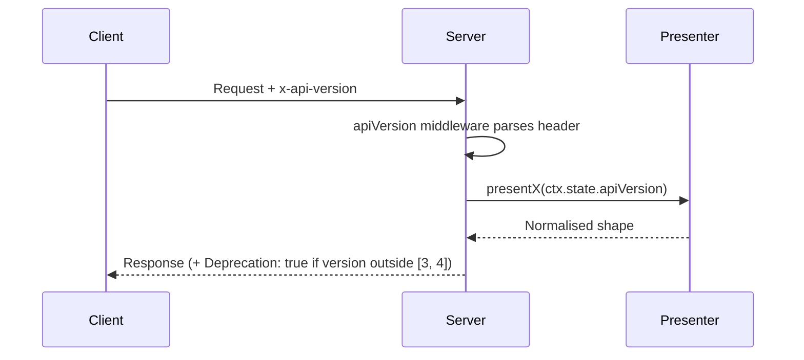

# API versioning

## Prerequisites

API versioning policy for the Outline JSON-RPC API.

## Overview

Clients select an API version by sending the `x-api-version` HTTP header on every request. The current version is `3`. The supported range is `[3, 4]`. The header is optional; a missing or unrecognised value defaults to the current version.

## Header format

The header accepts plain integers (`"3"`, `"4"`) or `v`-prefixed strings (`"v3"`, `"v4"`). The prefix is stripped before parsing; the rest of the value must be a base-10 integer. Any other format — empty string, non-numeric content, an unsupported version number — falls through to the current version.

When the fallback fires, the response sets `Deprecation: true` so callers can detect the downgrade even when the request itself succeeds.

## Negotiation

When the negotiated version is not in the supported list, the server responds with `Deprecation: true` and logs a warning. The `Sunset` header is reserved for the first sunset date; the response body does not currently include a `sunset` field. The negotiated version is exposed on the request as `ctx.state.apiVersion` for downstream consumers (presenters, routes).



## Migration from pre-policy behaviour

Before the formal policy:

- `presentDocument` and `presentCollection` read `x-api-version` directly from the header.
- Unknown or missing header → `Number(undefined ?? 0) >= 3` is `false` → legacy format.

After the policy:

- A new `apiVersion` middleware parses the header and attaches `ctx.state.apiVersion`.
- Unknown or missing header → defaults to `3` (current, normalised format). This is an intentional upgrade in default behaviour.
- The frontend's `x-api-version: "4"` (set in `app/utils/ApiClient.ts:164`) continues to work — it's in the supported range `[3, 4]`.
- The legacy format is **not reachable via the header**. Clients that previously depended on `x-api-version: 2` returning legacy data must now either (a) migrate to v3, or (b) use the deprecated `apiVersion` body parameter on `documents.info` (marked `@deprecated` in the schema and slated for removal in a future version).

## `/api/version` endpoint

`GET /api/version` is unauthenticated. It returns the current and supported versions and sets the `Deprecation` response header when the negotiated version is deprecated.

```json
{ "current": 3, "supported": [3, 4] }
```

## For client authors

Detect the server's current version with `GET /api/version` on startup. Treat a `Deprecation: true` response as a signal to log and plan an upgrade; the `Sunset` header will follow once the first version is formally retired. Breaking changes per version are tracked in the changelog in the project root.
