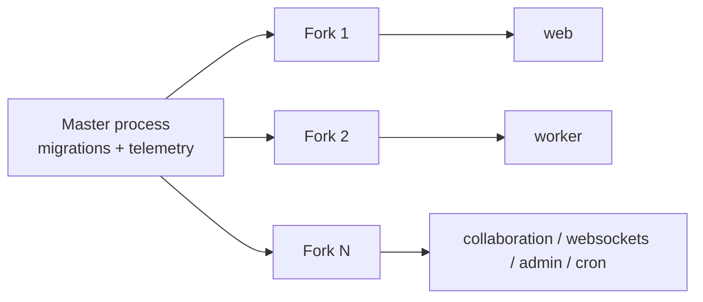
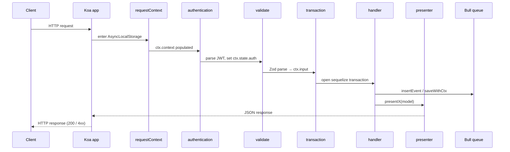
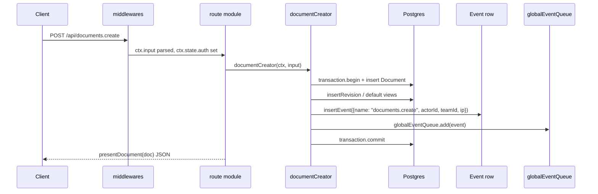

# Backend

Outline's server is a TypeScript Koa application that handles the JSON-RPC API, server-side rendered HTML, authentication, the real-time collaboration transport, and asynchronous event processing. This guide describes how it is structured, how a request moves through the system, and where the major subsystems live.

> For a folder map, see [`docs/ARCHITECTURE.md`](ARCHITECTURE.md). For the runtime service topology and operational concerns (start flags, ports, hosting), see [`docs/SERVICES.md`](SERVICES.md).

## Prerequisites

You should be comfortable with the following before reading or modifying server code.

- **Koa middleware model.** Requests pass through a chain of `app.use(...)` middlewares that mutate `ctx` and either call `next()` or short-circuit with a response. Each route module is mounted as middleware.
- **Sequelize with decorators.** Models extend `SequelizeModel` via `sequelize-typescript`. Column definitions, hooks, and associations are declared with decorators (e.g. `@Column`, `@HasMany`, `@AfterCreate`). The repo enables `experimentalDecorators` and `emitDecoratorMetadata` so reflection can read type info at runtime.
- **Bull queues.** Background work runs through Bull 4 (Redis-backed). Producers enqueue jobs; consumers register processors. Jobs retry with exponential backoff up to a per-queue maximum.
- **JWT cookies.** Authenticated sessions are JWTs signed with `SECRET_KEY` and delivered via an HTTP-only cookie. The token is also accepted from the `Authorization: Bearer` header, the request body, or the query string, depending on the transport.
- **cancan-style authorization.** Authorization is declarative: a policy file declares `allow(User, "action", Target, condition)` rules, and a `cancan.ts` engine evaluates them per request. Policies return a boolean or, in some cases, a `string[]` of membership identifiers.

## Process model

A single TypeScript entry point at `server/index.ts` boots the entire backend. It uses [`throng`](https://github.com/pebble/throng) to fork one worker per detected CPU, with one designated master process. The master runs migrations and telemetry, then the forks cooperate by spawning any combination of services. Each service is a dynamic-import lambda, so a worker-only fork never loads the web or collaboration code paths.



Selection is controlled by `--services=web,worker` (CLI) or `SERVICES=collaboration` (env). The official Docker image starts all production services by default. See [`docs/SERVICES.md`](SERVICES.md) for the operational view.

### Startup order

The master performs the following steps in order, in `server/index.ts`:

1. Load env (`dotenvx`) and resolve `server/env.ts` with class-validator.
2. Apply `--no-migrate` short-circuit (or run pending migrations via Umzug from `server/storage/database.ts`).
3. Call `checkUpdates()` — anonymous version ping; opt-out via `TELEMETRY=false`.
4. Print the resolved config (redacted) to stdout so the operator can see what the process actually loaded.
5. Hand off to `throng`, which forks. Each fork calls `start()` which dynamically imports the configured services.
6. Each service boots independently (web starts Koa; worker attaches Bull processors; collaboration starts Hocuspocus; etc.).

The master is the only place that runs migrations. Forks treat the database as already-migrated and never run schema changes themselves. This keeps multi-pod rollouts safe: only one process attempts `ALTER TABLE`.

## Service map

Each service is registered in `server/services/index.ts` and has its own boot file under `server/services/`.

- **`web`** — the Koa app. Mounts `/api` (the JSON-RPC API), `/auth`, `/oauth`, `/mcp`, and the SSR routes (`/`, `/share/:id`, `/doc/:slug`). Applies `koa-helmet` for CSP, `koa-sslify` for `FORCE_HTTPS`, the custom CSRF middleware, and the rate limiter. Hosts `/admin` (Bull Board) and `/_health` when the relevant flags are on.
- **`worker`** — runs the Bull queues. Owns `globalEventQueue`, `processorEventQueue`, and `taskQueue`. A `HealthMonitor` per queue observes stalled/dead-letter metrics and exits fatally if any queue becomes stuck, so the orchestrator can restart the process.
- **`collaboration`** — Hocuspocus WebSocket server bound to `/collaboration`. Loads the collaboration extensions (authentication, persistence, throttling, API update, views, metrics, logger) and the in-house `EditorVersion` and `Views` extensions. Debounce is 3 s; idle timeout is 30 s.
- **`websockets`** — Socket.IO server at path `/realtime`. Uses the `@socket.io/redis-adapter` for fan-out across pods. Authenticates from the `accessToken` JWT cookie, then joins the connection to `team-${id}`, `user-${id}`, `collection-${id}`, and `group-${id}` rooms for targeted broadcasts.
- **`admin`** — wraps Bull Board behind an admin-only mount at `/admin`. Used in development and behind an authentication check in self-hosted setups.
- **`cron`** — runs scheduled `CronTask`s (hourly and daily). Each task is enqueued on `taskQueue` with a partition `{partitionIndex: 0, partitionCount: 1}` so multi-pod rollouts can run partitions in parallel safely.

The services are independently scalable in production. A typical self-hosted install runs web + worker in one process, and a cloud-hosted install runs web in a pool, worker in a separate pool, and collaboration in a third pool so each can scale to the load it actually faces.

## Request lifecycle

Every API request follows the same chain. The middlewares are registered in `server/routes/api/index.ts` and are applied in the order shown below.



The middlewares, in order:

1. **`requestContext`** — wraps the request in a Node `AsyncLocalStorage` scope so downstream code can read `ctx.context` anywhere on the await chain (e.g. inside a Bull enqueue). This is also how "socket destroyed" is detected: the scope carries the Koa request object, and any code that resolves after the client disconnects checks `socket.destroyed` and short-circuits silently instead of writing to a dead socket.
2. **`userAgent` / logging** — extracts the UA, request id, and trace context for logs and Sentry.
3. **`csrf`** — verifies a CSRF token for state-changing requests, except when the request carries an OAuth token or API key (those transports are exempt by design).
4. **`authentication`** — parses the JWT from cookie, header, body, or query and populates `ctx.state.auth.user` and `ctx.state.auth.type`.
5. **`validate`** — runs the per-endpoint Zod schema (`routes/api/<resource>/schema.ts`) and writes the parsed value to `ctx.input`. Bad input returns `400` with a structured error.
6. **`transaction`** — opens a Sequelize transaction and binds it to `ctx.state.transaction` so commands and presenters can opt in.
7. **handler** — the route module function (see [API surface](#api-surface)). Calls commands and policies.
8. **presenter** — formats the response model(s) into JSON via `presentX(model, options?)`.

The `apiContext` middleware exposes a typed `ctx.context` getter that downstream code reads to grab the actor, transaction, ip, and auth type without explicit threading.

> The request context trick is reused outside the API: Bull processors construct a synthetic `APIContext` from the persisted `Event` so the same command code paths execute under the queue worker.

### The `ctx.context` shape

The `apiContext` middleware exposes a typed `ctx.context` getter. The shape (per `server/middlewares/apiContext.ts` and `server/types.ts`) is exactly three fields:

- `transaction` — the open Sequelize transaction (set by the `transaction` middleware)
- `auth` — `{ user, type }` from the authentication middleware
- `ip` — the request IP (after `PROXY_IP_HEADER` resolution)

The reason for the dedicated type is that commands and processors both expect an `APIContext`. Bull processors construct one from a persisted `Event` row (carrying `actorId`, `teamId`, `ip`, `authType`), so the same command function works whether it was triggered by an HTTP request or by a queued event.

Note: a separate `event` field lives on the Sequelize *hook context* (the object `Model.saveWithCtx` spreads into the `@BeforeSave` / `@AfterCreate` / `@AfterUpdate` hooks). It is the event override a command sets via `eventOpts` and is not on `ctx.context` itself. Commands that want to set a custom event name, attach extra `data`, or set `persist: false` do so through the `eventOpts` argument of `saveWithCtx` / `updateWithCtx` / `destroyWithCtx` — the namespace (`documents.`, `users.`, etc.) is auto-prefixed, and a literal period in `eventOpts.name` throws.

## Document create sequence

The `documents.create` endpoint is representative of the read-write API: Zod validation, a free-function command, a presenter, and event emission. Note that `documentCreator` is invoked from the API, not from the collaboration server; the collaboration path uses `documentCollaborativeUpdater` and a separate Y.js BLOB write.



`documentCreator` is one of several document lifecycle commands in `server/commands/`. The full set covers create, update, collaborative update, duplicate, move, restore, permanent delete, import, and load. See [`docs/DATA_MODEL.md`](DATA_MODEL.md) for the entity reference and [`docs/EDITOR.md`](EDITOR.md) for the multiplayer path.

A few details worth flagging:

- **Events in the same transaction.** The `insertEvent` call happens *inside* the same Sequelize transaction as the row write. If the transaction rolls back, the event row is never persisted; if the transaction commits, both the row and the event are durable. This is what makes the event bus reliable enough to be the source of truth for downstream side effects.
- **`ctx.context.event` overrides.** Commands can override the default event name, attach extra `data`, or set `persist: false` (the latter is rare and only used for transient writes that should not appear in the audit log). The override is passed via the `eventOpts` argument of `saveWithCtx` / `updateWithCtx`; the namespace is auto-prefixed and a literal period in the name throws.
- **Idempotency.** Event handlers can be replayed safely because every processor must treat a duplicate `Event` as a no-op. This is why processors are written defensively against repeat work.

## Authentication and authorization

### Authentication

`server/middlewares/authentication.ts` (the `parseAuthentication` helper it delegates to) resolves the request's principal. The accepted inputs are:

| Source | Example |
| --- | --- |
| HTTP-only cookie | `accessToken=eyJhbGc...` |
| `Authorization` header | `Bearer eyJhbGc...` |
| Request body | `{ "token": "eyJ..." }` |
| Query string | `?token=eyJ...` |

The resolved `Authentication` is shaped `{ user, type }` where `type` is one of `app`, `api`, `mcp`, or `oauth`. The type gates which routes are reachable; `/mcp` accepts `mcp`, `oauth`, and `api`; `/api/*` accepts `app`, `api`, `oauth`; the SSR routes accept `app` only. The middleware returns `401 AuthenticationError` when no valid principal is found.

### Authorization

Authorization lives in `server/policies/` and is evaluated by `server/policies/cancan.ts`. Each policy file is registered for side effects in `server/policies/index.ts`. The canonical form is:

```ts
allow(User, "createDocument", Team, (actor, team) =>
  and(
    !actor.isGuest,
    !actor.isViewer,
    isTeamModel(actor, team),
    isTeamMutable(actor)
  )
);
```

Reading the actual policy for a Document:

```ts
allow(User, "read", Document, (actor, document) =>
  and(
    isTeamModel(actor, document),
    or(
      includesMembership(document, [
        DocumentPermission.Read,
        DocumentPermission.ReadWrite,
        DocumentPermission.Admin,
      ]),
      and(!!document?.isDraft, actor.id === document?.createdById),
      can(actor, "read", document?.collection)
    )
  )
);
```

Two patterns are worth noting:

- **`and(...)` / `or(...)` composition.** Most conditions are built from short helpers (`isTeamModel`, `isTeamMutable`, `includesMembership`) composed with logical `and`/`or`. This keeps the policy readable and prevents one-line ternary soup.
- **`string[]` return for UI gating.** Some rules return an array of membership identifiers instead of a boolean. The result is forwarded to the client via `presentPolicies` so the frontend can grey out actions without re-evaluating the rule. For example, "you can `read` this document, and your access is via memberships `m1`, `m4`" lets the UI show those memberships on hover.

`presentPolicies` is called from `presentDocument` (and other presenters) and is the bridge between server-side authorization and client-side affordance.

## Data layer

The server's persistence layer is built on top of Sequelize with four base classes:

- **`Model`** (`server/models/base/Model.ts`) — the root. Adds the `saveWithCtx` / `updateWithCtx` / `destroyWithCtx` helpers that take a `ctx: APIContext` and an optional `eventOpts`. The ctx flows into the Sequelize hook lifecycle as `{...ctx.context, event}` so model hooks can publish events.
- **`IdModel`** — adds the UUID primary key and `id` getter.
- **`ParanoidModel`** — soft-delete: `destroy` sets `deletedAt` rather than removing the row.
- **`ArchivableModel`** — adds `archivedAt` for the `archived`/`restore` lifecycle (used by `Document` and `Template`).

### Decorators

Model columns are decorated with class-validator / class-transformer style decorators. The most important ones:

| Decorator | Purpose |
| --- | --- |
| `@Encrypted` | Marks a column as encrypted at rest via `SequelizeEncrypted`. The ciphertext is stored in the DB; the column accessor transparently decrypts with `env.SECRET_KEY`. Used for `ApiKey.secret`, OAuth tokens, attachment keys, and similar secrets. |
| `@Field` | Whitelist for `toAPI` serialization. Only decorated columns are emitted in the API response. |
| `@SkipChangeset` | Opts the column out of the changeset comparison so it does not show up in revision diffs (e.g. noisy `updatedAt`). |
| `@CounterCache` | Maintains a denormalized counter (e.g. `document.viewCount`) by listening for events on the related model. |
| `@Deprecated` | Marks a column as read-only and flags it in logs when written. |

### `saveWithCtx` and `insertEvent`

The single most important model-level pattern is `saveWithCtx(ctx, options?, eventOpts?)`. It does three things:

1. Runs `this.save({...options, ...hookContext})` with the ctx spliced into the hook context.
2. Persists an `Event` row in the same transaction (unless `eventOpts.persist === false`).
3. Enqueues a job on `globalEventQueue` so processors (search index, revisions, notifications, emails, websockets, webhooks) run async.

The persisted `Event` is the durable record of "what happened". The queue job is the side-effect dispatch. If the queue fails, the event row still exists; a cron job can re-fan-out stalled events. The `changeset` getter on `Model` produces the field-level diff between the previous and new state using the `@SkipChangeset` set, and that diff is attached to the event as `event.changes`.

### Domain models

The full entity reference — Document, Collection, Team, Group, Share, View, Star, Pin, Reaction, Subscription, Comment, Notification, Integration, WebhookSubscription, Attachment, FileOperation, Import, ApiKey, OAuthAuthentication, Event, and the rest — lives in [`docs/DATA_MODEL.md`](DATA_MODEL.md). That doc covers the ERD, the document lifecycle state diagram, the event bus semantics, and the permissions triangle. This file focuses on the server-side mechanics; consult `DATA_MODEL.md` when reasoning about entities.

### The Event union

Persisted events are defined as a discriminated union in `server/types.ts` (`Event = DocumentCreateEvent | DocumentUpdateEvent | ...`). Every variant carries the same envelope:

```
{
  name: "documents.create",      // "<namespace>.<event_action>"
  teamId: string,
  actorId: string,
  modelId: string,               // id of the affected row
  ip: string,
  authType?: "app" | "api" | "mcp" | "oauth",
  data?: object,                 // per-subtype payload (e.g. collectionId, documentId)
  changes?: { attributes: object, previous: object }  // update events only
}
```

The `name` field is the discriminator. Processors register handlers for the namespaces they care about (`documents.*`, `users.*`, etc.). The shared envelope means cross-namespace processors (notifications, websockets, webhooks) can inspect any event without case-switching on the variant. The `changes` block is the same shape the audit UI renders, so the event log and the change history are the same data.

## API surface

The HTTP front door is `server/routes/index.ts`, which mounts:

- `/api/*` — the JSON-RPC Koa app at `server/routes/api/index.ts`
- `/auth/*` — login / logout / SSO callback routes
- `/oauth/*` — OAuth 2.1 server endpoints (used by integrations and MCP clients)
- `/mcp` — the Model Context Protocol server (see [`docs/MCP.md`](MCP.md))
- `/share/:id` and `/doc/:slug` — SSR share / document routes
- `/admin` — Bull Board (when enabled)
- `/_health` — liveness probe

The JSON-RPC app is a Koa sub-app. Each resource is a self-contained module under `server/routes/api/<resource>/` with:

- `schema.ts` — Zod schemas and request/response types, exported for the API client to mirror
- `index.ts` — the route handlers, mounted on the resource router
- `*.test.ts` — colocated Vitest tests

The `Server#action` verb (e.g. `documents.create`, `documents.list`) is mapped to a handler by `server/routes/api/index.ts`.

### Most-touched modules

The following modules concentrate the bulk of the API surface; for the full list, browse `server/routes/api/`.

| Module | Purpose |
| --- | --- |
| `documents` | Create, read, update, delete, search, archive, restore, move, duplicate, export, view, star, pin, and revision endpoints for documents. |
| `collections` | Collection CRUD, structure, permissions, exports, and the trash endpoint. |
| `users` | User CRUD, profile, preferences, notifications, suspension, and membership management. |
| `teams` | Team CRUD, preferences, domains, SSO configuration, and member invite. |
| `comments` | Comment CRUD, reactions, resolve, and the reply tree. |
| `shares` | Share link CRUD, domain allow/deny, revoke, and `?format=md` SSR variant. |
| `groups` | Group CRUD, member management, and external group mapping. |
| `integrations` | Slack, Discord, GitHub, etc. OAuth and webhook configuration. |
| `subscriptions` | Document/collection subscription list and toggle. |
| `fileOperations` | Upload, import, and export operations; long-running file tasks. |

> Per-endpoint documentation is published at <https://getoutline.com/developers>. The source-of-truth schema lives in the colocated `schema.ts` files; when in doubt, read the schema.

### Chat API

Three endpoints for per-collection plain-text chat. Mirrors the Comments pattern.

| Endpoint | Auth | Notes |
| --- | --- | --- |
| `POST /api/chat.list` | `auth()` + `authorize(user, "read", collection)` | Paginated by `collectionId`. |
| `POST /api/chat.create` | `auth()` + `rateLimiter(TwentyFivePerMinute)` + `authorize(user, "updateDocument", collection)` + `transaction()` | Body length validated at 4000 chars (see [API_VERSIONING.md](API_VERSIONING.md)). |
| `POST /api/chat.delete` | `auth()` + `authorize(user, "delete", chatMessage)` | Soft delete via `destroyWithCtx`. Own + admin only per `policies/chat.ts`. |

Live updates: the WebsocketsProcessor emits `chat.create` (full message payload) and `chat.delete` (`{ modelId }`) as direct events to `collection-${id}` — the same room the joining client already subscribes to when the collection page mounts.

### MCP rate limit per team

The MCP route consumes from a dedicated, per-team rate limiter rather than the global `RateLimiter.defaultRateLimiter`. The global middleware (`defaultRateLimiter` in `server/middlewares/rateLimiter.ts`) is wired up in `server/index.ts` with a guard that skips any request whose `ctx.path` is `/mcp` or starts with `/mcp/`, so an MCP call counts only against the team's MCP budget — it does not double-bill against the shared default bucket.

The per-team budget is configured by two values that resolve through a `??` chain inside the MCP handler in `server/routes/mcp/index.ts`:

- `env.MCP_RATE_LIMIT_DEFAULT` in `server/env.ts` — the operator-tunable fallback, default `1.0` (which corresponds to 1000 requests per hour per team). The env var requires `RATE_LIMITER_ENABLED` to be true.
- `TeamPreference.McpRateLimitMultiplier` in `shared/types.ts` — the per-team override stored on the team preferences JSON column, defaulting to `1.0` via `TeamPreferenceDefaults` in `shared/constants.ts`.

The handler resolves the effective multiplier with `user.team.getPreference(TeamPreference.McpRateLimitMultiplier) ?? env.MCP_RATE_LIMIT_DEFAULT` and then calls `getMcpRateLimiter(multiplier).consume(\`mcp:${user.teamId}\`)`. `getMcpRateLimiter` (and its strategy helper `getMcpRateLimitStrategy`) in `server/utils/RateLimiter.ts` memoize a `RateLimiterRedis` per multiplier value; each instance uses its own `keyPrefix` (`rl:mcp`) and is consumed with a per-team key (`mcp:${teamId}`), so two teams on different multipliers never share a bucket. The strategy's `requests` value is `Math.max(1, Math.floor(1000 * multiplier))` (clamped to a 1-request-per-hour floor), and `duration` is 3600 s.

A team explicitly set to `multiplier = 0` is passed through literally because the `??` fallback only substitutes on `null` / `undefined`. `getMcpRateLimiter(0)` returns the strategy with `requests = Math.max(1, floor(1000 * 0)) = 1` — a floor, not an unlimited bucket. Operators who want "no MCP for this team" should leave the team's `MCP` preference disabled (`server/routes/mcp/index.ts` returns `NotFoundError` early when `TeamPreference.MCP` is off); the multiplier is for tuning budget, not gating access. See [`docs/MCP.md`](MCP.md) for the request flow and OAuth scope details.

### MCP write tools

The MCP tool surface is wired up under `server/tools/`. Each tool module (`users.ts`, `templates.ts`, `comments.ts`, etc.) exports a `*Tools(server, scopes)` function called from `server/routes/mcp/index.ts` that registers one tool per supported OAuth-scoped action. Tool visibility is gated by `AuthenticationHelper.canAccess("<resource>.<verb>", scopes)`, which maps each scope to its underlying `Server` (for writes) or `Scope.Read` (for reads) permission.

- **`users`** — five tools: `list_users`, `get_user`, `create_user`, `update_user`, `delete_user`. `list_users` and `get_user` are `Scope.Read`; `get_user` scopes the lookup to the actor's team and throws `NotFoundError` for cross-team ids so a caller cannot probe the existence of users in other workspaces. `create_user`, `update_user`, and `delete_user` require the `Server` scope (via `users.create` / `users.update` / `users.delete`). `create_user` calls `authorize(user, "createUser", team)` against the new policy added to `server/policies/team.ts` (admin-only, team-scoped). `update_user` calls `authorize(user, "update", target)` and additionally guards `role` changes with `promote` / `demote` checks plus an explicit "you cannot change your own role" rejection. `delete_user` calls `authorize(user, "delete", target)` and goes through `destroyWithCtx` so the soft-delete fires the audit event.
- **`templates`** — five tools: `list_templates`, `get_template`, `create_template`, `update_template`, `delete_template`. `list_templates` and `get_template` are `Scope.Read`; the three write tools are `Server`. `create_template` branches: it calls `authorize(user, "createTemplate", collection)` when a `collectionId` is provided (member-level access to that collection), otherwise `authorize(user, "createTemplate", user.team)` (admin-only on the team). `update_template` calls `authorize(user, "update", template)` and re-checks `createTemplate` when the template is moved between collections. `delete_template` calls `authorize(user, "delete", template)` and goes through `destroyWithCtx`.
- **`comments`** — four tools: `list_comments`, `create_comment`, `update_comment`, `delete_comment` (unchanged by Phase 2). All write tools call `authorize(actor, action, target)`; all read tools use `Scope.Read`.

`Server` is the umbrella scope that allows write operations; tools that mutate state use it, tools that only read use `Scope.Read`. `AuthenticationHelper.canAccess` is what maps the OAuth scope on the access token to the permission the handler is allowed to invoke. See [`docs/MCP.md`](MCP.md) for the full scope grammar.

## Policies pattern

Each resource has a policy file in `server/policies/`. The pattern is the cancan `allow` rule shown above. Conditions are short, pure functions that take `(actor, target)` and return `boolean` or `string[]`. The `[](...)` is a tiny combinator library defined in `server/policies/utils.ts`.

Two rules of thumb:

1. **Keep conditions short.** If a condition grows past ~10 lines, extract a helper in `policies/utils.ts`. Long conditions are hard to audit.
2. **Prefer `and` over nested ternaries.** The combinator library expresses the same logic as flat boolean composition, which is easier for code reviewers.

The frontend uses the policy result via `presentPolicies`, which the server runs for each visible resource and ships inside the document / collection / etc. response. The frontend stores the policy answer in `app/stores/PoliciesStore` so it does not need to re-ask.

### Cross-policy references

Policies can reference other policies via the `can(actor, "<action>", target)` combinator. The example above (`can(actor, "read", document?.collection)`) is the canonical case: a document's read permission depends on its collection's read permission. This indirection lets collection-level policy decisions (e.g. "members of group G can read collection C") be defined once and inherited by every document in C without per-document rules.

`cannot(...)` is the inverse and is used to write exclusions cleanly (e.g. "everyone except suspended users can read"). Combining `can` / `cannot` with `and` / `or` is enough to express most access rules without dropping to boolean algebra in the condition body.

### Team-scoped vs cross-team resources

Most policies start with `isTeamModel(actor, target)` — the rule applies only if the target belongs to the actor's team. The check is a hard precondition for any rule that should not leak across tenants. Policies that explicitly opt out (e.g. the admin tools) live in dedicated files; the default is team-scoped.

## Presenters pattern

Each model has a `presentX(model, options?)` function in `server/presenters/`. Presenters are the only sanctioned way to convert a Sequelize model into a client payload.

- **`presentDocument`** is the most complex presenter. It branches on the negotiated API version (v3 vs pre-v3) and an `Options` parameter (`{ isPublic, shareId, includeText, includeData, includeUpdatedAt, includeCommentCount, backlinkIds }`) to render the right combination of `text`, `content` (ProseMirror JSON), and `url` / `urlId`. The Y.js CRDT state is **not** part of the HTTP response — it is fetched separately through the collaboration path. Plugins can extend the returned shape via the `DocumentPresenter` extension point.
- **`presentEnv`** reads the `@Public`-decorated environment variables from `server/env.ts` and returns the subset that is safe to ship to the client. The `@Public` decorator is the explicit whitelist; anything not decorated is server-only.
- **`presentPolicies`** is called by presenters that need to ship authorization answers to the client (see [Policies pattern](#policies-pattern)).

### `presentDocument` options

The `Options` parameter is what lets the same presenter serve list views, search results, and full-document reads:

- **`includeText`** — adds the plain-text column. Cheap (already a column) and used by list views.
- **`includeData`** — adds the ProseMirror JSON body via `DocumentHelper.toJSON`. Used by full-document reads on the editor and by the `?format=md` share endpoint (which derives markdown from this JSON).
- **`includeUpdatedAt`** / **`includeCommentCount`** — small flags consumed by list and search views to avoid a follow-up round trip.
- **`backlinkIds`** — list of document ids that link back to this one, pre-computed by the `BacklinksProcessor` for the `?includeBacklinks` API flag.

The version comes from the `apiVersion` middleware (in `server/middlewares/apiVersion.ts`) which attaches it to `ctx.state.apiVersion`. See [API_VERSIONING.md](API_VERSIONING.md) for the full policy. The negotiated version flips between pre-v3 (legacy clients; `content` is the ProseMirror JSON) and v3 (current; `content` is normalised to v3 mark / node names). pre-v3 support is kept for backwards compatibility with older API clients; new code should target v3.

The same per-caller gating pattern is used by `presentShare` (`server/presenters/share.ts`), which strips `lastAccessedAt` and `expiresAt` from the payload unless `isAdmin = true` is passed. The two fields are emitted side by side so an admin caller can see both the timestamp of the last access and the timestamp at which the share will auto-revoke.

### Why presenters, not toJSON

Sequelize models carry a full object graph, including associations you do not want to ship. Prescribing a `presentX` function per resource gives the API a single audit point: every field on the wire is one place in the codebase. It also makes the schema of the API explicit — clients can import the types exported from `presenters/index.ts` and trust that no unannounced fields will appear.

## Commands pattern

Commands are free functions in `server/commands/`. They take an `APIContext` and an input, mutate one or more models, and return the resulting entity. They are the right place for multi-model writes that should happen in a single transaction.

The contract:

- **Open a transaction** if you mutate more than one model. The ctx already carries one for route handlers; commands opened from a Bull processor wrap their own.
- **Use `saveWithCtx` / `updateWithCtx`** so events are emitted in the same transaction as the row write. This avoids the "row updated but event lost" failure mode.
- **Schedule events** via `ctx.context.event` overrides when you need to attach extra `data` or set a custom event name.
- **Return the entity** so the route module can hand it to the presenter without re-fetching.

Document lifecycle commands include `documentCreator`, `documentUpdater`, `documentCollaborativeUpdater`, `documentDuplicator`, `documentMover`, `documentRestorer`, `documentPermanentDeleter`, `documentImporter`, and `documentLoader`. Sharing commands include `shareLoader` (used by the SSR share route) and `collectionExporter`. Cross-model commands include `pinCreator`, `starCreator`, `subscriptionCreator`, `revisionCreator`, `attachmentCreator`. Team commands cover create / update / provisioner / permanent-delete. User commands cover invite / provision / account-provision. The `groupsSyncer` command reconciles an external IdP's groups with Outline's `Group` table.

## Queues

Bull queues are configured in `server/queues/queue.ts`. Each queue gets a dedicated blocking Redis client and a metrics prefix `queue.<name>.jobs.{stalled,completed,errored,failed}`. The factory adds exponential backoff (1 s base) and `globalEventQueue` retries up to 5 attempts.

There are four queues:

| Queue | Producer | Consumer |
| --- | --- | --- |
| `globalEventQueue` | `Model.saveWithCtx` / `insertEvent` | `BaseProcessor` subclasses |
| `processorEventQueue` | Processors that emit follow-up events | Other processors |
| `websocketQueue` | Event-driven broadcasts | `websockets` service |
| `taskQueue` | `task(...)` calls + `cron` | `BaseTask` subclasses |

The `HealthMonitor` watches each queue and triggers a fatal exit on stuck conditions, letting the orchestrator restart the pod cleanly.

### Processors vs tasks

- **Processors** extend `BaseProcessor` in `server/queues/processors/`. They are event handlers: a job contains an `Event` row, the processor reacts to it. The base class wires up the standard naming (`processor.eventHandler`) and the per-processor retry policy.
- **Tasks** extend `BaseTask` in `server/queues/tasks/`. They are one-shot async jobs: a job contains a payload, the task does the work. They are not triggered by events.

Processors are organised by domain. The folder layout under `server/queues/processors/` covers:

- Documents (archive, move, subscription, deletion)
- Collections
- Comments and reactions
- Notifications and emails
- Revisions, search, and backlinks
- Imports (JSON / Markdown)
- File operations (created, deleted)
- Integrations (created, deleted)
- Users (created, deleted, demoted, suspended)
- OAuth clients (deleted, unpublished)
- Avatars
- Debounce (e.g. `DocumentUpdateText`)
- API key cleanup
- Websockets

Tasks in `server/queues/tasks/` cover cron jobs (cleanup, rollup, popularity), notifications, cleanup (e.g. expired shares, old events), uploads, imports (API / document / JSON / Markdown), SSO validation, email delivery, debounced text extraction, and exports. Browse the folder for the full list rather than treating this as exhaustive.

> The processor / task distinction is also enforced by naming: a processor reacts to a domain event, a task is enqueued from explicit code.

### Cron partitioning

`CronTask`s are scheduled via `node-cron` in `server/services/cron.ts`. When a cron fires, it enqueues the task on `taskQueue` with a partition payload:

```
{ partitionIndex: 0, partitionCount: 1 }
```

This partition object is the seam that lets a multi-pod rollout scale cron horizontally. The cron service can be told "I am pod 0 of N" via `SERVICES` or env, and it will only enqueue partitions for which it is the owner. Today the default is `0/1` (every pod runs every task), but the partition is there so a future deployment can run e.g. cleanup shards in parallel without re-architecting the cron service.

## Middlewares

`server/middlewares/` is the Koa middleware library. They are grouped by concern:

| Concern | Examples |
| --- | --- |
| Authentication | `authentication.ts`, `passport.ts` |
| Request context | `apiContext.ts`, `requestContext.ts`, `apexAuthRedirect.ts`, `apexRedirect.ts`, `shareDomains.ts` |
| Validation | `validate.ts` (Zod → `ctx.input`), `validateWebhook.ts` (HMAC SHA-256) |
| Transaction | `transaction.ts` (Sequelize tx) |
| CSRF | `csrf.ts` |
| Rate limiting | `rateLimiter.ts` (default + per-route strategies) |
| Security | `csp.ts`, `enforceHttps.ts` |
| Request body | `coaleseBody.ts`, `multipart.ts` |
| Logging / tracing | `requestTracer.ts` |
| Timeout | `timeout.ts` |

Each middleware is small and composable. `requestContext` and `apiContext` are the most important to understand: together they make the `ctx.context` typed-getter pattern work, which in turn is what makes the `saveWithCtx` flow and the `ctx.context.event` override work.

### Per-concern notes

- **Authentication** (`authentication.ts`) delegates to `parseAuthentication` (in `server/utils/authentication.ts`). It looks at the cookie, `Authorization` header, request body, and query string in that order, returning the first hit. The matched token is verified against `env.SECRET_KEY`.
- **Request context** (`requestContext.ts`) opens an `AsyncLocalStorage` scope. `apiContext.ts` decorates `ctx` with a getter that resolves the typed context object from the ALS frame. This is the seam that lets commands and Bull processors share the same `APIContext` shape.
- **Validation** (`validate.ts`) reads the Zod schema attached to the route module, parses `ctx.request.body`, and writes the parsed value to `ctx.input`. Validation failures short-circuit with `ValidationError` (status `400`).
- **Transaction** (`transaction.ts`) opens a Sequelize transaction and binds it to `ctx.state.transaction`. Downstream code that needs to commit-or-rollback-as-a-unit uses `ctx.state.transaction`. The transaction is committed automatically by the presenter middleware if no error was thrown; thrown errors trigger a rollback.
- **CSRF** (`csrf.ts`) verifies the `x-outline-csrf` header against the `csrf` cookie for state-changing requests. Webhooks (`validateWebhook.ts`) verify an HMAC SHA-256 signature over `JSON.stringify(request.body)` instead. OAuth and API-key transports are exempt from CSRF by design (they are not browser-same-origin requests).
- **Rate limiting** (`rateLimiter.ts`) uses the `RateLimiter` utility under the hood. The default strategy keys by user-id when a session JWT is present, otherwise by IP. Per-route strategies can override. `RATE_LIMITER_MULTIPLIER` scales all strategies for testing or load-shedding.
- **Security** (`csp.ts`) is a custom CSP builder that derives `script-src` from the configured S3 / CDN hosts so attachment uploads and avatars work. `DEVELOPMENT_UNSAFE_INLINE_CSP=true` (only in `.env.development`) is what allows Vite's HMR client to inline its bootstrap script.

## Editor server-side

The server maintains a parallel copy of the editor schema to support HTML / markdown / plain-text projections, attachment extraction, and mention resolution. `server/editor/` constructs three `ExtensionManager`s paired with three ProseMirror `Schema`s:

- **basic** — minimal schema for safe HTML rendering
- **rich** — full editor schema, used for export and import
- **comments** — schema that allows only inline marks, used by the comment renderer

The schema is wired through `server/models/helpers/ProsemirrorHelper.tsx`, which exposes the `ProsemirrorHelper` for PM ↔ Y.js ↔ HTML / markdown conversion. Emoji data comes from `@emoji-mart/data`.

The bridge has three directions:

1. **Y.js → ProseMirror.** When a document is loaded for editing, `Document.state` (a Y.js BLOB) is deserialised into a `Y.Doc`, then mapped into a ProseMirror document via `y-prosemirror`'s `yDocToProsemirrorJSON`. The collaboration extension on the client does the same in reverse for outgoing transactions.
2. **ProseMirror → HTML / markdown.** Used by exports, search indexing, the `?format=md` share variant, and email rendering. Markdown conversion goes through a fork of `prosemirror-markdown` (in `shared/editor/lib/markdown/`) that supports `serializeWithPositions` and `BlockMapEntry` so the server can return byte-accurate PM ↔ MD offsets.
3. **ProseMirror → plain text.** Used by `Document.text`, search snippets, notifications, and the `DocumentUpdateText` debounced task that writes the latest text into the column for fast `ILIKE` queries.

The same `ProsemirrorHelper` is also used to extract attachment IDs and mentions out of the document so they can be re-attached to the model after a save (and re-emitted as events on the next write).

For the full editor architecture (nodes, marks, extensions, multiplayer flow), see [`docs/EDITOR.md`](EDITOR.md).

## Email pipeline

Outbound mail is composed in `server/emails/`. The `Mailer` class wraps `nodemailer` for delivery and `oy-vey` for React-to-HTML rendering. Templates are React components grouped under `server/emails/templates/` by domain:

- Lifecycle / security (invite, password reset, SSO required)
- Documents (publish, mention, export)
- Comments
- Collections
- Exports

Reusable components (`Body`, `Button`, `CopyableCode`, `Diff`, `EmailLayout`, `EmptySpace`, `Footer`, `Header`, `Heading`) live next to the templates. SMTP transport is configured via `SMTP_*` env vars; transactional service providers (Postmark, etc.) can be used by setting the corresponding `*_API_KEY` var.

The render flow is straightforward:

1. A processor (e.g. `EmailsProcessor`) decides that an event warrants a notification and resolves the recipient(s).
2. It constructs a `Mailer` with the right template class and props.
3. `Mailer` renders the React template to HTML (oy-vey), generates the plaintext alternative, and hands the message to `nodemailer` for delivery.
4. The send is wrapped in a Bull `EmailTask` so retries and rate-limiting happen at the queue, not the processor.

This split lets templates be unit-tested with React Testing Library against the React tree, while the SMTP path stays in `Mailer` and is mocked in `server/test/setup.ts`.

## Error classes

Errors are created by factory functions in `server/errors.ts` (built on `http-errors`). The most common ones are:

| Error | When it fires | Typical handling |
| --- | --- | --- |
| `ValidationError` | Zod / class-validator rejected the input. | Return `400` with the structured issue list. The API client maps these to form errors. |
| `AuthenticationError` | `parseAuthentication` could not resolve a principal. | Return `401`. The frontend `AuthStore` listens for this and triggers a re-login flow. |
| `RateLimitExceededError` | The rate limiter (default or per-route) tripped. | Return `429` with `Retry-After`. The frontend shows a toast. |
| `EditorUpdateError` | The `editor.version` header / body did not match the server's last-known version. | Return `409`. The frontend prompts the user to reload before retrying. |
| `FileImportError` | An import or upload failed at the storage / processing layer. | Return `400` with a human-readable reason. The frontend clears the upload and shows the reason. |

For the full list (e.g. `AuthorizationError`, `CSRFError`, `InviteRequiredError`, `UserSuspendedError`, `OAuthStateMismatchError`, `ClientClosedRequestError`, `InternalError`), see `server/errors.ts`. The reporting rules — `err.isReportable === true || err.status === 500` push to Sentry — live in `server/onerror.ts`. The threat model and the rate-limiter / CSP / SSRF posture are in [`docs/SECURITY_MODEL.md`](SECURITY_MODEL.md).

## Share time-bombs

Shares can carry an optional `expiresAt` timestamp. The column is declared in `server/models/Share.ts` as a nullable `@Column expiresAt: Date | null` and is added by the migration at `server/migrations/20260619000000-add-share-expires-at.js`. It defaults to `null` for every existing share, so existing links keep their "never expires" behaviour with no migration side effects.

A daily cron task, `CleanupExpiredSharesTask` in `server/queues/tasks/`, walks the table once a day and issues a single `Share.update` that sets `revokedAt = NOW` for every row where `expiresAt < NOW` and `revokedAt IS NULL`. The task deliberately leaves `revokedById` unset so the share is recorded as system-revoked (no human actor). It is idempotent: rows already revoked are skipped, and re-running within the same window is a no-op.

The update is wrapped in a try/catch that recognises both `/column .* does not exist/i` and `SequelizeUnknownColumnError` and logs a warning before exiting cleanly. This keeps rolling deploys safe when a new worker pod runs against a database that has not yet been migrated: rather than throwing on every cron tick, the task waits for the schema to catch up. The full surface for the share row (creation, revocation, last-access tracking, SSR render) is unchanged — the only addition is the column and the cron task.

`presentShare` in `server/presenters/share.ts` gates the new field identically to `lastAccessedAt`: the timestamp is emitted in the response only when the caller passes `isAdmin = true`, so non-admin readers of a share record do not see when it will expire. See [Presenters pattern](#presenters-pattern).

## Storage abstraction

File storage lives under `server/storage/files/`. The interface is `BaseStorage`, with two implementations:

- **`S3Storage`** — production default. Uses `lib-storage` for multipart uploads and `@aws-sdk/s3-request-presigner` for presigned URLs. CloudFront signed URLs are enabled when `AWS_S3_CLOUDFRONT_URL` is set.
- **`LocalStorage`** — writes to `FILE_STORAGE_LOCAL_ROOT_DIR` (defaults to `/var/lib/outline/data` in Docker; `/tmp` in tests). Used for development and for self-hosted setups where S3 is overkill.

Both expose `upload`, `getUploadUrl`, `getDownloadUrl`, `delete`, `exists`. Upload URLs are pre-signed and short-lived. Object keys are validated (`utils/parseAttachmentIds`, `parseImages`) to prevent path traversal.

A typical attachment write follows this shape:

1. The client requests an upload via `attachments.create`, which returns a presigned URL.
2. The client `PUT`s the bytes directly to S3 (multipart for large files).
3. The client calls `attachments.create` with the now-uploaded object key; the server creates the `Attachment` row referencing it.
4. Reading the attachment serves a signed `GET` URL, or a CloudFront signed URL if configured.

Sensitive columns (api keys, OAuth tokens, attachment keys) are encrypted at rest by the `@Encrypted` column decorator, backed by `SequelizeEncrypted` in `server/storage/vaults.ts`. The vault key is derived from `env.SECRET_KEY`. For the threat model — key rotation, backup posture, what is and is not encrypted — see [`docs/SECURITY_MODEL.md`](SECURITY_MODEL.md).

## Cache layer

The Redis-backed cache and synchronisation primitives live in `server/utils/`:

- **`CacheHelper`** — a typed wrapper around `ioredis` with `getOrSet`, `set` (TTL), and `del`. Used for expensive reads (e.g. team preferences, public settings) and for deduplication of OAuth provider discovery.
- **`MutexLock`** — a distributed mutex backed by Redis `SET NX PX`. Used to serialise critical sections across pods (e.g. cron cleanup, OAuth state).
- **`CounterCache`** — denormalized counters maintained by listening for model events. Implemented as a `@CounterCache` decorator on the model column.
- **`VerificationCode`** — short-lived, single-use codes for email-link sign-in, password reset, and passkey enrollment. Stored in Redis with TTL; consumed atomically.

### Lazy registry and providers

Two utilities in `server/utils/` are worth knowing about because they underpin most pluggable backends:

- **`lazyRegistry`** — a deferred singleton pattern. Providers register themselves on first import but only initialise on first use, so e.g. the OpenSearch client is not opened when the self-hosted install runs against Postgres-only.
- **`SearchProviderManager`** — abstracts over `BaseSearchProvider` (Postgres FTS in self-hosted installs; OpenSearch in cloud). The `SearchIndexProcessor` writes through whichever provider is active.
- **`GroupSyncProvider`** — abstracts SCIM / LDAP / Google group sync. The `groupsSyncer` command calls into whichever provider the team has configured.
- **`PluginManager`** — discovers and registers plugins under `plugins/*/server/`. Called from `server/index.ts` before any service boots; see [`docs/PLUGINS.md`](PLUGINS.md) for the plugin authoring side.

## SSR

Server-side rendering is for the public share page and the marketing/landing surface only. The application surface itself is a SPA.

- `server/routes/app.ts` is the shell. It returns the same HTML for any route the SPA handles.
- `presentEnv` is inlined into the page so the SPA boots with the same env vars the server sees.
- `readManifestFile` (in `server/utils/readManifestFile.ts`) reads the rolldown-vite `webpack-stats.json` and the chunked asset manifest so the right preloaded chunks and the PWA manifest are emitted.
- The share route at `/share/:id` calls `shareLoader` (a command, not a presenter) to resolve the share, then renders `DocumentShare` from the SSR-specific React tree. The `?format=md` query variant returns the document body as markdown instead of HTML.

### The `@Public` whitelist

Env vars are loaded from `.env` (or `.env.development` / `.env.test`) by a `dotenvx` loader (`server/utils/environment.ts`) into a class-validated `env` object (`server/env.ts`). The set of vars the SSR shell may ship to the client is opt-in: a property on the `env` class decorated with `@Public` is included in the inlined `window.env` payload. Anything without the decorator is server-only and would leak credentials into the bundle if referenced on the client.

This is how `URL`, `CDN_URL`, `DEPLOYMENT`, `SENTRY_DSN`, and the analytics IDs reach the SPA, while `SECRET_KEY`, `DATABASE_URL`, and the S3 credentials stay server-side. The same decorator-driven approach is what `presentEnv` reads.

### Share route specifics

The `/share/:id` endpoint is the only SSR page that does meaningful work per request. The flow:

1. The route middleware applies the same CSRF / rate-limit / authentication chain (modified: it accepts `app` or no auth, depending on `published`).
2. `shareLoader` resolves the share row, validates that it is not revoked, applies the `domain` and `allowIndexing` checks, and fetches the document.
3. The HTML is rendered via `DocumentShare` (in `server/components/`). The tree shares editor components with the SPA but uses the server-side `basic` schema for safety.
4. The `?format=md` variant skips HTML rendering and writes the markdown output of `ProsemirrorHelper.toMarkdown` directly to the response.

The SSR route does not run the collaboration service; the document is rendered statically and the SPA on the page takes over for any interactive features.

## Test setup

The server uses Vitest with a dedicated `server` project (Node + threads pool) defined in `vitest.config.ts`. Tests are colocated as `*.test.ts` next to the code they exercise.

- **Fixtures** live in `server/test/fixtures/` and are loaded via helpers in `server/test/`.
- **MSW** (`server/test/msw.ts`) intercepts outbound HTTP for tests that hit third-party APIs (OAuth providers, unfurl services, OpenSearch).
- **Mocks** for Bull, dd-trace, franc, iso-639-3, and the vendored `request-filtering-agent` live in `server/__mocks__/`. `server/test/setup.ts` additionally mocks S3, `lib-storage`, `s3-presigned-post`, and `s3-request-presigner`.
- **Database tests** use `yarn test:server` against the CI-provided `postgres:14.2`; the workflow sharded command is `yarn test:server --maxWorkers=2 --shard=N/4`.

## Cross-cutting concerns

A few utilities span the layers above and are worth knowing before you start changing code that touches them.

### Logging

Logging goes through `server/logging/Logger.ts` (winston). The logger is namespaced (`Logger.info("module", "msg", meta)`). In production, the winston Sentry transport forwards reportable errors to Sentry with the `outline` or `outline-mcp` service tag so you can filter in the Sentry UI. The MCP service tag is set when the request originated from `routes/mcp`. Set `LOG_LEVEL` in `.env` to control verbosity (`.env.development` ships with `debug`, `.env.sample` defaults to `info`).

### SSRF-protected fetch

Outbound HTTP goes through `server/utils/fetch.ts`, which wraps a custom `Agent` based on a vendored copy of `request-filtering-agent@3.2.0` (`server/utils/requestFilteringAgent/`). The agent refuses to resolve private IP ranges unless they are allow-listed via `ALLOWED_PRIVATE_IP_ADDRESSES`. This is what protects unfurl and import features from being abused to probe the host's internal network. Plugins that fetch URLs (webhooks, integrations) must use this utility, not raw `fetch` or `axios`.

### Tracing

`server/middlewares/requestTracer.ts` opens a `dd-trace` span per request and propagates the trace context to Bull enqueues, so the Sentry trace view can stitch a user action to the queue workers that handled its side effects. The tracer is mocked in tests (`server/__mocks__/dd-trace.ts`).

## Cross-references

- Folder map: [`docs/ARCHITECTURE.md`](ARCHITECTURE.md).
- Service topology: [`docs/SERVICES.md`](SERVICES.md).
- Entity reference, event bus, document lifecycle: [`docs/DATA_MODEL.md`](DATA_MODEL.md).
- Editor (ProseMirror, multiplayer, extension authoring): [`docs/EDITOR.md`](EDITOR.md).
- Threat model and controls: [`docs/SECURITY_MODEL.md`](SECURITY_MODEL.md).
- MCP server (HTTP, OAuth, tools): [`docs/MCP.md`](MCP.md).
- Plugin system (and how it relates to events / editor): [`docs/PLUGINS.md`](PLUGINS.md).

## File map

| Directory | Purpose |
| --- | --- |
| `server/` | Koa server root; entry `server/index.ts`. |
| `server/services/` | Service registry and per-service boot files (web, worker, collaboration, websockets, admin, cron). |
| `server/middlewares/` | Reusable Koa middlewares (auth, CSRF, rate limit, validation, transaction, CSP). |
| `server/routes/` | HTTP routes: `index.ts` front door, `api/` JSON-RPC, `auth/`, `oauth/`, `mcp/`, `embeds/`, `app.ts` SSR shell. |
| `server/routes/api/` | JSON-RPC resource modules; each has `schema.ts`, `index.ts`, `*.test.ts`. |
| `server/models/` | Sequelize models. `base/` for `Model`/`IdModel`/`ParanoidModel`/`ArchivableModel`; `decorators/` for `@Encrypted`, `@Field`, etc. |
| `server/policies/` | cancan-style policy files, one per resource, registered by `policies/index.ts`. |
| `server/presenters/` | `presentX(model, options?)` functions; `presentDocument` is the most complex. |
| `server/commands/` | Free functions that mutate one or more models in a transaction. |
| `server/queues/` | Bull queue factory, `BaseProcessor`, `BaseTask`, plus `processors/` and `tasks/` folders. |
| `server/emails/` | Mailer + email templates + reusable email components. |
| `server/editor/` | Server-side ProseMirror ExtensionManagers and Schemas. |
| `server/storage/` | Database, Redis, files (S3 / local), vault, request context. |
| `server/utils/` | Auth, crypto, JWT, OAuth, env, fetch (SSRF-protected), search, validation, indexing, lazy registry, plugins. |
| `server/collaboration/` | Hocuspocus extensions. |
| `server/mcp/` | MCP server (StreamableHTTPServerTransport, OAuth discovery). |
| `server/errors.ts` | Error factories used throughout the API. |
| `server/onerror.ts` | Error reporting rules (Sentry, `isReportable`). |
| `server/test/` | Test helpers, fixtures, MSW. |
| `server/__mocks__/` | Vitest mocks for Bull, dd-trace, franc, request-filtering-agent. |