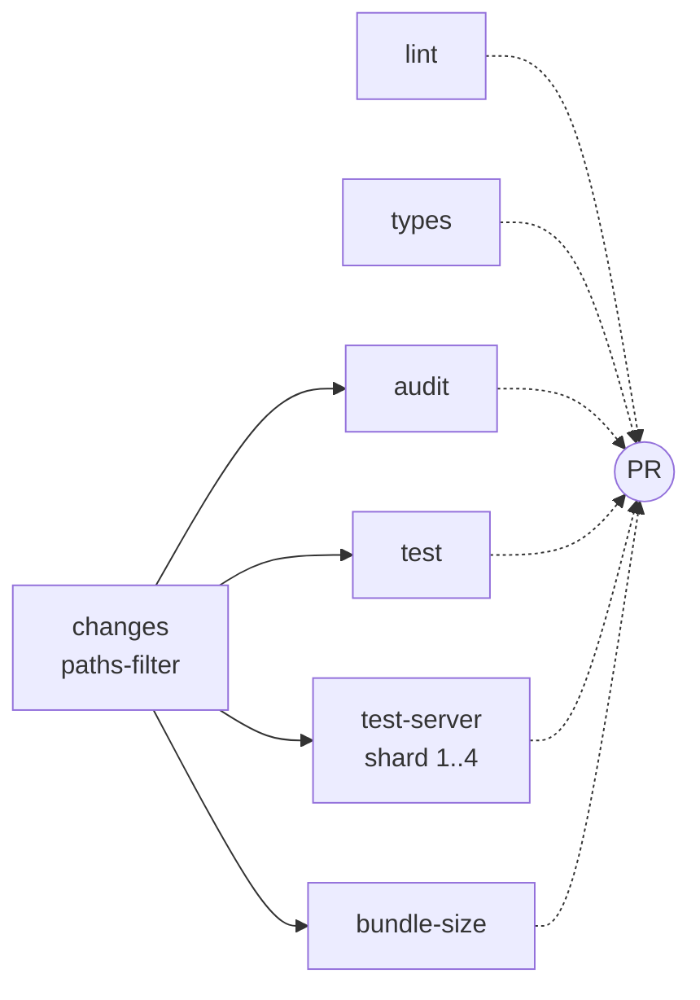
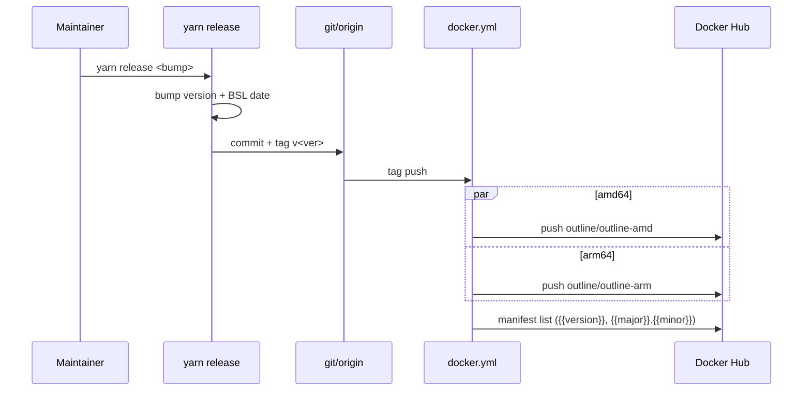

# CI & release workflows

Outline's continuous integration runs on GitHub Actions. This doc covers what each workflow does, how the jobs fit together, and how the release pipeline produces multi-arch Docker images. Build, deploy, and environment details live in `BUILD_AND_DEPLOY.md`; local development commands live in `DEVELOPMENT.md`.

## Prerequisites

Familiar with GitHub Actions (workflows, jobs, matrix strategies, composite actions, secrets). Useful context: Yarn 4 workspaces, Vitest, Docker multi-arch builds, and semantic versioning.

## Main CI workflow

`.github/workflows/ci.yml` runs on every push to `main` and every pull request targeting `main`. It exports shared env vars for the run: `NODE_ENV=test`, `DATABASE_URL` pointing at a local test database, `REDIS_URL`, `URL=http://localhost:3000`, `NODE_OPTIONS=--max-old-space-size=8192` (large heap for type-check and bundle builds), and fixed test secrets for `SECRET_KEY`, `UTILS_SECRET`, `SLACK_VERIFICATION_TOKEN`, and `SMTP_USERNAME`. The workflow has seven jobs; later jobs gate on outputs from the `changes` job so unrelated PRs finish fast.

Continuous integration is a directed graph of jobs: the `changes` job is the source of truth for "what did this PR touch" and gates `audit`, `test`, `test-server`, and `bundle-size`. `lint` and `types` run unconditionally because they are cheap and catch the most common breakages. Dependency order: `lint` and `types` finish first; `test`, `test-server`, and `bundle-size` then run in parallel against the matrix they own.

### changes

A pure-DAG job. It uses `dorny/paths-filter` to classify the diff into four boolean outputs: `config` (`.github/**`, `vite.config.ts`, `vitest.config.ts`), `server` (`server/**`, `shared/**`, `package.json`, `yarn.lock`), `app` (`app/**`, `shared/**`, `package.json`, `yarn.lock`), and `deps` (`package.json`, `yarn.lock`, `.yarnrc.yml`). Downstream jobs read these outputs to decide whether to run. Has no runner work, so it finishes in seconds.

### lint

Runs `yarn lint --quiet` (Oxlint with the TS-aware ruleset, see "Lint and format" below). Skips TypeScript type-check; that is the next job. Has no matrix and no special services.

### types

Runs `yarn tsc` to type-check the whole monorepo. Catches decorator and import errors that Oxlint cannot. Runs every time; not gated by the `changes` job.

### audit

Runs only when `changes.deps == 'true'`. Executes `yarn npm audit --severity high --recursive --environment production` to fail the build on new high-severity advisories in production dependencies. Skipped for non-dependency PRs to keep the signal useful.

### test

Runs when `changes.app == 'true' || changes.config == 'true'`. Matrix is two project groups: `app` and `shared` (the two Vitest projects that exercise the browser-shaped code; the server project is handled by the next job). Each matrix entry calls `yarn test:app` or `yarn test:shared`.

### test-server

Runs when `changes.server == 'true' || changes.config == 'true'`. Spins up a `postgres:14.2` service container with a `pg_isready` health check, then runs migrations with `yarn sequelize db:migrate` and then `yarn test:server --maxWorkers=2 --shard=N/4` for `N` in `1, 2, 3, 4`. The four-way matrix splits the server test suite across parallel jobs; combined wall time stays bounded as the suite grows.

### bundle-size

Runs when the diff touches the app or config, and only on the canonical `outline/outline` repository (fork PRs are skipped because RelativeCI keys live in secrets). Sets `NODE_ENV=production`, runs `yarn vite:build`, then uploads the emitted `build/app/webpack-stats.json` to RelativeCI via `relative-ci/agent-action` for size regression tracking. See "Bundle size" below.

## Composite action: install

`.github/actions/install/action.yml` is a composite action that every CI job (except `changes`) and the bundle job invokes. It enables Corepack, calls `actions/setup-node@v5` with `node-version: 24.x` and `cache: "yarn"` for the Yarn 4 cache, then runs `yarn install --immutable`. Centralising the install keeps the heap, lockfile, and cache behaviour consistent across all jobs.

## Docker publish workflow

`.github/workflows/docker.yml` runs on push of any tag matching `v*` and on manual `workflow_dispatch`. It builds and publishes the production Docker images to Docker Hub as `outlinewiki/outline` (app) and `outlinewiki/outline-base` (builder). The workflow is split across three jobs: `build-arm` runs on a Blacksmith ARM runner, `build-amd` runs on an x86_64 runner, each pushes per-arch images and exports the resulting digests, and a third `merge` job uses `docker buildx imagetools create` to combine the per-arch digests into a single multi-arch manifest list. Tags follow semver: `{{version}}` and `{{major}}.{{minor}}`. The release flow below explains when this workflow fires.

## CodeQL

`.github/workflows/codeql-analysis.yml` runs on push and pull request to `main`, plus a weekly cron schedule. It executes the CodeQL JavaScript security scan against the repository on each push and produces a security alert if it finds a new issue. The weekly run picks up changes in the CodeQL query packs.

## Maintenance workflows

These are small, scheduled, and rarely edited.

- `.github/workflows/stale.yml` — runs daily at 01:30 UTC. Marks issues and pull requests as stale after 5 days of inactivity, then closes them after 60 days for PRs and 120 days for issues. Labels `security`, `pinned`, and `A1` are exempt.
- `.github/workflows/update-node.yml` — runs weekly on Monday at 09:00 UTC and on manual dispatch. Reads the current Node version from `Dockerfile.base`, queries the latest LTS release from the Node release feed, and opens a PR that updates `Dockerfile`, `Dockerfile.base`, `.nvmrc`, the `engines` field in `package.json`, and the Node version used in the CI install-action cache keys. Maintainers review and merge the PR; once merged, the new Node version flows into both the Docker image and the CI runners. This is how the runtime Node version gets bumped, and it is the only scheduled source of Node-version PRs.
- `.github/workflows/auto-close-prs.yml` — runs daily at 00:00 UTC. Closes pull requests that have been flagged by CLA-assistant as lacking a signed CLA for more than 14 days, skipping any PR labelled `pinned`.
- `.github/workflows/calibreapp-image-actions.yml` — runs on changes to image paths in `public/`, weekly on Sunday at 20:00 UTC, and on manual dispatch. Compresses JPG, PNG, and WebP assets via the Calibre service. On non-PR runs it auto-creates a follow-up PR with the compressed images.

## Dependabot and bot automation

`.github/dependabot.yml` opens weekly npm updates with grouped PRs for `@babel/*`, `@sentry/*`, `@fortawesome/*`, `@aws-sdk/*`, and `@radix-ui/*`; semver-major bumps are ignored so the bot produces small, reviewable diffs. `.github/config.yml` activates the standard Probot responders: `request-info` (asks for missing detail), `new-pr-welcome`, and `first-pr-merge`. `.github/auto_assign.yml` adds `tommoor` as a reviewer to new pull requests (skipping work-in-progress PRs). `.github/no-response.yml` closes issues that have been tagged `more information needed` for 7 days without a response.

## Lint and format

`yarn lint` runs Oxlint with the TS-aware `oxlint-tsgolint` engine across `app/`, `server/`, `shared/`, and `plugins/`. Prettier enforces an 80-column line width with `trailingComma: "es5"`. A pre-commit hook (`.husky/pre-commit`) triggers `npx lint-staged`, which in turn runs Prettier, then Oxlint with `--fix --type-aware`, then `yarn build:i18n` so the extracted `en_US` translation keys are committed alongside the source, and finally re-adds the staged changes. Updates to `yarn.lock` or `package.json` also run `yarn dedupe`. Format and lint are part of the merge contract; CI fails the build on any deviation.

## Test runner

`vitest.config.ts` defines four projects: `server` (Node, threads pool), `app` (jsdom), `shared-node` (Node), and `shared-jsdom` (jsdom). The babel transform handles legacy decorators, class properties, and `reflect-metadata`; esbuild and oxc transforms are disabled in the test config. The `vitest` config runs with `TZ=UTC`, the threads pool, and `dangerouslyIgnoreUnhandledErrors: true` for tests that emit benign background warnings. Local entry points are `yarn test:app`, `yarn test:server`, and `yarn test:shared`; CI shards the server project into 4 parallel jobs, each limited to two workers, and the lint and types jobs run before tests in the dependency graph.

## Bundle size

The `bundle-size` job in `ci.yml` produces a fresh production build and uploads the resulting `webpack-stats.json` to RelativeCI. The job only runs on the canonical `outline/outline` repository; fork PRs are skipped because the upload requires the `RELATIVE_CI_KEY` secret, which is not exposed to forks. This avoids leaking build telemetry from untrusted PRs. RelativeCI compares the current chunk inventory against a baseline and surfaces regressions on the pull request and the RelativeCI dashboard. The vendor split groups in `vite.config.ts` (`vendor-react`, `vendor-prosemirror`, `vendor-collab`, `vendor-mermaid`, etc.) keep each per-chunk signal small enough to attribute a regression to a specific dependency; a single PR adding a heavy new library shows up as one new chunk rather than inflating many existing chunks. Build output is written to `build/app/`, and the stats file lives next to the bundle at `build/app/webpack-stats.json`.

## Release flow

Release is a single end-to-end pipeline:

1. The maintainer runs `yarn release <major|minor|patch|x.y.z>` locally (`server/scripts/release.js`).
2. The script prompts for confirmation, increments the version in `package.json`, rewrites the BSL `LICENSE` to bump the change date by four years and refresh the licensed-work field, and commits `package.json` and `LICENSE` with message `v<ver>` (using `--no-verify` to skip hooks).
3. The script creates an annotated tag `v<ver>` and pushes both the commit and the tag to `main`.
4. The tag push triggers `.github/workflows/docker.yml`, which builds `amd64` and `arm64` images in parallel, pushes them to Docker Hub, and merges them into a single multi-arch manifest list tagged `{{version}}` and `{{major}}.{{minor}}`.
5. Crowdin (see "Translation flow") continues to push translation PRs between releases, all suffixed with `[ci skip]` so they never trigger a Docker build.

There is no `CHANGELOG.md`; release notes are produced from the GitHub release UI.

## Translation flow

`crowdin.yml` is the Crowdin configuration; the service pushes commits of the form `fix: New %language% translations from Crowdin [ci skip]` directly to `main`. Those commits are recognised by lint-staged and CI: lint-staged regenerates `en_US` keys on every commit, while the `[ci skip]` marker prevents the Docker workflow from firing on a translation-only push.

## Cross-references

- Local development commands and Yarn 4 specifics: `DEVELOPMENT.md`.
- Build pipeline, Dockerfile contents, and runtime configuration: `BUILD_AND_DEPLOY.md`.
- Vulnerability disclosure policy: `SECURITY.md` (existing, unchanged).
- Translator-facing notes: `TRANSLATION.md` (existing, unchanged).

## File map

- `.github/workflows/ci.yml` — main CI workflow.
- `.github/workflows/docker.yml` — tag-driven Docker publish.
- `.github/workflows/codeql-analysis.yml` — weekly + push security scan.
- `.github/workflows/stale.yml` — daily stale issue/PR close.
- `.github/workflows/update-node.yml` — weekly Node version bump PR.
- `.github/workflows/auto-close-prs.yml` — daily unsigned-CLA PR close.
- `.github/workflows/calibreapp-image-actions.yml` — image compression PRs.
- `.github/actions/install/action.yml` — composite install action.
- `.github/dependabot.yml` — grouped weekly npm updates.
- `.github/config.yml`, `.github/auto_assign.yml`, `.github/no-response.yml` — bot responders and reviewer assignment.
- `crowdin.yml` — Crowdin translation integration.
- `vitest.config.ts` — Vitest 4-project config used by CI test jobs.
- `vite.config.ts` — emits `webpack-stats.json` consumed by the bundle-size job.
- `server/scripts/release.js` — invoked by `yarn release` to cut a tag.
- `.husky/pre-commit` — runs `lint-staged` on commit.
- `docs/BUILD_AND_DEPLOY.md`, `docs/DEVELOPMENT.md`, `docs/SECURITY.md`, `docs/TRANSLATION.md` — referenced docs.
