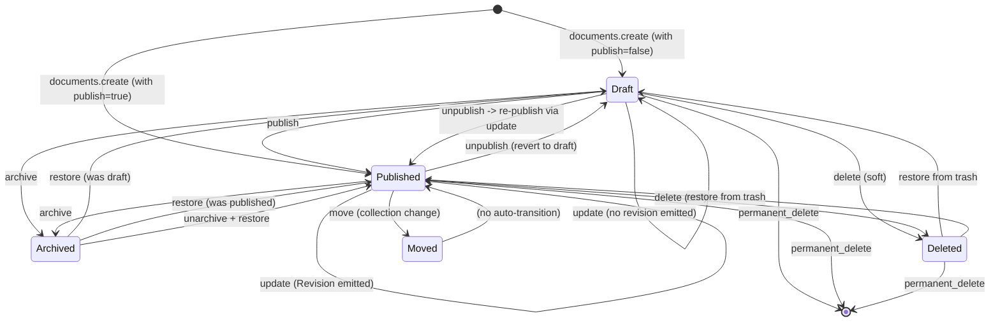
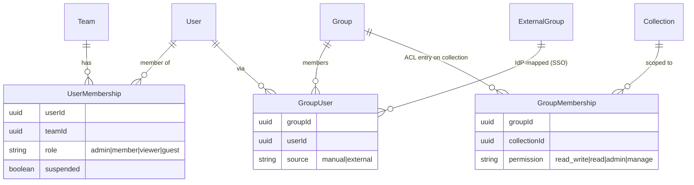
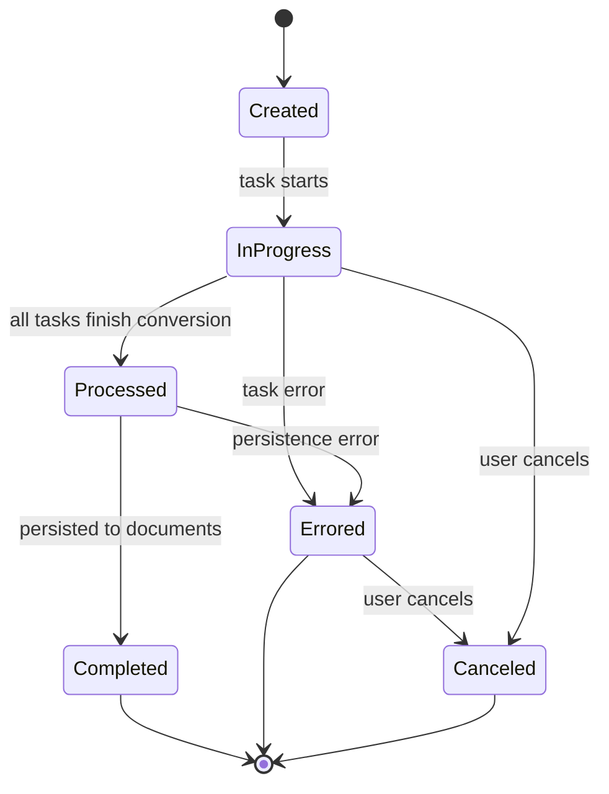

# Data model

This doc is the reference for the entities Outline persists in PostgreSQL, the event bus that ties writes to side effects, and the soft-delete + archive conventions that govern lifecycle. It is the single highest-value doc in this folder: many of the details below are not recoverable by skimming the source tree alone.

Server patterns that operate on these entities (request lifecycle, cancan policies, presenters, the `saveWithCtx` machinery) live in [BACKEND.md](BACKEND.md). The threat surface (authN/Z, CSRF, encryption) is in [SECURITY_MODEL.md](SECURITY_MODEL.md).

## Prerequisites

- SQL ERD literacy. The doc uses `erDiagram` notation; cardinalities are read as "many-side cardinality first".
- Familiarity with soft-delete (`deletedAt` timestamp) and archive (`archivedAt` timestamp). Outline uses both, on different rows, for different reasons.
- Comfort with the CRUD+event pattern: a write hits the database, then an `Event` row is appended in the same transaction, then a Bull job fans it out to processors.
- CRDTs (Yjs) are helpful context for the document `state` column but not required.
- The umbrella shape is: every business object is a Sequelize model in `server/models/`, every API request returns a presenter from `server/presenters/`, and every successful write emits an `Event`.

## Overview

Outline stores three large groups of things:

- **Content**: `Document`, `Revision`, `Collection`, `DocumentInsight`, `Comment`, `Reaction`.
- **Identity + access**: `User`, `Team`, `Group`, `GroupMembership`, `GroupUser`, `UserMembership`, `ExternalGroup`, `ApiKey`, `UserAuthentication`, `UserPasskey`, `AuthenticationProvider`, `Share`, `ShareSubscription`.
- **Plumbing**: `Event`, `Notification`, `Subscription`, `View`, `Star`, `Pin`, `Attachment`, `FileOperation`, `Import`, `ImportTask`, `Integration`, `IntegrationAuthentication`, `WebhookSubscription`, `WebhookDelivery`, `SearchQuery`, `Emoji`, `AccessRequest`.

The append-only `Event` table is the connective tissue: every state change produces one row, and the row is the unit of work for the queue system. The rest of this doc walks the entities, the lifecycle they participate in, and the pipeline that consumes them.

## Entity-relationship diagram

The diagram below covers the highest-traffic entities. Cardinalities are abbreviated (`||--o{` = "one-to-many", `}o--o{` = "many-to-many"). A row like `string urlId` is read as "column `urlId` of type `string`".

```mermaid
erDiagram
    Team ||--o{ User : "has members via UserMembership"
    Team ||--o{ Collection : "owns"
    Team ||--o{ Document : "owns"
    Team ||--o{ Group : "groups"
    Team ||--o{ Event : "audit log"
    Team ||--o{ WebhookSubscription : "delivers"
    Team ||--o{ AuthenticationProvider : "SSO"

    User ||--o{ UserMembership : "joins teams"
    User ||--o{ ApiKey : "API tokens"
    User ||--o{ UserPasskey : "WebAuthn"
    User ||--o{ UserAuthentication : "OAuth identities"
    User ||--o{ Document : "authored"
    User ||--o{ Comment : "authored"
    User ||--o{ Reaction : "reacted"
    User ||--o{ View : "viewed"
    User ||--o{ Star : "starred"
    User ||--o{ Pin : "pinned"
    User ||--o{ Subscription : "subscribed"
    User ||--o{ Notification : "received"

    Group ||--o{ GroupUser : "members"
    ExternalGroup ||--o{ GroupUser : "IdP-mapped members"
    Group ||--o{ Document : "ACL override"

    Collection ||--o{ Document : "contains"
    Collection ||--o{ Document : "child documents (parentDocumentId)"
    Collection ||--o{ Share : "shared via"

    Document ||--o{ Revision : "snapshots"
    Document ||--o{ View : "views"
    Document ||--o{ Star : "stars"
    Document ||--o{ Pin : "pins"
    Document ||--o{ Comment : "comments"
    Document ||--o{ Reaction : "reactions"
    Document ||--o{ Subscription : "subscribers"
    Document ||--o{ Share : "shared via"
    Document ||--o{ Attachment : "attached"
    Document ||--o{ DocumentInsight : "summaries"

    Comment ||--o{ Reaction : "reactions"
    Comment ||--o{ Comment : "parent (replies)"
    Comment ||--o{ Comment : "children"

    Share ||--o{ ShareSubscription : "subscribers"

    Document ||--o{ FileOperation : "exports"
    Import ||--o{ Document : "produces"
    Import ||--o{ FileOperation : "uses"

    Event }o--|| Team : "scope"
    Event }o--|| User : "actor"
    Notification }o--|| User : "recipient"
    Notification }o--o{ Event : "derived from"

    WebhookSubscription ||--o{ WebhookDelivery : "deliveries"

    Team {
        string name
        string urlId
        string subdomain
        string domain
    }
    User {
        string email
        string username
        string role "admin|viewer|member|guest"
    }
    Document {
        string urlId
        string title
        string text "plain-text projection"
        jsonb content "ProseMirror JSON"
        blob state "Yjs CRDT"
        string stateVector "Yjs vector clock"
        string stateVersion "editor version"
        uuid collectionId
        uuid publishedRevisionId
        uuid createdById
    }
    Collection {
        string name
        string color
        string icon
        string permission "read|read_write|manage|admin"
    }
    Revision {
        string title
        string text
        jsonb content
    }
    Comment {
        uuid documentId
        uuid parentCommentId
        uuid createdById
    }
    Share {
        boolean published
        boolean revoked
        string urlId
        boolean includeChildDocuments
        boolean allowIndexing
        string domain
        timestamp revokedAt
    }
    Group {
        string name
        string externalId
        uuid teamId
    }
    Event {
        string name "namespace.event_action"
        uuid actorId
        uuid teamId
        ip ip
        string authType "app|api|mcp|oauth"
        json changes "before/after diff"
    }
```



For the full set of entities, see `server/models/`. For presenter-level shapes (what the API actually returns), see `server/presenters/`.

## Base model hierarchy

Every persisted entity in `server/models/` extends a chain of base classes. The chain encodes the cross-cutting invariants (soft delete, archive, identifier shape, audit emission) so subclasses do not have to repeat them.

```text
Model (server/models/base/Model.ts)
  └─ IdModel            (UUID v4 primary key, createdAt/updatedAt, common helpers)
       └─ ParanoidModel (soft-delete via `deletedAt`; queries auto-filter)
            └─ ArchivableModel  (soft-archive via `archivedAt`; restore() available)
                 └─ Document, Template
```

A few things to know about the chain:

- **ParanoidModel** is the default. Most rows have a `deletedAt` column and a default `scope` that excludes them. Queries must opt in to deleted rows explicitly.
- **ArchivableModel** adds a separate `archivedAt` timestamp and a `restore()` lifecycle. A document can be deleted but not archived, archived but not deleted, or both. The two are independent invariants.
- **Model** is where the event-emission hooks live (see "Event bus" below). Every `saveWithCtx` call flows through `@BeforeSave` / `@AfterCreate` / `@AfterUpdate` / `@AfterDestroy` / `@AfterUpsert` / `@AfterRestore` on this base class.

The decorators on top of the base classes encode per-column behaviour: `@Encrypted` for at-rest encryption (API keys, OAuth tokens, attachment S3 keys), `@CounterCache` for denormalised counters, `@Deprecated` for soft-removed fields, `@Changeset` for before/after diff capture, and `@Fix` for one-shot data fixes.

## Document lifecycle

`Document` is the only `ArchivableModel`. Its lifecycle is the most complex in the system.



Things to know about the lifecycle:

- **Revision snapshots are emitted on publish**. The first publish creates a `Revision` from the content; subsequent updates to a published document create a new `Revision` per edit (debounced via `DocumentUpdateTextTask`).
- **`archive` is reversible** by the same actor; `delete` is reversible only until the row is hard-deleted by `CleanupDeletedDocumentsTask`. See "Retention" below.
- **`move` does not transition the state machine**. It rewrites `collectionId` and emits a `documents.move` event but the document stays in its prior state.
- **`permanent_delete` is destructive**. It is the only path that drops the row from the database. It is exposed only to admins and only for documents already soft-deleted.
- **`unpublish`** reverts a published document to a draft. It does not delete revisions; they remain for audit.

The state diagram is a behavioural model, not a column constraint. There is no single `state` enum on `Document`. The "state" is the combination of `publishedAt IS NOT NULL`, `archivedAt IS NOT NULL`, and `deletedAt IS NOT NULL`. Commands in `server/commands/document*.ts` are the only place that mutates these fields and they enforce the transitions explicitly.

## Soft-delete, archive, and retention

Two timestamps, two purposes:

- `deletedAt` (set by `ParanoidModel.destroy`) marks a row as soft-deleted. Default Sequelize queries filter it out. Trashed UI surfaces (`app/scenes/Trash/`) opt in to see it. A soft-deleted row is still in the database, still audit-logged, and still emits events.
- `archivedAt` (set by `ArchivableModel.archive`) marks a row as archived. Archived documents are excluded from the document tree but still readable when navigated to. They are not deleted.

Retention is enforced by cron tasks in `server/queues/tasks/` that hard-delete rows older than their retention threshold. The pattern is uniform: each `Cleanup*Task` is a `CronTask` (hourly or daily) that opens a transaction, queries soft-deleted or expired rows, and calls `permanentDelete` on them. Examples: `CleanupDeletedDocumentsTask`, `CleanupDeletedTeamsTask`, `CleanupDeletedTeamTask`, `CleanupOldEventsTask`, `CleanupOldNotificationsTask`, `CleanupOldImportsTask`, `CleanupExpiredAttachmentsTask`, `CleanupExpiredFileOperationsTask`, `CleanupOAuthAuthorizationCodeTask`, `CleanupDynamicOAuthClientsTask`, `CleanupDemotedUserTask`, `CleanupDocumentInsightsTask`, `ErrorTimedOutImportsTask`, `ErrorTimedOutFileOperationsTask`, `InviteReminderTask`, `EmptyTrashTask`, `DetachDraftsFromCollectionTask`.

The audit log (`Event`) is itself subject to retention: `CleanupOldEventsTask` bounds its growth. This means the event bus is not a permanent record. If you need to debug a write that happened weeks ago, the search provider's index and the Sentry breadcrumbs are the fallback.

Migrations (in `server/migrations/`) are the third retention lever. Umzug auto-runs them at master startup. Each migration must be reversible via its `down` function. There is no offline schema-management UI; schema changes go through `yarn db:create-migration` → edit → `yarn db:migrate`.

## Event bus

The event bus is the mechanism by which a single write fans out to side effects (search indexing, revision snapshots, notifications, emails, webhooks, real-time updates) without coupling the originating request to any of them.

### Event shape

An `Event` row is the persisted record of one state change. It is created in the same database transaction as the write it describes, then enqueued onto `globalEventQueue` after commit.

The full TypeScript union lives in `server/types.ts` and contains roughly two dozen subtypes (`documents.create`, `documents.publish`, `documents.archive`, `users.create`, `groups.update`, `webhookSubscriptions.create`, etc.). Every subtype shares a common envelope:

| Field      | Type                              | Notes                                                                                          |
| ---------- | --------------------------------- | ---------------------------------------------------------------------------------------------- |
| `id`       | UUID v4                           | Primary key.                                                                                   |
| `name`     | `string`                          | Discriminator. Format `"namespace.event_action"` (e.g. `documents.create`, `users.invite`).   |
| `teamId`   | UUID (nullable)                   | Scope of the write. Most events are team-scoped; a few (signup, billing) are not.              |
| `actorId`  | UUID (nullable)                   | The user who initiated the write. Null for system-originated events (cron, importers).         |
| `modelId`  | UUID (nullable)                   | The row that was created/updated/deleted.                                                      |
| `ip`       | string (IPv4/IPv6)                | Normalised via `normalizeIp` (in `server/utils/ip.ts`).                                        |
| `authType` | `AuthenticationType` (nullable)   | One of `app`, `api`, `mcp`, `oauth`.                                                            |
| `data`     | JSON (nullable)                   | Per-subtype payload (e.g. `collectionId`, `documentId`, prior `publishedAt` for unpublish).   |
| `changes`  | JSON (nullable)                   | On `update` events: `{ attributes, previous }` produced by the `@SkipChangeset`-aware `changeset` getter. `attributes` is the new value, `previous` is the value before the write. `create` and `delete` events carry no `changes`. |
| `createdAt`| timestamp                         | Set on insert only; no `updatedAt`.                                                            |

The union is discriminated by `name`, so consumers narrow with a switch on the string. Each subtype (`DocumentEvent`, `UserEvent`, `CollectionEvent`, …) extends the base envelope with a typed `data` field, so the consumer can `switch (event.name) { case "documents.create": … }` and TypeScript narrows correctly.

### Producer side: how an event gets emitted

Every write that goes through `saveWithCtx` (or one of its peers: `createWithCtx`, `updateWithCtx`, `destroyWithCtx`) emits an `Event` row. The plumbing lives in `server/models/base/Model.ts` and is implemented as a Sequelize hook:

```text
saveWithCtx(...)
  └─ Sequelize save
       ├─ @BeforeSave  -> cacheChangeset()
       ├─ @AfterCreate -> insertEvent("create", model, ctx)
       ├─ @AfterUpdate -> insertEvent("update", model, ctx)
       ├─ @AfterDestroy-> insertEvent("delete", model, ctx)
       └─ @AfterRestore-> insertEvent("create", model, ctx)
```

`insertEvent` writes an `Event` row inside the active transaction (or warns if none is active), then calls `globalEventQueue.add(...)` after commit. The `event.persist === false` opt-out suppresses the row when callers know they do not want audit or fan-out (used in tight internal loops and migrations).

Three rules follow from this:

- **Anything that bypasses `saveWithCtx` does not emit an event.** Raw `Model.create` / `Model.update` calls are tracked as a smell in code review; they must either go through the `WithCtx` family or set `event.persist === false` explicitly.
- **The transaction boundary matters.** If the request handler opens a transaction (via the `transaction` middleware), the event row is written atomically with the change. If it does not, the event may be written without the change (rare; logs a warning).
- **Retries are safe.** Processors must be idempotent on `(name, modelId)`. The queue has 5 attempts with exponential backoff before a job goes to the failed queue.

### Consumer side: how a processor consumes the event

Consumers live in `server/queues/processors/` and extend `BaseProcessor`. Each subclass declares a `performedEvents` map of `eventName -> handler` and an `on` hook. The wiring is:

```text
globalEventQueue (Bull)
  └─ BaseProcessor.process(job)
       ├─ match job.name against performedEvents
       ├─ if no match -> ignore (other processors handle it)
       └─ else -> handler(job)
            ├─ load the affected model row
            ├─ perform the side effect
            └─ ack / retry
```

Processors are organised by the side effect they produce. See `server/queues/processors/` for the full list (a sample: `SearchIndexProcessor`, `RevisionsProcessor`, `BacklinksProcessor`, `DocumentArchivedProcessor`, `DocumentMovedProcessor`, `DocumentSubscriptionProcessor`, `CollectionsProcessor`, `NotificationsProcessor`, `EmailsProcessor`, `ImportsProcessor`, `JSONImportsProcessor`, `MarkdownImportsProcessor`, `FileOperationCreatedProcessor`, `FileOperationDeletedProcessor`, `IntegrationCreatedProcessor`, `IntegrationDeletedProcessor`, `UserCreatedProcessor`, `UserDeletedProcessor`, `UserDemotedProcessor`, `UserSuspendedProcessor`, `OAuthClientDeletedProcessor`, `OAuthClientUnpublishedProcessor`, `AvatarProcessor`, `DebounceProcessor`, `ApiKeyCleanupProcessor`, `WebsocketsProcessor`).

Tasks are different from processors: a processor is a Bull job handler triggered by an `Event`, while a task is a one-shot operation enqueued by a command or by a cron. Tasks live in `server/queues/tasks/` and include import drivers (`APIImportTask`, `DocumentImportTask`, `JSONAPIImportTask`, `MarkdownAPIImportTask`), exports (`ExportTask`, `ExportDocumentTreeTask`, `ExportHTMLZipTask`, `ExportJSONTask`, `ExportMarkdownZipTask`), debounced text updates (`DocumentUpdateTextTask`), and the cleanup tasks described earlier. They are not event-driven; they are scheduled directly.

There are four Bull queues in total:

| Queue                 | Owner service | Producer                                         | Consumer                                       |
| --------------------- | ------------- | ------------------------------------------------ | ---------------------------------------------- |
| `globalEventQueue`    | `worker`      | `Model.insertEvent` after every `saveWithCtx`    | `BaseProcessor` subclasses in `worker`        |
| `processorEventQueue` | `worker`      | Processors that need to schedule follow-up work  | Processors                                     |
| `websocketQueue`      | `worker`      | Processors that need to push real-time updates   | `WebsocketsProcessor` (consumed by `websockets` service only) |
| `taskQueue`           | `worker`      | Commands and cron                                | Tasks                                          |

The `HealthMonitor` per queue (`server/queues/HealthMonitor.ts`) watches for stalled jobs and exits the process if a queue is stuck; the orchestrator restarts it.

### Why the event bus exists

Four reasons, in priority order:

1. **Decoupling.** The HTTP handler that creates a document does not need to know that the search index, the revision table, the notification feed, the email queue, the webhook delivery system, and the websocket fan-out all need to react. They each subscribe to the event they care about and ignore the rest.
2. **Retries and idempotency.** If a downstream processor throws (e.g. OpenSearch is unavailable), the Bull job retries with exponential backoff for five attempts. The originating request has long since returned 200. The processor must be idempotent on `(name, modelId)`, which is why each one re-loads the row at the top of its handler.
3. **Observability.** Every state change is a row in the `events` table with `actorId`, `teamId`, `ip`, `authType`, and a `changes` diff. The Sentry breadcrumb for any HTTP error links to this row. The retention task bounds it, but for the recent past the trail is durable.
4. **Transactional integrity.** The event row is written in the same transaction as the state change. If the write rolls back, no event is emitted. If the event fails to enqueue, the transaction fails. This keeps the audit log honest.

The cost is eventual consistency. A user who creates a document will not see it in search results for a few hundred milliseconds. The UI is designed around this: it optimistically inserts the row into the local MobX store and reconciles on the next list fetch.

## Permissions model

Authorization in Outline is a three-level model: `Team` membership (`UserMembership`) plus collection-level ACL plus document-level ACL overrides. Groups are an optional shortcut for collections with many users.



Key points:

- **A user is in a team via `UserMembership`.** The `role` field is the team-wide ceiling. An admin can manage everything; a viewer can only read what they have ACL on; a guest has no team-wide read access and depends entirely on ACL entries.
- **Collection-level permission enum** (`CollectionPermission`) is `read`, `read_write`, `admin`, `manage`. It is the default ACL for everyone in the team unless overridden.
- **Document-level overrides** come from `GroupMembership` entries that include the document (via the collection) plus an explicit grant on a document subtree.
- **Groups** exist to bundle users. `GroupUser` is the membership join; `GroupMembership` is the collection-level grant. A group with no `GroupMembership` rows is inert.
- **`ExternalGroup`** is the escape hatch for IdP-mapped groups. SSO providers (Azure AD, Google Workspace, OIDC, Slack, generic OAuth2) push their group rosters via `groupsSyncer` (in `server/commands/groupsSyncer.ts`). The mapping stores the IdP's group ID on `Group.externalId` and creates `GroupUser` rows with `source: "external"`. IdP-synced memberships are marked read-only on the client; they cannot be edited in the UI.

The cancan policy files in `server/policies/` encode the rules. Each policy file is a list of `allow(actor, action, target, condition?)` lines. The matcher can return `true`, `false`, or a `string[]` of membership IDs that gate UI controls (the array tells the client which checkboxes to render as enabled). See [BACKEND.md](BACKEND.md) for the engine mechanics.

See [SECURITY_MODEL.md](SECURITY_MODEL.md) for the AuthN flow that produces the actor and [BACKEND.md](BACKEND.md) for the cancan mechanics.

## Sharing model

Sharing is a public-link bypass around the cancan checks. A `Share` row exposes a document or collection to anyone with the URL, optionally gated by a domain allow-list.

| Column                   | Type        | Purpose                                                                                              |
| ------------------------ | ----------- | ---------------------------------------------------------------------------------------------------- |
| `documentId` / `collectionId` | UUID    | Exactly one is set. A share cannot span both.                                                        |
| `published`              | boolean     | Whether the link resolves. Toggling off renders a 404 even to holders of the URL.                    |
| `revokedAt`              | timestamp   | Soft revoke. Distinct from `published` to preserve the URL for audit.                                |
| `includeChildDocuments`  | boolean     | For collection shares, whether descendants of published documents are also exposed.                  |
| `allowIndexing`          | boolean     | Whether search engines may index the share URL.                                                       |
| `domain`                 | string      | Optional allow-list (e.g. `@example.com`); share renders only to matching users.                     |
| `urlId`                  | string      | The random path segment. Unique index.                                                                |

`ShareSubscription` is the recipient of a published share: a user that wants notifications about changes to a shared document can subscribe. It is a thin join with an optional user reference (anonymous subscribers are possible).

The SSR front door (`server/routes/app.ts`) routes share URLs to the public reader using `shareLoader` (in `server/commands/shareLoader.ts`).

## Collaboration surface

`Document`, `Revision`, `Comment`, `Reaction`, `View`, `Star`, `Pin`, `Subscription` together form the user-facing collaboration surface.

- **`Document.state`** is the Yjs binary blob persisted by the Hocuspocus `Persistence` extension after a collaborative edit. `Document.content` is the ProseMirror JSON projection, `Document.text` is the plain-text projection, and `Document.stateVector` / `Document.stateVersion` are the CRDT bookkeeping fields used to reconcile new clients on connection.
- **`Revision`** is a snapshot of `Document.{title, text, content}` taken on first publish and on each subsequent published edit. `RevisionsProcessor` is what creates them. `Revision` rows are append-only; they are never updated in place.
- **`Comment`** is a discussion thread anchored to a document. It is its own MobX model on the client (rendered in `Comment` sidebar) and its own Sequelize model on the server. Replies are modelled as `Comment` rows with a `parentCommentId` self-reference.
- **`Reaction`** is a per-user, per-emoji association on either a `Document` or a `Comment`. Unique on `(subjectId, subjectType, userId, emoji)`.
- **`View`** records the last time a user opened a document. `Document.viewsCount` is a denormalised counter maintained by `CounterCache`.
- **`Star`** is a per-user bookmark on a document.
- **`Pin`** pins a document to the team sidebar or a collection header. Pin ordering is fractional-index-based.
- **`Subscription`** lets a user follow a document or collection for notifications. `DocumentSubscriptionProcessor` and `CollectionsProcessor` react to subscription changes.

All of these share the same write-path: `saveWithCtx` → `Event` row → fan-out. None of them emit their own events independently.

## File model

Three tables cover files:

- **`Attachment`** is a per-document file upload. The S3 object key is stored encrypted on the row via `@Encrypted`. The actual upload is a presigned POST to S3 (or local disk under `LocalStorage`); the row is the database side of the reference.
- **`FileOperation`** is a long-running export or import job. It has a `type` (`export` | `import`), a `state` enum, the user who started it, the team, and the source/target. The body of the export (or the progress of the import) lives here; the resulting `Document` rows are separate.
- **`Import`** + **`ImportTask`** is the higher-level import workflow. `Import` represents a batch of files being imported into a target collection; `ImportTask` is the per-file state machine (`pending`, `processing`, `complete`, `error`, `expired`). The state transitions are driven by `ImportsProcessor` and the per-format processors (`JSONImportsProcessor`, `MarkdownImportsProcessor`).

The lifecycle of an import, in mermaid:



The state names match the `ImportState` enum in `shared/types.ts`. Each `ImportTask` row runs its own sub-state machine with `ImportTaskState` (`Created | InProgress | Completed | Errored | Canceled`) for the individual document conversion; the parent `Import` only advances to `Completed` once every task has finished. Cleanup of `Canceled` and `Errored` rows older than the retention window is a hard delete by `CleanupOldImportsTask`, not a state transition.

Export tasks (`ExportTask` and the format-specific subclasses) consume a `Document` or `Collection` and produce a zip in S3. They are enqueued by commands and tracked via `FileOperation`.

Cleanup of expired attachments and file operations is handled by the cron tasks in `server/queues/tasks/` (see "Retention").

## Integrations and observability

- **`WebhookSubscription`** is a per-team outbound webhook. Each row has a URL, an event filter (which event `name`s to deliver), and an HMAC secret used to sign payloads. The webhook delivery is decoupled: the originating event triggers a fan-out, which schedules a `WebhookDelivery`, which is a row in `WebhookDelivery`. The actual HTTP POST is retried with exponential backoff.
- **`Notification`** is a per-user inbox entry. The shape is `actorId`, `teamId`, `documentId`, `commentId`, a `kind` enum (e.g. `document.added_to_collection`, `comment.mentioned`), and an `emailSent` flag. `NotificationsProcessor` and the per-event notification tasks in `server/queues/tasks/` (e.g. `CollectionCreatedNotificationsTask`, `DocumentPublishedNotificationsTask`, `CommentCreatedNotificationsTask`) create them.
- **`SearchQuery`** is an audit row of every search the team has run. It is read by the analytics dashboards and by `CacheIssueSourcesTask` (which primes the suggestion cache from frequent queries).
- **`Integration`** + **`IntegrationAuthentication`** model an OAuth integration into an external service (Slack, Discord, Linear, GitHub, GitLab, etc.). They live in the core model layer because most integrations are plugins (see [PLUGINS.md](PLUGINS.md)) that subscribe to the event bus.
- **`AccessRequest`** models a guest asking for access to a document. It has a `documentId`, a `userId`, and a status (`pending` | `approved` | `declined`). Approval creates the appropriate `UserMembership` or document-level ACL grant.

## Identity

- **`User`** is the human (or service account) record. It carries `email`, `username`, `role`, `language`, and a `services` array of provider identities. SSO-only users have no password hash.
- **`UserAuthentication`** is one row per `(provider, providerId)` pair. It is the join between a `User` and an OAuth identity (`slack`, `google`, `azure`, `discord`, `oidc`). It carries the provider-scoped tokens, encrypted via `@Encrypted`.
- **`UserPasskey`** stores a WebAuthn credential. It is created by the `passkeys` plugin (see [PLUGINS.md](PLUGINS.md)).
- **`ApiKey`** is an API token. The secret is hashed (not encrypted) and only the prefix is stored in plaintext. The full secret is shown to the user once at creation.
- **`AuthenticationProvider`** is a per-team SSO configuration row. It is the join between a `Team` and a passport-style strategy (`slack`, `google`, `azure`, `discord`, `oidc`). Teams can configure multiple providers.

All identity writes go through `saveWithCtx` and produce events. `UserCreatedProcessor` primes the default workspace, `UserDeletedProcessor` cascades the cleanup, `UserDemotedProcessor` revokes admin-only resources, `UserSuspendedProcessor` blocks further sign-in.

## The "document create" example end-to-end

To make the bus concrete, here is the path of a `POST /api/documents.create` request as it crosses the layers described above. This is the same sequence diagrammed in [BACKEND.md](BACKEND.md); the table below names the rows that get written.

| Step | Layer | Effect on the database |
| ---- | ----- | ---------------------- |
| Validate Zod schema | `server/middlewares/validate.ts` | No write |
| Authorize via cancan | `server/policies/document.ts` | No write |
| Open transaction | `server/middlewares/transaction.ts` | BEGIN |
| Run command | `server/commands/documentCreator.ts` | INSERT into `documents` (via `saveWithCtx`) |
| Emit event (in-tx) | `Model.afterCreateEvent` | INSERT into `events` (`name = "documents.create"`) |
| Commit | `server/middlewares/transaction.ts` | COMMIT |
| Enqueue (post-commit) | `Model.afterCreateEvent` | `globalEventQueue.add(...)` |
| Return response | Presenter + Koa | HTTP 200 with `presentDocument` body |
| Fan-out | `BaseProcessor` subclasses | `revisions` row (on publish), search index entry, websocket push to the team room, notification to subscribed users, webhook delivery, email (if configured) |

The transaction guarantees that either both the `documents` row and the `events` row are persisted, or neither is. The post-commit enqueue guarantees that no consumer sees an event for a transaction that later rolled back.

## Migrations

The schema is managed by Sequelize migrations in `server/migrations/`. The migration files are named `<TIMESTAMP>-<slug>.js`, export `up` and `down`, and use the `queryInterface` API directly (not Sequelize models). There is no in-app migration UI.

Workflow:

1. `yarn db:create-migration --name=add-foo-to-bar` creates a timestamped stub.
2. Edit the stub. Use `queryInterface.addColumn` / `removeColumn` / `addIndex` / `removeIndex` / `createTable` / `dropTable`. Keep `down` strictly inverse.
3. `yarn db:migrate` applies the migration against the configured database.
4. `yarn db:rollback` rolls back the most recent.
5. `yarn db:reset` drops and re-runs (dev only).

At runtime, the master process auto-runs all pending migrations on boot (via Umzug, in `server/storage/database.ts`). `yarn start --no-migrate` short-circuits this. Production deployments should rely on the auto-run, but can opt out if migrations are run as a separate pre-deploy step.

Indexes: every foreign key column needs an index. Every column used in a hot-path `WHERE` needs an index. Compound indexes are preferred when the query always filters on the same combination. Cross-column unique constraints (e.g. `Collection(userId, name)`) are encoded via Sequelize's `unique` field on the column definition.

## Conventions

- **Timestamps**: `createdAt`, `updatedAt`, `deletedAt`, `archivedAt`. All nullable except `createdAt`. Stored as UTC; the server does not localise.
- **Identifiers**: UUID v4. The `IdModel` base class generates them. `Document.urlId`, `Collection.urlId`, `Share.urlId`, etc. are short random strings for URLs and are unique-indexed separately.
- **Naming**: snake_case in SQL, camelCase in TypeScript. Sequelize handles the mapping via `field` / `columnName`.
- **Soft delete** is the default. Hard deletes are only in cron cleanup tasks and in the `permanentDelete` commands.
- **Cross-team resources**: rare. `Event` and `Notification` are team-scoped via `teamId`. `SearchQuery` is per-team. There is no cross-team document sharing — collaboration is team-bounded.
- **Audit**: every write goes through `saveWithCtx` and emits an event. If you find yourself writing a model that does not fit the base chain, add the hook in `Model.ts` rather than bypassing it.

## File map

| Directory | What lives there |
| --- | --- |
| `server/models/` | One file per Sequelize model. `base/` holds the four base classes (Model, IdModel, ParanoidModel, ArchivableModel); `decorators/` holds the field-level decorators (`Encrypted`, `Fix`, `Changeset`, `CounterCache`, `Deprecated`); `helpers/` holds non-persisted helpers (`DocumentHelper`, `ProsemirrorHelper`, `AttachmentHelper`, etc.). |
| `server/presenters/` | One file per presenter. Mirrors the models 1:1. `presentDocument` is the most complex due to `x-api-version` branching. |
| `server/policies/` | cancan policy files, one per resource. `cancan.ts` is the engine. |
| `server/commands/` | Free functions that mutate state. Per-document lifecycle commands, per-share commands, per-team commands, plus cross-model commands like `pinCreator`, `starCreator`, `subscriptionCreator`, `groupsSyncer`. |
| `server/types.ts` | The `Event` union and other cross-cutting types (`AuthenticationType`, `APIContext`, `Pagination`, `Replace`). |
| `server/queues/processors/` | Event consumers (Bull job handlers). |
| `server/queues/tasks/` | One-shot tasks (cron, imports, exports, cleanup). |
| `server/queues/queue.ts` | `createQueue` factory. |
| `server/queues/HealthMonitor.ts` | Per-queue stall watchdog. |
| `server/migrations/` | Sequelize migration files, one per schema change. |
| `server/storage/database.ts` | Sequelize + Umzug wiring. |
| `shared/types.ts` | Client-side counterparts (ProsemirrorData, TeamPreference, UserRole, IntegrationService, Scope, NotificationBadgeType, etc.). |
| `shared/constants.ts` | Pagination defaults, CSRF field names, `TeamPreferenceDefaults` (incl. `MCP: true`), `UserPreferenceDefaults`. |

See also: [BACKEND.md](BACKEND.md) for the request lifecycle and the `saveWithCtx` mechanics; [SECURITY_MODEL.md](SECURITY_MODEL.md) for the encryption + permission-decision surfaces; [PLUGINS.md](PLUGINS.md) for how plugins register processors and tasks that subscribe to this event bus.
