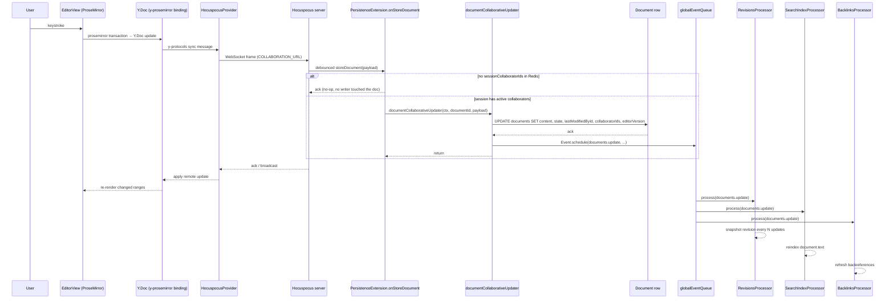

# Editor

Outline's editor is a [ProseMirror](https://prosemirror.net/) schema with a real-time collaboration layer built on [Y.js](https://yjs.dev/) and [Hocuspocus](https://tiptap.dev/docs/hocuspocus/introduction). The schema and its nodes, marks, and commands are defined in the `shared/editor/` package and consumed unchanged by both the React app (`app/editor/`) and the server (`server/editor/`). The editor mounts inside scenes via `app/scenes/Document/components/Editor.tsx` and `app/scenes/Document/components/MultiplayerEditor.tsx`. See [FRONTEND.md](FRONTEND.md) for the broader React/MobX context and [BACKEND.md](BACKEND.md) for the server side.

## Prerequisites

- **ProseMirror** schema, state, view, transactions, and plugins.
- **Y.js** CRDT and `Y.Doc` operations; awareness for presence.
- **Hocuspocus** provider, document state, and extensions (server + client).
- Familiarity with `prosemirror-model`, `prosemirror-state`, `prosemirror-view`, `prosemirror-keymap`, and `prosemirror-transform`.
- React 17 + class components (the host `Editor` in `app/editor/index.tsx` is a class), MobX 4 decorators.

## High-level architecture

The editor is a single shared ProseMirror schema assembled by an `ExtensionManager`. The React host (`Editor` in `app/editor/index.tsx`) mounts the view, owns the `EditorState`, and injects app-only behaviour (block menu, mention menu, smart-text, multiplayer, paste handler, etc.). Multiplayer is bolted on by `MultiplayerEditor.tsx`, which constructs a `HocuspocusProvider` + `IndexeddbPersistence` + `Y.Doc` and passes them to `Editor` via `props.extensions`. The server has its own `ExtensionManager` instances and the same schema, used by `server/models/helpers/ProsemirrorHelper.tsx` to convert between ProseMirror JSON, Y.js binary, HTML, and Markdown.

```
shared/editor
├── lib              # ExtensionManager, Extension, markdown serializer, helpers
├── marks            # Mark base + concrete mark classes
├── nodes            # Node base + ReactNode base + concrete node classes
├── extensions       # cross-cutting PM plugins (History, Math, Mermaid, …)
├── plugins          # standalone PM plugins (Upload, Placeholder, SuggestionsMenu, …)
├── components       # React NodeViews + hooks
├── embeds           # EmbedDescriptor + provider catalog
├── commands         # command factories
├── queries          # predicate helpers
├── rules            # markdown-it plugins for input parsing
├── selection        # ColumnSelection / RowSelection
└── styles           # CSS class-name constants

app/editor
├── index.tsx        # Editor React class (host)
├── extensions       # app-only PM extensions (BlockMenu, EmojiMenu, Multiplayer, …)
├── components       # toolbars, menus, link/image editors
└── menus            # per-node/per-block toolbar descriptors

server/editor
└── index.ts         # 3 ExtensionManagers + 3 Schemas (basic / rich / with-comments)
```

## Core abstractions

### Base classes

`Extension` (`shared/editor/lib/Extension.ts`) is the abstract base for everything that participates in the schema: it carries `type`, `name`, `plugins`, `rulePlugins`, `defaultOptions`, `widget`, `keys`, `inputRules`, `commands`, and `selectionToolbarMenus`. Subclasses set `type` to `"mark"`, `"node"`, or `"extension"`.

`Mark` (`shared/editor/marks/Mark.ts`) extends `Extension` with `type: "mark"` and adds a ProseMirror `MarkSpec` (`schema`), `markdownToken`, the `keys` / `inputRules` round-trip, and `toMarkdown` / `parseMarkdown`. The default `commands` proxy delegates to `toggleMark` so every mark gets a toggle command for free.

`Node` (`shared/editor/nodes/Node.ts`) extends `Extension` with `type: "node"`, a `NodeSpec`, and the same round-trip pair. `ReactNode` (`shared/editor/nodes/ReactNode.ts`) is a `Node` subclass whose `toDOM` returns React elements instead of DOM nodes; the NodeView machinery in `shared/editor/components/` renders them.

### ExtensionManager

`ExtensionManager` (`shared/editor/lib/ExtensionManager.ts`) is constructed with a list of `AnyExtensionClass | AnyExtension`. On construction it:

1. Filters out extensions whose `allowInReadOnly` is false when the editor is read-only (this is how `RevisionViewer` and `Public` documents avoid mounting the full `Multiplayer` and `PasteHandler` extensions).
2. Instantiates each extension, calls `bindEditor(editor)` so the extension can reach the host (used to resolve `editor.props.uploadFile`, `editor.props.dictionary`, etc.).
3. Collects every node spec, mark spec, plugin, keymap, input rule, command, and selection-toolbar menu into the assembled ProseMirror `Schema`.
4. Builds a `MarkdownSerializer` and `MarkdownParser` from the extensions' `toMarkdown` / `parseMarkdown` methods.
5. Wires `rulePlugins` (markdown-it plugins from `shared/editor/rules/`) into the parser via `makeRules` in `shared/editor/lib/markdown/rules.ts`.

The assembled `Schema` is the argument to `EditorState.create({ schema, plugins, doc })`. Because the schema is built from extensions, a single `EditorState` carries the entire feature set: marks, nodes, keymaps, input rules, plugins, and Markdown round-trip — all in one immutable value.

`ExtensionManager` is also the public surface for the package: there is no top-level `index.ts` exported from `shared/editor/`. Consumers import the assembled lists from `shared/editor/nodes/index.ts` and `shared/editor/marks/` / `shared/editor/extensions/` directly.

## Reference tables

The tables below enumerate the schema surface. Each row is one line. Concrete classes live in `shared/editor/marks/`, `shared/editor/nodes/`, and `shared/editor/extensions/`.

### Marks

| Name | Kind | Key attribute(s) |
| --- | --- | --- |
| Bold | mark | — |
| Italic | mark | — |
| Underline | mark | — |
| Strikethrough | mark | — |
| Code | mark | uses `prosemirror-codemark` fake cursor |
| Link | mark | `href` (sanitised by `sanitizeUrl`), `title`; `rel` = noopener/noreferrer/nofollow |
| Highlight | mark | `color` (preset or hex) |
| Comment | mark | `id`, `userId`, `resolved`, `draft` |
| Placeholder | mark | `title`; round-trips `!!token!!` template tokens |

### Nodes

| Name | Kind | Key attribute(s) |
| --- | --- | --- |
| Doc | node | root |
| Paragraph | node | — |
| Text | node | — |
| HardBreak | node | — |
| Heading | node | `level`, `offset`, `id` (anchor), fold decoration |
| Blockquote | node | — |
| BulletList | node | — |
| OrderedList | node | `order`; supports `alphaLists` (a/b/c lists) |
| ListItem | node | — |
| CheckboxList | node | — |
| CheckboxItem | node | `checked` |
| CodeBlock | node | `language` |
| CodeFence | node | `language`, `wrap`, `plain`; collapsible past 12 lines; Mermaid-aware |
| Table | node | — |
| TableHeader | node | `colwidth`, `background` |
| TableRow | node | — |
| TableCell | node | `colwidth`, `background`, alignment via col/row groups |
| Image | node | `src`, `alt`, `width`, `height`, `layout`; caption + lightbox |
| SimpleImage | node | inline image (`src`, `alt`) |
| Video | node | `src`, `width`, `height` |
| Attachment | node | `href`, `size`, `mimeType`, `documentId` |
| Embed | node | `href`, resolved via embed providers |
| Notice | node | `type` (info / success / tip / warning) |
| ToggleBlock | node | `expanded` |
| Math | node | inline, LaTeX string |
| MathBlock | node | block, LaTeX string |
| Mention | node | `type` (MentionType enum), `id`, `label`, `actorId`; auto-converts URLs |
| Emoji | node | `id`, `name`, `color`, `skin`, `native`, `src` |
| HorizontalRule | node | — |
| ReactNode | node | base for nodes that render via React NodeView |

### Cross-cutting extensions

The `shared/editor/extensions/` directory holds `Extension` subclasses that are neither marks nor nodes but contribute plugins / keymaps / input rules to the schema:

| Extension | Responsibility |
| --- | --- |
| History | Undo/redo (`prosemirror-history`). |
| TrailingNode | Ensures a paragraph at the end of the document. |
| MaxLength | Caps document size; emits `EditorUpdateError` past the limit. |
| InputRuleUndo | Allows input rules to participate in the undo stack. |
| DeleteNearAtom | Tweaks delete behaviour around atomic inline nodes. |
| DateTime | Inserts the current date/time when triggered. |
| HexColorPreview | Live-swatch preview for `#rrggbb` typed in the Highlight mark. |
| CodeHighlighting | Lazy-loaded `refractor` syntax highlighter for code blocks. |
| Math | `prosemirror-math` + KaTeX rendering. |
| Mermaid | LRU sessionStorage cache + lightbox + edit-on-Enter. |
| Diagrams | diagrams.net popup via `DiagramsNetClient`. |
| Diff | Renders revision diffs in the editor view. |

## App-side extensions

The `app/editor/extensions/` directory contains `Extension` subclasses that depend on the React app (MobX stores, hooks, app-only components) and so cannot live in the shared package. They are registered by the host `Editor` in `app/editor/index.tsx` rather than by the shared `ExtensionManager`.

| App-side extension | Responsibility |
| --- | --- |
| `BlockMenu` | Floating "+" menu that appears next to empty block boundaries; inserts headings, lists, code blocks, embeds, etc. |
| `ClipboardTextSerializer` | Overrides the default `text/plain` clipboard output with a Markdown render of the selection (so pasting elsewhere round-trips as Markdown). |
| `EmojiMenu` | The `:`-triggered emoji picker (separate from the `@` mention menu). |
| `FindAndReplace` | Cmd-F / Cmd-H floating bar with regex and case-sensitive options. |
| `HoverPreviews` | Link hover tooltips powered by `HoverPreview` components (document, mention, issue, etc.). |
| `Keys` | App-level keymaps (tab/shift-tab indent in lists, escape dismisses menus, etc.). |
| `MentionMenu` | The `@`-triggered mention menu; delegates to `SuggestionsMenuPlugin`. |
| `Multiplayer` | The Y.js / Hocuspocus binding on the client (pairs with the server-side `PersistenceExtension`). |
| `PasteHandler` | Classifies pastes (URL → embed, Markdown → parse, HTML → sanitise) and routes them. |
| `PreventTab` | Stops the browser from trapping Tab focus inside the editor. |
| `SelectionToolbar` | The floating formatting toolbar that appears above non-empty selections. |
| `SmartText` | Auto-replaces "..." → "…", straight quotes → curly quotes, etc. |
| `Suggestion` | Wires `SuggestionsMenuPlugin` triggers to the various menus (mention, slash, emoji). |
| `UpArrowAtStart` | Moves the cursor from the start of a block to the end of the previous block, matching Gmail-style up-arrow navigation. |

App-side menus (`app/editor/menus/`) hold the descriptors that the floating toolbars render for each block type (`attachment`, `block`, `code`, `formatting`, `image`, `notice`, `readOnly`, `table`, `tableCol`, `tableRow`, plus `mapMenuItems.ts` for shared helpers). The host aggregates them via `SelectionToolbar` / `BlockMenu`.

## Standalone plugins

Standalone plugins live in `shared/editor/plugins/`. They are not subclasses of `Extension`; they are plain ProseMirror `Plugin`s returned from an `Extension`'s `plugins` getter or registered directly by the host.

`UploadPlugin` intercepts paste and drop events, hands the file list to `editor.props.uploadFile`, and replaces any in-flight placeholder. It is the single entry point for inserting images, videos, and attachments from the user's clipboard or filesystem.

`PlaceholderPlugin` paints a "heading", "Write something…", or empty-list placeholder when the document is empty, driven by a `Map<nodeType, string>` of placeholder strings.

`SuggestionsMenuPlugin` is the unified suggestion engine behind `@`-mentions, `/`-slash commands, and emoji search. Each "trigger" registers a configuration (char, search regex, item renderer, keymap); the plugin owns the floating menu, keyboard navigation, and selection state.

`AnchorPlugin` turns plain paragraphs that look like `# heading` into real `Heading` nodes with stable anchors, and keeps the anchor stable across edits.

`TableLayoutPlugin` maintains a CSS-grid `TableLayout` description on the current table — column widths, alignment groups, row offsets — and re-renders the table when cells resize or merge.

`FixTablesPlugin` corrects malformed table edits (mis-merged cells, missing rows after backspace at the start of a cell) that would otherwise leave the schema in an invalid state.

`TableDragState` is a small store for the column/row drag gestures: it tracks the in-progress drag, the hit-test grid, and the resize handle under the cursor, and is consumed by `TableHeader` / `TableCell` NodeViews.

`CommentedImagePlugin` adds the comment-marker decoration to images whose `comment` attribute is set, so images can carry a comment without a wrapping `comment` mark.

`CodeWordDecorationsPlugin` decorates identifiers in code blocks with the highlighting classes produced by the `CodeHighlighting` extension.

## NodeView components

The `shared/editor/components/` directory holds the React NodeViews that the editor mounts in place of the default DOM nodes. Each one is a React component that receives `NodeViewProps` and renders a styled wrapper around the actual content.

`Caption` renders the editable caption beneath an image, attachment, or video.

`DateMentionPicker` is the date-picker popup used when inserting `@date` mentions.

`DiagramPlaceholder` is the in-editor stub shown while a diagrams.net diagram is being edited.

`DisabledEmbed` renders an unrecognised or blocked embed as a static link.

`Embed` is the resolver for embed providers: it picks an `EmbedDescriptor`, renders the provider's `component`, and falls back to a generic preview when none matches.

`FileExtension` is the small icon + filename strip rendered for `Attachment` nodes.

`Frame` is the generic bordered wrapper used by `Notice`, `ToggleBlock`, `CodeFence`, and other container nodes.

`Image` is the ReactNode wrapper around an `` that handles layout, sizing, lightbox, and the commented-image marker.

`Img` is the inner `` used inside embed previews; it centralises the invertable-dark-mode filter and rounded corners.

`Mentions` is the ReactNode for `Mention` nodes; it renders an `@`-prefixed link to the mentioned user, document, or group.

`PDF` renders an `Attachment` whose mime type is `application/pdf` using an inline PDF preview.

`ResizeHandle` is the small grab-handle rendered on images, videos, and embeds that lets the user resize the media directly.

`Styles` is a single 2800-line styled-components string containing every CSS class-name constant used by the editor; it is imported once by the editor host so styles ship in one chunk.

`Video` is the ReactNode for `Video` nodes; it renders an inline `<video>` element with poster, controls, and a resize handle.

`Widget` is the base class for floating, in-editor widgets (the suggestion menu, the link editor, the find-and-replace bar, the color picker).

`hooks/useDragResize` is the shared hook that wires `ResizeHandle` to the corresponding NodeView so drag-resize works uniformly across media nodes.

## Embeds

Embeds are configured by the `EmbedDescriptor` class (`shared/editor/embeds/index.tsx`). An `EmbedDescriptor` declares `id`, `icon`, `name`, `placeholder`, `shortcut`, `keywords`, `tooltip`, `defaultHidden`, `hideToolbar`, `matchOnInput`, `regexMatch`, `transformMatch`, `component`, `settings`, and `matcher`. The serializer consults `matcher` to detect when a pasted URL or typed shortcut should become an `Embed` node; the NodeView consults `component` to render the resolved embed.

The provider catalog lives next to `EmbedDescriptor`:

| Provider | Notes |
| --- | --- |
| YouTube | Standard YouTube URLs and shorts. |
| Vimeo | Vimeo share URLs. |
| Figma | Figma file and prototype URLs. |
| Spotify | Track / album / playlist URLs. |
| Trello | Card URLs. |
| JSFiddle | Fiddle URLs. |
| Dropbox Paper | Paper document URLs. |
| InVision | InVision prototype URLs. |
| Gist | GitHub Gist URLs. |
| GitLabSnippet | GitLab Snippet URLs. |
| Linkedin | LinkedIn post URLs. |
| Pinterest | Pin URLs. |
| Berrycast | Berrycast recording URLs. |
| PlantUml | `plantuml://` shortcut. |
| Diagrams | diagrams.net URL or `.drawio` shortcut. |
| Airtable, Bilibili, Camunda, Canva, Cawemo, ClickUp | additional providers registered from the catalog |

To register a new provider:

1. Add a new `EmbedDescriptor` instance to the inline `embeds` array in `shared/editor/embeds/index.tsx`. (Most providers live inline rather than in their own file; a small number of the most-used ones — YouTube, Vimeo, Figma, Spotify, Trello, JSFiddle, Dropbox Paper, InVision, Gist, GitLab Snippet, Linkedin, Pinterest, Berrycast, PlantUml, Diagrams — have separate `.tsx` files that are still imported into the same `embeds` array.)
2. Implement `component`, `regexMatch` (and optional `transformMatch`), and fill in `name` / `icon` / `placeholder`.
3. If the provider needs a server-side helper (e.g. an oEmbed fetch), register it in `server/utils/embeds.ts`.
4. If it should appear in the slash-menu, no extra step is needed — `SuggestionsMenuPlugin` walks the catalog.

## Commands

Commands live in `shared/editor/commands/`. Each is a factory that returns a `Command` (a `(state, dispatch?, view?) => boolean`). Five common entry points:

- `toggleMark(markType, attrs?)` — flips a mark on the current selection; the base for every `Mark.commands` default.
- `toggleList(listType, itemType, attrs?)` — converts the current block to a list, or lifts out of one.
- `toggleWrap(wrapType, attrs?)` — wraps or unwraps the current block in a single container (used by Notice, Blockquote, CodeBlock).
- `insertFiles(view, files, options?)` — inserts one or more files at the current selection, delegating to `UploadPlugin` and `editor.props.uploadFile`.
- `comment.addComment(attrs)` — appends a `comment` mark wrapping the current selection (or extends an existing one).

For the rest, see the `shared/editor/commands/` directory. The directory also contains `codeFence` (enter / newline / indent / outdent helpers), `table` (row / column add/remove, merge, export), `toggleBlock`, `collapseSelection`, `splitHeading`, `clearNodes`, `backspaceToParagraph`, `deleteEmptyFirstParagraph`, `link` (add / update / open / remove), and `selectAll`.

## Queries

Queries are predicate helpers — `(state) => boolean` or `(state) => T` — that components and commands call to decide what to render or do. They live in `shared/editor/queries/`. Five commonly used ones:

- `isMarkActive(state, markType, attrs?)` — true when the selection contains a mark.
- `isInList(state)` / `isListActive(state, listType)` — true when the cursor is inside a list.
- `isInCode(state)` — true when the cursor is inside a code block or fence.
- `findParentNode(predicate)` — walks up the document tree and returns the nearest matching ancestor `{node, pos}`.
- `getMarksBetween(from, to, state)` — enumerates the marks that overlap a range (used by the comment list to highlight ranges).

For the rest, see `shared/editor/queries/`. Notable entries include the `table` query set (column / row selection detection, cell enumeration, colour-set extraction), `getDocumentHighlightColors`, `findCollapsedNodes`, `findCutAfterHeading`, `findNewlines`, `findChildren`, `getCurrentBlock`, `getParentListItem`, `getMarkRange`, `isInHeading`, `isInNotice`, `isNodeActive`, `isPDFAttachment`, and the `toggleBlock` predicate.

## Markdown pipeline

The Markdown serializer is a fork of `prosemirror-markdown` (`shared/editor/lib/markdown/serializer.ts`). It adds two Outline-specific extensions:

- `serializeWithPositions` — emits an additional side-channel mapping ProseMirror positions to Markdown byte offsets so the editor can rebuild selection ranges after a paste-as-Markdown round trip.
- `BlockMapEntry` — the per-block entry inside the position map; carries the start offset, the end offset, and the block's depth so nested blocks can be addressed.

The serializer is consumed by the clipboard handler, the export pipeline, and the server-side markdown round trip. The header comment marks it as a fork ("forked for table support") and the file is annotated with `@ts-nocheck` and oxlint-disable because the upstream API surface is preserved.

`shared/editor/lib/markdown/normalize.ts` fixes up Markdown that the parser would otherwise reject — most commonly escaped list bullets and hard-break artefacts.

`shared/editor/lib/markdown/tableCell.ts` adds the table-cell tokeniser the upstream `prosemirror-markdown` lacks.

The vendored copy of `prosemirror-recreate-transform` lives in `shared/editor/lib/prosemirror-recreate-transform/`; the editor uses it to recreate decorations against a remote Y.js update (see `shared/editor/lib/multiplayer.ts`). The library is vendored rather than imported because the published version on npm is incompatible with `y-prosemirror`'s `RelativeSelection`; this is also patched in the `patches/y-prosemirror+*.patch` file referenced by `patch-package` in [DEVELOPMENT.md](DEVELOPMENT.md).

The Markdown round trip is also exercised by the import pipeline (the `importMarkdown` API endpoint and the `MarkdownAPI` import task — see [DATA_MODEL.md](DATA_MODEL.md)) and by the export pipeline (the `documents.export` endpoint streams Markdown to the browser). In both cases `server/models/helpers/ProsemirrorHelper.tsx` consumes the same shared pipeline, so a paste-as-Markdown in the editor and an import-as-Markdown through the API produce byte-identical results.

## Input rules

Input rules are markdown-it plugins used by the parser when the user types markdown-like text. They live in `shared/editor/rules/`. The set includes:

- `alphaLists` — `a.` / `b.` / `c.` ordered lists.
- `breaks` — GFM-style hard breaks.
- `checkboxes` — `- [ ]` and `- [x]` items.
- `emoji` — `:emoji_name:` tokens.
- `hardbreaks` — backslash hard breaks (alternative to `breaks`).
- `links` — auto-link `https?://…` text.
- `mark` — generic delimiter-pair plugin adapted from `markdown-it-mark`; the `Placeholder` mark instantiates it with `delim: "!!"` to round-trip `!!token!!` template tokens.
- `math` — `$ … $` and `$$ … $$` math.
- `mention` — `@user` and `@document-id` mentions.
- `notices` — `:::tip` / `:::warning` / `:::info` / `:::success` Notice blocks.
- `tables` — GFM pipe tables.
- `toggleBlocks` — `>>>` / `<<<` toggle-block fences.
- `underlines` — `__underline__` syntax.

Each rule is also a `MarkdownIt.PluginSimple`; `shared/editor/lib/markdown/rules.ts` (`makeRules`) instantiates markdown-it with the right options, disables rules the schema does not support (e.g. `list` when the schema lacks `ordered_list`), and registers the plugins.

## Selection subclasses

Two custom `Selection` subclasses ship with the editor:

- `ColumnSelection` (`shared/editor/selection/ColumnSelection.ts`) — selects every cell in a column of the current table.
- `RowSelection` (`shared/editor/selection/RowSelection.ts`) — selects every cell in a row of the current table.

Both are constructed by the `Table` NodeView on click-and-drag of the row/column grip. They carry enough metadata for `Selection`-aware plugins (toolbars, keymaps) to recognise them.

## Comments

Comments are not a node — they are a `comment` mark (`shared/editor/marks/Comment.ts`) that wraps the highlighted text. The mark carries four attributes:

- `id` — UUID of the comment.
- `userId` — the author of the original comment.
- `resolved` — boolean, true when the comment thread is closed.
- `draft` — boolean, true when the comment has been created locally but not yet persisted.

Two ways to create a comment:

- Keyboard: `Mod-Alt-m` (`shared/editor/marks/Comment.ts`) toggles a comment mark around the current selection.
- Mouse: the editor's mouseup handler in `app/editor/index.tsx` detects a selection that does not yet have a comment mark and emits the `onCreateCommentMark` callback. The host React tree passes that callback from `app/scenes/Document/components/Editor.tsx` (the *scene* component, not the host `Editor` class), which holds `handleDraftComment` and writes a draft `Comment` MobX model via the `CommentsStore`; the mark is then re-applied with the new `id`.

Clicking a comment mark fires `onClickCommentMark`; the host opens the comment thread in the sidebar (`app/scenes/Document/components/Comments/CommentThread.tsx`). The sidebar renders the thread via the `Comment` MobX model (`app/models/Comment.ts`), which lives in the `Comments` store.

## Collaborative edit sequence

The end-to-end path from a keystroke to a persisted change and back into other clients:



The persistence path is debounced on the Hocuspocus side (3 s default, 30 s timeout, see [SERVICES.md](SERVICES.md)) so rapid typing produces one BLOB write per debounce window rather than one per keystroke.

## Multiplayer

`app/scenes/Document/components/MultiplayerEditor.tsx` is the multiplayer-aware wrapper around `app/components/Editor.tsx`. It:

1. Constructs a `Y.Doc` and an `IndexeddbPersistence` for offline-first replay on page open.
2. Constructs a `HocuspocusProvider` against `env.COLLABORATION_URL` with the user's `collaborationToken`.
3. Reads `EDITOR_VERSION` from `shared/editor/version.ts`; if the server returns a different version in the close event (the `EditorUpdateError` code in `shared/collaboration/CloseEvents.ts`), the editor flips an `editorVersionBehind` state which is passed as `readOnly` to the editor. A banner asks the user to reload; the editor does not auto-reload.
4. Wires awareness for presence: each connected client publishes `{id, name, color}` updates (with `scrollY` from a scroll handler) that flow through `DocumentPresenceStore` in `app/stores/` and into the `AvatarWithPresence` ring in the header. There is no `editing` field on the awareness payload and no per-cell "X is editing" indicator — the only presence signal other clients see is the avatar and cursor.
5. Listens to `useIdle` and `usePageVisibility` and toggles a full `provider.disconnect()` when both `isIdle && !isVisible`; restores via `provider.connect()` once the tab is foregrounded or activity resumes. There is no heartbeat; the disconnect/connect is the idle behaviour.
6. Retries connection with backoff **only on the `AuthenticationFailed` close event** (codes listed below). Other close events surface the `ConnectionStatus` indicator and let the user decide.

| Code | Constant | Meaning |
| --- | --- | --- |
| 1009 | `DocumentTooLarge` | Server rejected a frame that exceeded the size limit. |
| 4401 | `AuthenticationFailed` | The collaboration token was missing, invalid, or expired. Triggers an exponential-backoff reconnect. |
| 4403 | `AuthorizationFailed` | The authenticated user is not permitted to view this document. |
| 4503 | `TooManyConnections` | Server-side connection limit reached for this document. |
| 4999 | `EditorUpdateError` | `EDITOR_VERSION` mismatch — editor goes read-only with a banner; the user reloads manually. |
| 4408 | `ConnectionTimeout` | Server timed out waiting for a request. |

`AsyncMultiplayerEditor.ts` wraps `MultiplayerEditor` so the React tree can `<Suspense>` on the multiplayer setup and render a skeleton until Y.js is ready.

The awareness payload exchanged between clients is `{id, name, color}` plus `scrollY`; the full awareness event shape is `AwarenessChangeEvent` in `app/types.ts`. The `Multiplayer` extension itself (`app/editor/extensions/Multiplayer.ts`) only registers `ySyncPlugin`, `yCursorPlugin`, `yUndoPlugin`, and a small `handleScrollToSelection` plugin.

## The host Editor class

`app/editor/index.tsx` is a ~1019-line `React.Component` named `Editor`. It is intentionally a class because it owns a `EditorView` instance as an instance field and needs to manage mount/unmount lifecycle for the ProseMirror view. It accepts a `Props` interface from `app/components/Editor.tsx` (the lazy-loaded wrapper) including `id`, `defaultValue`, `value`, `extensions`, `readOnly`, `uploadFile`, `onChange`, `onSave`, `onCreateCommentMark`, `onClickCommentMark`, `dictionary`, `theme`, `template`, `placeholder`, and a handful of display flags.

The lifecycle sequence is:

1. `componentDidMount` — calls `Editor.createView()` which constructs a `EditorState` from `defaultValue || value || emptyDoc`, instantiates an `ExtensionManager(props.extensions, this)`, then `new EditorView(this.ref, { state, ... })`. Plugins that need to interact with the host (`Multiplayer`, `FindAndReplace`) receive the editor instance via `bindEditor` during this step.
2. Re-renders — the `Editor` re-renders on every transaction via a MobX `observable` of the doc; `transaction` events call `setState({ state })` which forces a re-render of React-controlled overlays (toolbars, mention menu, selection toolbar) without touching the ProseMirror view.
3. `componentDidUpdate` — reconciles `props.value` against the current `state.doc`; if they differ, dispatches a replacement transaction. This is the path used by read-only views (revision diff, public share) where the doc arrives from props rather than from keystrokes.
4. `componentWillUnmount` — calls `view.destroy()` and disconnects the multiplayer provider, releasing the Y.js document handle and IndexedDB persistence listeners.

The editor is wired into `app/scenes/Document/components/Editor.tsx`, which assembles the final extension list (`richExtensions + withComments(richExtensions) + withUIExtensions`). The "ui" set is appended at scene mount and includes the app-only extensions listed in the App-side extensions section above.

## Server-side editor

`server/editor/index.ts` exports three `ExtensionManager` instances and three ProseMirror schemas whose variable names match the code exactly:

- `extensionManager` — wraps `withComments(richExtensions)`, i.e. the full schema with the `comment` mark.
- `basicExtensionManager` — wraps `basicExtensions` (inline + list, no tables, no comments).
- `commentExtensionManager` — wraps `[...basicExtensions, CodeBlock, CodeFence, Mention]`. Note: this is the schema for the **comment composer**, so it intentionally does *not* include the `comment` mark itself (a comment cannot contain another comment). The `comment` mark lives in `extensionManager`.

Emoji data is loaded from `@emoji-mart/data` (see `package.json`) at server boot so emoji tokens like `:rocket:` can be resolved to a URL during Markdown parsing without an extra round trip.

The bridge between ProseMirror and the rest of the server lives in `server/models/helpers/ProsemirrorHelper.tsx`:

- `toYDoc(document)` / `toProsemirrorJSON(yDoc)` — convert between the persisted Y.js `state` BLOB and ProseMirror JSON.
- `toMarkdown(document, options)` / `fromMarkdown(text, schema)` — Markdown round trip using the same `shared/editor/lib/markdown/*` pipeline.
- `toHTML(document, schema)` / `fromHTML(html, schema)` — HTML round trip for oEmbed previews and email rendering.
- `getSummary(document)` — extracts the plain-text summary used for the search index and unfurls.

`ProsemirrorHelper.tsx` is paired with `app/models/helpers/ProsemirrorHelper.ts`, the client twin. The two stay in lockstep — the editor schema is the single source of truth, and both helpers consume it.

The persistence side of collaboration lives in `server/collaboration/PersistenceExtension.ts`. Its `onStoreDocument` hook receives the debounced Y.js update from Hocuspocus, opens a transaction, and calls `documentCollaborativeUpdater` (in `server/commands/documentCollaborativeUpdater.ts`), which writes the merged `state` BLOB and emits the `documents.update` event that fans out to revisions, search index, and backlinks.

## Extension authoring guide

This is the highest-value section. To add a custom Node, Mark, or Extension:

### 1. Pick a base class and a folder

- Mark → `shared/editor/marks/<Name>.ts`
- Node → `shared/editor/nodes/<Name>.ts` (extend `Node` or `ReactNode` if `toDOM` returns React)
- Cross-cutting plugin → `shared/editor/extensions/<Name>.ts` (extend `Extension` directly)

### 2. Declare the schema spec

Marks implement `schema: MarkSpec`; nodes implement `schema: NodeSpec`. Keep `inline`, `group`, `content`, `marks`, `attrs`, and `parseDOM` / `toDOM` consistent with the rest of the schema. For `toDOM`, never set `href` or `src` from user-controlled data without `sanitizeUrl()`.

### 3. Implement the Markdown round trip

Override `toMarkdown(state, mark|node)` and `parseMarkdown` so the document survives a copy-paste-as-Markdown or export. The serializer + parser are wired by `ExtensionManager`; if you skip this step your mark / node will fail to round trip.

### 4. Add commands and queries

`commands: CommandFactory[]` — at minimum, a `toggleMark` for a mark or an `insertX` for a node.
`keys: Record<string, CommandFactory>` — keyboard shortcuts for the above.
`inputRules: InputRule[]` — typing patterns that auto-create your mark / node.
`selectionToolbarMenus: SelectionToolbarMenuDescriptor[]` — entries in the floating toolbar that appear when the selection is inside your node.

### 5. Wire React NodeView (optional)

If `toDOM` needs React, extend `ReactNode` (`shared/editor/nodes/ReactNode.ts`) instead of `Node`. ReactNode declares a single abstract `component` property of type `(props: Omit<ComponentProps, "theme">) => React.ReactElement`. Implement that property to point at the React NodeView from `shared/editor/components/<Name>.tsx` (for example `Image` extends `ReactNode` and assigns `component: ImageComponent`, which is `shared/editor/components/Image.tsx`). The editor host resolves the component via the ReactNode machinery when it builds the `NodeView`.

### 6. Register the extension

Three registration surfaces in `shared/editor/nodes/index.ts`:

- `inlineExtensions` — always present, even in inline-only editors.
- `listExtensions` — added by `basicExtensions` and `richExtensions`.
- `tableExtensions` — added only by `richExtensions`.
- `basicExtensions` — `inlineExtensions` + `listExtensions`. Used by simple editors (e.g. document titles, comments).
- `richExtensions` — the full surface for document bodies.

Push your class into the appropriate array, or pass it directly to a host via `props.extensions` (consumed in `app/editor/index.tsx`). The host applies the read-only filter from `ExtensionManager` so extensions with `allowInReadOnly = true` survive into render-only contexts.

### 7. Test

Add a `.test.ts` colocated with your new file. Vitest's `app` and `shared` projects both run editor tests; `shared/test/editor.ts` exports schema + editor factories shared between them.

### 8. i18n

Add any user-facing strings to the existing locale files (see [TRANSLATION.md](../TRANSLATION.md)). The editor host never calls `i18n.t` itself; NodeViews do.

## File map

Directories referenced by this document:

- `shared/editor/` — schema, base classes, nodes, marks, extensions, plugins, components, embeds, commands, queries, rules, selection, styles.
- `shared/editor/lib/` — `Extension`, `ExtensionManager`, Markdown pipeline (`lib/markdown/`), helpers, vendored `prosemirror-recreate-transform`.
- `shared/editor/lib/markdown/` — forked `prosemirror-markdown` serializer + parser + `normalize` + `tableCell`.
- `shared/editor/marks/` — concrete mark classes.
- `shared/editor/nodes/` — concrete node classes + registration (`index.ts`).
- `shared/editor/extensions/` — cross-cutting PM extensions.
- `shared/editor/plugins/` — standalone ProseMirror plugins.
- `shared/editor/components/` — React NodeViews, toolbars, `hooks/useDragResize`.
- `shared/editor/embeds/` — `EmbedDescriptor` and provider catalog.
- `shared/editor/commands/` — command factories.
- `shared/editor/queries/` — predicate helpers.
- `shared/editor/rules/` — markdown-it input-rule plugins.
- `shared/editor/selection/` — `ColumnSelection`, `RowSelection`.
- `shared/collaboration/` — `CloseEvents` (Hocuspocus close codes).
- `app/editor/` — React host (`index.tsx` — `Editor` class), app-only extensions, menus, components.
- `app/components/Editor.tsx` — lazy-loaded wrapper that exposes the host Editor to the scene tree.
- `app/scenes/Document/components/Editor.tsx` — scene-level wiring (`richExtensions + withComments + withUIExtensions`).
- `app/editor/extensions/` — app-side PM extensions (`BlockMenu`, `EmojiMenu`, `Multiplayer`, …) and per-block menus.
- `app/scenes/Document/components/` — `Editor.tsx`, `MultiplayerEditor.tsx`, `AsyncMultiplayerEditor.ts`, `Comments/`.
- `server/editor/` — server-side `ExtensionManager` + schemas (`index.ts`).
- `server/collaboration/` — Hocuspocus extensions, including `PersistenceExtension.ts`.
- `server/commands/documentCollaborativeUpdater.ts` — Yjs BLOB write + event emission.
- `server/models/helpers/ProsemirrorHelper.tsx` — PM ↔ Y.js ↔ HTML ↔ Markdown bridge.