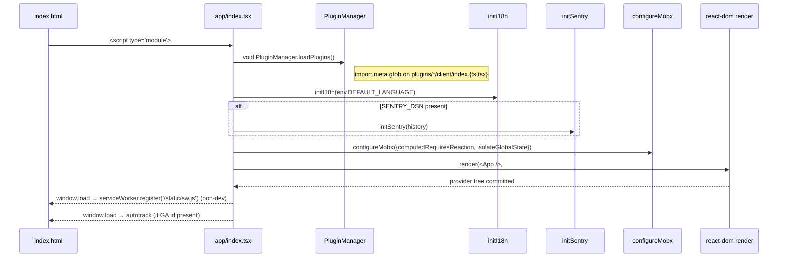

# Frontend

Outline's frontend is a React application compiled with [Vite](https://vitejs.dev/) (using [rolldown-vite](https://rolldown.rs/)). It uses [MobX](https://mobx.js.org/) for state management, [styled-components](https://www.styled-components.com/) for component styles, and lazy-loaded route chunks for code splitting. See [ARCHITECTURE.md](ARCHITECTURE.md) for the high-level folder map; this document describes the patterns and runtime behaviour inside `app/`.

## Prerequisites

- **React 17** with class and function components, hooks, and `Suspense`.
- **MobX 4** with legacy decorators (`@observable`, `@action`, `@computed`). `experimentalDecorators` and `emitDecoratorMetadata` are enabled in `tsconfig.json`.
- **react-router 5.3** (uses `history@4` directly, not the v6 data router).
- **styled-components 5** with the babel display-name plugin disabled in production.
- **react-i18next** plus `i18next-http-backend`, loading locale JSON files from `/locales/<lang>.json` via the configured `cdnPath`.
- Familiarity with Y.js / Hocuspocus for the multiplayer sections.

## Boot sequence

`app/index.tsx` is the single entry. The provider tree it renders is:

```
StrictMode
└── HelmetProvider
    └── Provider (mobx-react, rootStore={stores})
        └── Analytics
            └── Router (history={history})
                └── Theme (Radix Direction, light/dark/pitchBlack)
                    └── ActionContextProvider
                        └── ErrorBoundary (showTitle)
                            └── KBarProvider (actions=[])
                                └── LazyPolyfill
                                    └── LazyMotion (features={domMax})
                                        └── PageScroll
                                            ├── PageTheme
                                            └── ScrollToTop
                                                ├── Routes
                                                ├── Toasts (sonner)
                                                ├── Dialogs (Radix modal stack)
                                                ├── Presentation (full-screen overlays)
                                                └── Desktop (native shell bridge)
```



The two `window.addEventListener("load", …)` callbacks at the bottom of `app/index.tsx` are deferred until after first paint: the service worker registers at `/static/sw.js` with scope `/` (production only), and Google Analytics autotrack plugins (`outboundLinkTracker`, `urlChangeTracker`, `eventTracker`) load only if `GOOGLE_ANALYTICS_ID` is configured.

`PluginManager.loadPlugins()` runs before i18n and before render because plugin authors can register extra i18n namespaces and override component rendering; doing it earlier means plugin code never sees a half-initialised tree.

## Routing

Routing uses `react-router-dom` 5 with a singleton browser history from `app/utils/history.ts`. Three route files split the surface:

| File | Responsibility |
| --- | --- |
| `app/routes/index.tsx` | Top-level `<Switch>`; chooses between authenticated and unauthenticated trees based on `AuthStore`. |
| `app/routes/authenticated.tsx` | Authenticated app shell — wraps with `<Authenticated>` + layout components. |
| `app/routes/settings.tsx` | Settings sub-router mounted under the authenticated tree. |

Every scene is imported via `lazyWithRetry` (in `app/utils/lazyWithRetry.ts`) so that failed chunk loads retry once with a forced reload before propagating the error. Each scene route is wrapped by `ProfiledRoute` (`app/components/ProfiledRoute.ts`) which attaches a React profiler in development builds.

The `Authenticated` component (in `app/components/Authenticated.tsx`) gates the authenticated tree: it waits for `AuthStore.authenticated` to resolve, redirects to `/login` if not, and renders the surrounding layout. A `useLocation` effect re-evaluates the redirect on every navigation so a logout from any deep route lands on the login screen with the `?notice=session` query string.

### Code splitting and profiling

Every scene is wrapped in `<Suspense fallback={<LoadingIndicator />}>` and each scene import is routed through `lazyWithRetry` (`app/utils/lazyWithRetry.ts`). When a chunk fetch fails (typically a stale deployment on a long-lived tab), `lazyWithRetry` does one full reload and re-imports; only on second failure does the error propagate to `ErrorBoundary`. This is the user-visible "I left Outline open for two weeks and now it works again" behaviour.

`ProfiledRoute` (`app/components/ProfiledRoute.ts`) wraps a `Route` element in `React.Profiler` with id derived from the path. Profiles are submitted to Sentry as `ui.perf` breadcrumbs when `SENTRY_DSN` is configured; in development the same data is logged via the React DevTools profiler integration.

URL patterns broadly fall into:

- `/login`, `/logout`, `/share/*`, `/error/*` — unauthenticated.
- `/doc/:id`, `/doc/:id/*` — document + outline + share subtree; lazy-loads `Document` scene.
- `/collection/:id` — collection scene; renders the document tree and the active document if `?documentId=…`.
- `/search`, `/drafts`, `/trash`, `/archive`, `/home` — list scenes.
- `/settings/:tab?` — settings sub-router.
- `/developers`, `/desktop-redirect`, `/api-keys/new` — utility flows.

The URL → scene mapping is implemented in the route files themselves; this list is a high-level pointer, not a per-scene table. See `app/scenes/` for the full set.

## Stores

The store layer is in `app/stores/`. The base class lives at `app/stores/base/Store.ts` and is generic over the model type:

```ts
abstract class Store<T extends Model> {
  data: Map<string, T> = new Map();
  isFetching = false;
  isSaving = false;
  isLoaded = false;
  requests: Map<string, Promise<unknown>> = new Map();
  modelName: string;
  apiEndpoint: string;
  actions: RPCAction[];
  policies: { [key: string]: PolicyDescriptor };
  lifecycle: LifecycleManager;
  // ...
}
```

Stores talk to the backend via `ApiClient.request` using the JSON-RPC verb set `RPCAction.{Info, List, Create, Update, Delete, Count}`. In-flight requests are deduped by `${action}-${serializedArgs}` in the `requests` map so two components can ask for the same `Documents.list` and only one network call fires. Results are added to `data` keyed by the model's primary key.

Most stores follow a one-model pattern (`Documents` for `Document`, `Users` for `User`, and so on) and live alongside the model they wrap. The `Documents` store is the most complex; it owns computed collections (`all`, `recentlyViewed`, `recentlyUpdated`, `popular`, `drafts`, `archived`, `deleted`, `createdByUser`), backlink/similar fetches, and the lifecycle hooks for revisions and search indexing.

`RootStore` (`app/stores/RootStore.ts`) is a container that holds every concrete store and exposes `registerStore(name, store)` plus `getStoreForModelName(name)` so models and decorators can resolve stores by string name.

### Special stores

- **`AuthStore`** — the only store that persists across reloads. State is mirrored to `localStorage` under a versioned key and synchronised across tabs via the `storage` event. On boot it rehydrates the user, then validates the JWT against `/auth.config`. Unauthorized responses (`401` / `403 user_suspended`) trigger the logout flow and an i18n-keyed toast.
- **`UiStore`** — observable UI state: `theme` (`system` | `light` | `dark` | `pitchBlack`), sidebar collapse/expanded state, the top progress bar, `multiplayerStatus` (one of `connecting` | `connected` | `disconnected` | `offline`), and the `exportToasts` map.
- **`DialogsStore`** — a stack of modal descriptors; `Dialogs.tsx` reads the top of the stack and renders a Radix Modal. Drawers are pushed separately via `vaul` from the `primitives/Drawer` component.
- **`DocumentPresenceStore`** — Y.js awareness state per open document: user id, name, color, cursor range. Read by `AvatarWithPresence` to render the user list in the document header.

### Store lifecycle hooks

`LifecycleManager` is the small pub/sub on each store. Models register hooks via `@Lifecycle`; when a model method (`save`, `destroy`, `archive`, …) fires, the owning store invokes matching hooks across the model and its relations. The base `Store` also exposes:

- **`addPolicies(policies)`** — declares the policies this store's models participate in, contributing to the policy answer returned by `presentPolicies` server-side.
- **`fetchByQuery(query)`** — convenience used by `Searchable` stores; delegates to the search RPC and merges results into `data`.
- **`onDelete(model)`** / **`onArchive(model)`** — invoked by `ParanoidModel.destroy` and `ArchivableModel.archive` so related stores can clean up their own caches.

## Models

`app/models/base/Model.ts` defines the base `Model` class. Each instance is a MobX observable with `id`, `isSaving`, `isNew`, `createdAt`, `updatedAt`, and the dynamic fields returned by the API. Key methods:

- `updateData(partial)` — merges new fields and fires any matching lifecycle hooks.
- `loadRelations()` — resolves `@Relation` decorators into references to other models in their respective stores.
- `save()` — POSTs the diff to the create/update RPC verb and persists the result.

Specialised base classes extend this:

- `ParanoidModel` — adds soft-delete via `deletedAt`; `destroy()` becomes a tombstone.
- `ArchivableModel` — adds `archivedAt`; archives participate in the document lifecycle (`Document`, `Template`).
- `NavigableModel` — adds a `url` getter that points to the in-app location (`Share`, `UserMembership`, `GroupMembership`).

Decorators in `app/models/decorators/`:

- `@Field(name)` — whitelists a property for `toAPI()`. Without it, a property is treated as derived and is not sent on writes.
- `@Lifecycle({BeforeCreate, AfterCreate, BeforeUpdate, AfterUpdate, BeforeDelete, AfterDelete, …})` — registers callbacks on the model's `LifecycleManager`.
- `@Relation({ modelName, multiple, onDelete, onArchive })` — declares a relationship. `multiple: true` resolves to a list; `onDelete` controls cascade behaviour when the related row is removed; `onArchive` archives dependent rows with the parent.

The `Searchable` interface declares `findByQuery(query, options?)`; stores that own searchable entities (Documents, Collections) implement it on top of the search RPC.

### Lifecycle hooks

`@Lifecycle` is the only decorator that takes a multi-hook object. The keys match ProseMirror-style lifecycle names because the same shape is reused by editor extensions later:

- **Create**: `BeforeCreate`, `AfterCreate`
- **Update**: `BeforeUpdate`, `AfterUpdate`
- **Change** (any field touched): `BeforeChange`, `AfterChange`
- **Delete**: `BeforeDelete`, `AfterDelete`
- **Remove** (cascade via `@Relation(onDelete)`): `BeforeRemove`, `AfterRemove`
- **Archive** (`ArchivableModel` only): `BeforeArchive`, `AfterArchive`
- **Restore**: `BeforeRestore`, `AfterRestore`

Hooks run in declaration order; an exception in one aborts the operation and rolls back the surrounding `transaction` middleware on the server. Hooks receive `(model, context)` where `context` includes `{transaction, previous, changes, actorId, ip, authType}`. This is the same context the server-side `saveWithCtx` passes; keeping the shape aligned lets the same hook logic be invoked on both sides during SSR.

## Cross-cutting patterns

### Data fetching

Two layers cooperate:

1. **Stores** hold authoritative state and own the long-lived lists. Use them for anything that needs to survive a route change.
2. **Hooks** in `app/hooks/` add short-lived, component-scoped request state. Top patterns:

- **`useRequest(name, fn, deps?)`** — runs `fn` on mount and on `deps` change, returns `{data, error, loading, reload}`. Used for one-shot reads where you do not want to populate a store.
- **`usePaginatedRequest(name, fn, options?)`** — adds pagination state (`page`, `pageSize`, `hasMore`) and stitches pages into a flat list. Used by `PaginatedList` and `PaginatedDocumentList`.
- **`useTableRequest(name, fn, options?)`** — like `usePaginatedRequest` but exposes row-by-row fetching for `@tanstack/react-virtual` tables.
- **`useQuery(options?)`** — returns `{query, setQuery, updateQuery}` over the URL query string via `query-string`. Pair with `usePaginatedRequest` to drive list filters from the URL.
- **`useConsumeQueryParam(key)`** — a one-shot reader that pulls a single query param, unsubscribes immediately, and returns the value or `undefined`. Used for flash messages (`?notice=session`) and deep-link payloads.

The full set is in `app/hooks/` (grouped: stores/context, auth/identity, action context, document, layout/responsive, input/UI state, persistence, data fetching, routing/lifecycle, display).

### Error handling

Errors flow through three layers:

1. **`ApiClient.fetch`** maps HTTP status codes to typed errors (`AuthenticationError`, `AuthorizationError`, `ValidationError`, `RateLimitExceededError`, `EditorUpdateError`, etc.) defined in `app/utils/errors.ts`. Network failures throw a generic `NetworkError`.
2. **`<ErrorBoundary>`** (`app/components/ErrorBoundary.tsx`) catches React render errors, reports them to Sentry when configured, and renders the error scene with a copy-to-clipboard stack trace.
3. **Toasts** — user-visible feedback. `AuthStore` handles `401` and `403 user_suspended` directly (forces logout); everything else surfaces via `sonner` `<Toaster>` mounted at the root. Non-blocking, themed via `ui.resolvedTheme`.

Sentry initialisation is opt-in (`env.SENTRY_DSN`); `initSentry(history)` wires React Router navigations into Sentry breadcrumbs and tags releases with `SOURCE_VERSION`.

### Auth gating

`<Authenticated>` (`app/components/Authenticated.tsx`) is the single gate. While `AuthStore.authenticated` resolves it renders a loading shell; once resolved it either renders children or redirects to `/login`. Inside the authenticated tree, route components call `usePolicy` (`app/hooks/usePolicy.ts`) to check cancan-style policies returned by the backend via `presentPolicies`. Each policy is a function `(actor, target) => boolean | undefined`.

The `401` / `403` path: `ApiClient` raises an `UnauthorizedError`, `AuthStore` catches it, marks the user as logged out, and pushes a localized toast. The next render of `<Authenticated>` redirects to `/login`.

### Toasts and modals

- **Toasts** use [sonner](https://sonner.emilkowal.ski/) — themed via the resolved theme. The `<Toaster>` element lives at the root of the provider tree (see the boot-sequence diagram above); any module can emit a toast by calling `toast(...)` directly, since `sonner` exposes a singleton.
- **Modals** use Radix `Modal` driven by `DialogsStore.modalStack`. `Dialogs.tsx` reads the top of the stack. Multiple modals stack and the topmost traps focus; pressing `Escape` pops.
- **Drawers** use [vaul](https://vaul.emilkowal.ski/) (`app/components/primitives/Drawer.tsx`); they are pushed via `DialogsStore.openDrawer` rather than the modal stack because they need different focus and gesture handling.

### Command palette

The `kbar` provider is mounted at the root with `actions={[]}`. Populating it happens via `useCommandBarActions` hooks in `app/components/CommandBar/`, each one converting a slice of actions (registered through `app/actions/definitions/`) into kbar entries. Sections are defined in `app/actions/sections.ts` per domain (Navigation, Documents, Settings, Users, …); priority comes from the action's `section.priority`. `actionToKBar` converts an action descriptor to a kbar action shape; `performAction(action, context)` invokes it with the current `ActionContext`.

### Keyboard shortcuts

The router is the module-level `keydown` listener installed by `useKeyDown` (`app/hooks/useKeyDown.ts`). It walks a registry of shortcut descriptors and dispatches the matching action via `performAction`. The router is **IME-aware**: `event.isComposing` short-circuits dispatch so typing into a CJK IME never triggers global shortcuts. Each shortcut declares `allowInInput: boolean`; if `false` and the event target is a text input, the shortcut is skipped. The full table is rendered in `app/scenes/KeyboardShortcuts.tsx` (reached via `?` in the command palette).

Notable built-ins: `n` (new document), `e` (edit current), `t` or `/` (focus search), `.` (toggle sidebar), `mod+k` (command palette), `mod+shift+p` (presence menu), `mod+alt+m` (new comment).

### Virtualization

Two libraries, one per use case:

- **`react-window`** — `DocumentExplorer` (move/copy document tree) renders an `AutoSizer` + `FixedSizeList`.
- **`@tanstack/react-virtual`** — table-style lists (`useTableRequest`) and the document search results use `useVirtualizer` for variable-height rows.

### Drag and drop

- **`react-dnd`** — the document tree, sidebar, and notification reordering use `react-dnd` with an HTML5 backend. The HTML5 backend is wrapped by **`EditorAwareHTML5Backend`** which no-ops drops that land inside `.ProseMirror`; this prevents the editor from swallowing file drops intended for the surrounding app.
- **`@dnd-kit`** — `PinnedDocuments` and the Emoji picker's palette use `@dnd-kit` because it handles pointer + touch + keyboard reorder out of the box.

The DnD provider is mounted in `AuthenticatedLayout` so all authenticated scenes share a single context.

### Presence

`DocumentPresenceStore` reads from Y.js awareness via the `Multiplayer` ProseMirror plugin. Each participant pushes `{userId, name, color, cursor: {from, to}}`; the store emits a MobX change whenever any field updates. `AvatarWithPresence` consumes the store to render the cluster in the document header; the cursor colour is derived deterministically from the user id so the same user keeps the same colour across sessions.

### Real-time

The collaborative editor wires three pieces:

- **`HocuspocusProvider`** — connects to `COLLABORATION_URL` over WebSocket. Auth token from `AuthStore.collaborationToken`. Reconnect is exponential with a visibility-aware backoff.
- **`IndexeddbPersistence`** — caches the document Y.js document in `IndexedDB` so reloads show the last in-flight state while the server catches up.
- **`yjs`** + **`y-prosemirror`** — the actual CRDT. The host Y.Doc is created in `MultiplayerEditor` (`app/scenes/Document/components/MultiplayerEditor.tsx`), which also handles the `EDITOR_VERSION` handshake: if the version returned by the server differs from the bundled `EDITOR_VERSION`, the editor flips into read-only and renders a banner asking the user to reload — the editor itself does not auto-reload.

> The editor's multiplayer flow (Hocuspocus extensions on the server, `PersistenceExtension.onStoreDocument`, revision fan-out) is documented in [EDITOR.md](EDITOR.md).

### i18n

`initI18n(env.DEFAULT_LANGUAGE)` configures `i18next` with `i18next-http-backend` pointing at `${cdnPath}/locales/<lang>.json`. `cdnPath` is build-time injected so self-hosted installs can serve from their own origin, and cloud installs can pull from the Outline CDN. The supported language list (`languages`) and the per-language `languageOptions` (label, name, country code, RTL flag) are exported from `shared/i18n/index.ts`; the locale JSON files themselves live in `shared/i18n/locales/`.

RTL is driven by `isRTLLanguage(lang)`; `Theme` wraps the app in `<DirectionProvider dir={rtl ? "rtl" : "ltr"}>` from Radix so layout utilities that read `Direction` flip automatically.

The user's language is persisted in `UserPreference` and reapplied on every login via `AuthStore.fetch()` → `changeLanguage`.

### Theming

`shared/styles/theme.ts` defines three palettes via `buildLightTheme`, `buildDarkTheme`, and `buildPitchBlackTheme`. Each is a flat record of design tokens consumed by styled-components via `ThemeProvider`. The `system` mode reads `prefers-color-scheme` and reacts via `matchMedia` listeners installed in `Theme`. `UiStore.theme` (`system` | `light` | `dark` | `pitchBlack`) overrides the system preference; the resolved value lives at `UiStore.resolvedTheme` and is what the rest of the app reads.

Design tokens (colours, spacing scale, radii, depths, breakpoints) live in `shared/styles/` rather than `app/styles/` so the server-side rendering path can read them too.

### Iconography

Most icons come from [`outline-icons@^4`](https://www.npmjs.com/package/outline-icons), which exposes a flat set of typed icon components. App-specific SVGs (the Outline brand mark, `ArrowIcon`, `CollectionIcon`, `ConnectedIcon`, `GoogleIcon`, `LanguageIcon`, `MarkdownIcon`) live in `app/components/Icons/`.

The `IconPicker` (`app/components/IconPicker/`) lets users pick either an emoji (powered by `@emoji-mart/data` and `@emoji-mart/react`) or an icon, with a colour picker and skin-tone selector. Frequencies are persisted in `UserPreference`. Custom team emojis are owned by `Emoji` and `Emojis` and rendered via `shared/components/CustomEmoji`.

## Actions

`app/actions/` is the centralised action registry. Every action is a plain object built with `createAction` and consumed by menus, command bar entries, keyboard shortcuts, and buttons. The shape:

```ts
createAction({
  id: "documents.archive",
  name: t("Archive"),
  section: ActionSection.Document,
  shortcut: ["e", "d"],
  icon: <ArchiveIcon />,
  perform: ({ activeDocumentId, stores, t }) =>
    stores.documents.archive(activeDocumentId),
});
```

`useActionContext` (`app/hooks/useActionContext.tsx`) provides the context object passed to `perform`: `{activeDocumentId, activeCollectionId, currentUserId, currentTeamId, stores, t, location, sidebarContext, event, isMenu, isCommandBar, isButton, …}`. The `ActionContextProvider` mounted in the provider tree reads from `UiStore` and `AuthStore` and updates on every navigation so `activeDocumentId` is always current.

Conversions:

- **`actionToMenuItem(action, ctx)`** — turns an action into a DropdownMenu item.
- **`actionToKBar(action, ctx)`** — turns an action into a kbar action.
- **`performAction(action, ctx)`** — central dispatcher used by shortcut router, menu items, and kbar.

Definitions live in `app/actions/definitions/` grouped by domain (`documents.ts`, `collections.ts`, `users.ts`, `teams.ts`, `comments.ts`, `shares.ts`, `templates.ts`, `integrations.ts`, `oauthClients.ts`, `apiKeys.ts`, `revisions.ts`, `emojis.ts`, `notifications.ts`, `navigation.ts`, `developer.ts`, `settings.ts`). The `root*Actions` arrays in `app/actions/root.ts` aggregate them by domain for menus that want a flat list.

### Sections and priority

`app/actions/sections.ts` groups actions into kbar sections (`Navigation`, `Documents`, `Settings`, `Users`, `Teams`, `Collections`, `Comments`, `Templates`, `Integrations`, …). Each section declares:

- **`name`** — display name (i18n key).
- **`priority`** — kbar ordering weight (`Higher` | `High` | `Normal` | `Low` | `Lower`). Higher priority sections appear at the top of the palette.
- **`section`** — the section an action belongs to, declared via `createAction({section: ActionSection.Document, …})`.

The kbar provider at the root is mounted with `actions={[]}` because actions are populated lazily by `useCommandBarActions` hooks (`app/components/CommandBar/`). Each hook subscribes to a slice of stores and rebuilds the kbar action list whenever the slice changes, so the palette always reflects the current document, collection, and selection context.

### Visibility rules

Actions declare `visible: (ctx) => boolean` to hide themselves from menus, the command bar, and shortcut listings. Common patterns:

- `visible: ({activeDocumentId}) => !!activeDocumentId` — needs a document open.
- `visible: ({stores, currentUserId}) => stores.policies.allowed(currentUserId, "delete", Document)` — policy gate.
- `visible: ({sidebarContext}) => sidebarContext === "collection"` — only when a collection is the active sidebar context.

When `visible` returns `false` the action is omitted from the kbar results, the DropdownMenu items list, *and* the shortcut router skips it; this is what makes the keyboard shortcut help screen (`?`) always reflect what the user can actually do.

## Menus

`app/menus/` holds per-model dropdown definitions (the buttons that appear next to each document, collection, user, etc.). Each `use<X>MenuActions(target)` hook returns a list of actions filtered by policy and context; the DropdownMenu component then converts them via `actionToMenuItem`. The full set covers Account, ApiKey, Breadcrumb, Collection, Comment, Document, Emojis, FileOperation, Group, Import, NewChildDocument, NewDocument, NewTemplate, Notification, OAuthAuthentication, OAuthClient, Revision, Share, TableOfContents, Team, Template, Templates, and User.

Menus never call the API directly; they always go through actions. That single rule keeps keyboard shortcuts, command bar, and dropdowns in lockstep when behaviour changes.

## Hooks

Beyond the five patterns in *Data fetching*, the full hook list lives in `app/hooks/`. Useful adjacent hooks:

- **`useStores()`** — returns the `RootStore` from MobX context.
- **`usePolicy(action, target)`** — evaluates a cancan policy descriptor against the current user.
- **`useCurrentUser()`** / **`useCurrentTeam()`** — observable shorthands.
- **`useDragAndDrop()`** — sidebar drag context.
- **`useCollectionDocuments(collectionId)`** — collection tree fetch and mutation.
- **`useMeasure()`** — wraps `react-use-measure` for responsive components.

## Styles

`app/styles/` holds mixins (especially the desktop-specific offsets that account for the native title bar) and named animations (`fadeIn`, `fadeOut`, `fadeOutCursor`, `fadeAndScaleIn`, `fadeAndSlideDown`, `fadeAndSlideUp`, `fadeInAndSlideLeft`, `fadeOutAndSlideRight`, `mobileContextMenu`, `bounceIn`, `pulsate`, `pulse`, `bigPulse`). `sidebarAppearDuration = 600` (ms) is the canonical sidebar reveal duration — referenced from the layout and from E2E tests.

Design tokens (default colours, light/dark/pitchBlack builders, breakpoints, depths, globals) live in `shared/styles/`; do not redefine them in `app/styles/`.

## Utils

`app/utils/` holds cross-cutting helpers. Modules:

| Module | Purpose |
| --- | --- |
| `ApiClient` | Singleton JSON-RPC client; maps responses and errors. |
| `history` | Singleton browser history used by react-router 5. |
| `Logger` | Categorised logger (`lifecycle`, `network`, `editor`, …) writing to `console`. |
| `errors` | Custom error classes thrown by `ApiClient` and stores. |
| `sentry` | Optional Sentry init + breadcrumbs. |
| `files` | File download and upload helpers. |
| `compressImage` | Client-side image compression via `compressorjs`. |
| `emoji` | Emoji parsing, frequency tracking, shortcode resolution. |
| `mention` | Mention parsing and rendering helpers. |
| `PluginManager` | Client-side plugin registry; loads `plugins/*/client/index.{ts,tsx}` via `import.meta.glob`. |
| `Desktop` | Native shell bridge for the Electron build. |
| `Analytics` | GA event helpers + autotrack wiring. |
| `FeatureFlags` | Reads team + user feature flags. |
| `LazyLoad` / `lazyWithRetry` | Lazy component loader with chunk-failure retry (`app/utils/lazyWithRetry.ts`). |
| `developer` | Dev-mode diagnostics overlay. |
| `pageVisibility` | Visibility / focus events. |
| `polyfills` | Polyfill loader exposed via `<LazyPolyfill>`. |
| `viewTransition` | View Transitions API wrapper for route changes. |
| `autotrack.js` | GA autotrack plugins. |
| `__mocks__/` | Vitest manual mocks. |

## Plugins

The client `PluginManager` (`app/utils/PluginManager.ts`) discovers plugins via `import.meta.glob("../../plugins/*/client/index.{ts,tsx,js,jsx}")` invoked from `app/index.tsx` *before* i18n init. Each module exports a `PluginClient` shape with three optional hooks:

- `Settings` — declarative settings UI injected into the team or user settings pages.
- `Imports` — alternate import providers (Notion, Confluence, …) the user can pick from.
- `Icon` — icon components the IconPicker exposes alongside the built-in set.

`PluginManager` gates registration on the manifest's `deployments: ["cloud" | "community" | "enterprise"]` against `isCloudHosted()`. Components consume plugin values via the `usePluginValue<T>(type, id)` hook exported from `app/utils/PluginManager.ts`; it returns the registered component for the given (hook, id) pair or `null`.

Server-side plugins (Hook.API, Hook.AuthProvider, Hook.Processor, etc.) live in `server/utils/PluginManager.ts` and are out of scope for this doc — see [BACKEND.md](BACKEND.md) and [PLUGINS.md](PLUGINS.md).

## Editor host

The editor is rendered from two scenes:

- **`app/scenes/Document/components/Editor.tsx`** — single-player mode. Lazy-loads the `Editor` host through `app/components/Editor.tsx`, assembles `richExtensions + withComments + withUIExtensions`, and reads `Document` from the store. Used for search-result previews and the read-only outline view.
- **`app/scenes/Document/components/MultiplayerEditor.tsx`** — collaborative mode. Adds `HocuspocusProvider`, `IndexeddbPersistence`, and the multiplayer ProseMirror plugin. `AsyncMultiplayerEditor` waits for the Y.Doc to sync before mounting the React editor so the user never sees an empty flash. Reconnection is full `provider.disconnect()` when the tab is hidden and the user is idle, and `provider.connect()` when the tab is foregrounded or activity resumes; a separate exponential-backoff retry fires only on the `AuthenticationFailed` close event. See [EDITOR.md](EDITOR.md) for the full multiplayer flow.

App-side editor extensions live in `app/editor/extensions/` (BlockMenu, ClipboardTextSerializer, EmojiMenu, FindAndReplace, HoverPreviews, Keys, MentionMenu, Multiplayer, PasteHandler, PreventTab, SelectionToolbar, SmartText, Suggestion, UpArrowAtStart). App-side menus live in `app/editor/menus/` (attachment, block, code, formatting, image, notice, readOnly, table, tableCol, tableRow, plus the `mapMenuItems` helper). The `Editor` React class itself is in `app/editor/index.tsx`.

> The shared ProseMirror schema (nodes, marks, commands, queries, embed providers) and the multiplayer flow are documented in [EDITOR.md](EDITOR.md).

## Test setup

Vitest is configured in `vitest.config.ts` with four projects (`app`, `server`, `shared-node`, `shared-jsdom`). The frontend project uses `jsdom` and runs from `app/test/setup.ts`, which:

1. Imports `reflect-metadata` so decorator metadata is populated.
2. Mocks `app/utils/ApiClient` so stores never hit the network during tests.
3. Replaces `globalThis.localStorage` with an in-memory implementation.
4. Calls `initI18n("en_US")` and awaits the initial translation fetch.

Tests are colocated with the code they cover (`Component.test.tsx`, `util.test.ts`). Run a single file with `yarn test path/to/file.test.ts`; the `test:app` script runs the entire app project.

## SSR and the app shell

The Koa server renders a small HTML shell for every non-API route via `server/routes/app.ts`. The shell includes:

- A `<link rel="manifest">` and the PWA `registerServiceWorker` script (production only).
- `<meta>` tags derived from `presentEnv()` (e.g. CSP nonces, theme colour, OG defaults).
- The critical CSS extracted at build time so the first paint matches the resolved theme.
- The `<div id="root">` mount point and the hashed JS bundle from `build/app/assets/`.

The frontend handles SSR-hydrated data through `window.__INITIAL_DATA__`, populated by the server using the same `presenters` that the JSON-RPC API returns. The `Document` and `Share` scenes read from this object during the first render, then defer to stores for subsequent updates. Hydration mismatches are caught by React and reported via `Logger` at `warn` level — they do not throw, so a stale server render does not break the page.

The share route (`/share/:id`) uses the same SSR path but renders a stripped-down shell without the chrome (no sidebar, no command bar). It still lazy-loads the editor and reads `PRESENTATION_VIEW` from `useLocation()` to disable collaborative extensions.

## Real-time updates beyond the editor

The `WebsocketProvider` (`app/components/WebsocketProvider.tsx`) opens a Socket.IO connection to `/realtime` and joins the team / user rooms computed from `AuthStore`. It is mounted inside `AuthenticatedLayout` so every authenticated scene benefits from server-pushed events without re-subscribing.

Server-side events from `websocketQueue` (see `BACKEND.md`) are translated into MobX store mutations:

- **Documents**: `documents.update` / `documents.delete` refresh the affected document in `DocumentsStore.data` and notify the active scene via a toast if the user is on the document when it's edited.
- **Comments**: new comments push into `CommentsStore` and bubble up to the comment sidebar in the document scene.
- **Notifications**: appended to `NotificationsStore`; the header bell (`NotificationsPopover`) reads MobX directly, so an event arriving while the popover is open animates the new entry in.
- **Presence** (for non-editor surfaces, e.g. who is viewing a collection): `DocumentPresenceStore` also receives these pings, although the editor's Y.js awareness remains the source of truth for in-document cursors.

The connection status is reflected in `UiStore.multiplayerStatus`; a red dot in the sidebar header indicates disconnection, with a tooltip suggesting a page refresh if reconnection fails.

## Sidebar and primary navigation

The sidebar (`app/components/Sidebar/`) is the primary navigation surface for authenticated users. Three variants render under the same component:

- **`App`** — workspace sidebar: team switcher, drafts, recently viewed, all collections, pinned documents.
- **`Shared`** — flattened shared-document tree, used on the public share view.
- **`Settings`** — settings sub-navigation: account, workspace, members, groups, integrations, etc.

`useCollectionDocuments(collectionId)` (`app/components/Sidebar/hooks/`) fetches the children of a collection and exposes `{nodes, isLoading, fetchChild, reorder}`; `useDragAndDrop` (`app/components/Sidebar/hooks/useDragAndDrop.tsx`) wires react-dnd for the drag-to-reorder and drag-to-move flows. Drop targets render their own disclosure state (`DropCursor`, `DropToImport`) so the user always sees where a dragged document will land.

The sidebar collapse state is in `UiStore.sidebarCollapsed`; the toggle is bound to the `.` shortcut and the bottom-corner chevron. Width is animated via `sidebarAppearDuration` from `app/styles/animations.ts` (see *Styles* below).

## Notifications

Notifications live in `NotificationsStore` and are rendered through the `Notifications` component cluster:

- **`NotificationsPopover`** — the header bell. MobX-observed; opens via click or the `g` `n` shortcut sequence.
- **`NotificationsListItem`** — per-row renderer with read/unread state and an inline `AccessRequestActions` for access-request notifications.
- **`NotificationIcon`** — type→icon mapping (`mention`, `document`, `comment`, `approval`, `access_request`).

Marking a notification as read fires a `notifications.update` RPC; the server emits `notifications.update` over the websocket so other tabs (and the server-side `NotificationProcessor`) stay in sync without a refetch.

## Avatar and presence

`Avatar` (`app/components/Avatar/Avatar.tsx`) is the rendering primitive. It has `Size` and `Variant` enums (`Size.Small` | `Medium` | `Large` | `XL`; `Variant.User` | `Group` | `Document` | `Custom`) and resolves to the right subcomponent (`User` → initials/photo, `Group` → `GroupAvatar`, `Document` → emoji/icon, `Custom` → uploaded image).

`AvatarWithPresence` wraps `Avatar` with a small status dot driven by `DocumentPresenceStore`; the colour is computed deterministically from the user id so the same user keeps the same colour across sessions and tabs.

## Env and configuration

`app/env.ts` (read in `app/index.tsx`) is a typed re-export of the runtime environment. Build-time values come from `vite.config.ts` (`define`, environment variables prefixed with `VITE_`), while runtime values come from `window.env` (populated by the SSR shell via `presentEnv()` from `@Public`-decorated env vars).

Critical values the frontend reads:

| Env var | Source | Use |
| --- | --- | --- |
| `DEFAULT_LANGUAGE` | build | i18n init language. |
| `SENTRY_DSN` | runtime | Enables Sentry; otherwise `initSentry` is skipped. |
| `CDN_URL` | build | Prefix for `/locales/*.json` and static assets. |
| `COLLABORATION_URL` | runtime | WebSocket endpoint for `HocuspocusProvider`. |
| `GOOGLE_ANALYTICS_ID` | runtime | If set, autotrack plugins load on `window.load`. |
| `ENVIRONMENT` | build | `"development"` disables service worker registration. |
| `FEATURE_FLAGS` | runtime | JSON blob of remote feature toggles consumed by `FeatureFlags.ts`. |

The frontend never reads `process.env` directly outside `app/env.ts`; everything goes through that module so values are traceable and SSR-safe.

## Analytics

Analytics is split between:

- **`Analytics.tsx`** (`app/utils/Analytics.ts`) — a thin React context provider plus typed helpers (`trackEvent(category, action, label?)`, `identify(userId, traits)`). It writes to `window.ga` when GA is configured and to a debug sink in development.
- **`autotrack.js`** (`app/utils/autotrack.js`) — loaded on `window.load` *only* when `GOOGLE_ANALYTICS_ID` and `window.ga` are both present. Registers `outboundLinkTracker`, `urlChangeTracker`, and `eventTracker` (with `data-` attribute prefix).

Because `Analytics` is high in the provider tree, every page view and authenticated event is automatically tagged with the current route via the `urlChangeTracker`. Custom events use the `data-event-category="…"`, `data-event-action="…"`, `data-event-label="…"` attributes — the autotrack plugin reads these.

## File map

| Directory | What lives there |
| --- | --- |
| `app/` | Frontend source. |
| `app/actions/` | Reusable action descriptors (createAction family, sections, definitions/). |
| `app/components/` | Reusable React components and the primitives layer. |
| `app/editor/` | App-side editor host (`Editor` class) and scene wiring (`MultiplayerEditor`). |
| `app/hooks/` | Reusable React hooks. |
| `app/menus/` | Per-model dropdown definitions. |
| `app/models/` | MobX observable models and decorators. |
| `app/routes/` | React Router 5 route files. |
| `app/scenes/` | Full-page views (one folder per major scene). |
| `app/stores/` | Store classes (base + per-model + special). |
| `app/styles/` | Mixins and named animations. |
| `app/test/` | Vitest setup for the frontend project. |
| `app/utils/` | Cross-cutting helpers (ApiClient, history, PluginManager, …). |
| `shared/` | Code shared between app and server (components, editor, i18n, styles, utils). |
| `shared/i18n/` | Language list, RTL helpers, locale JSON files. |
| `shared/styles/` | Design tokens (light/dark/pitchBlack, breakpoints, depths). |