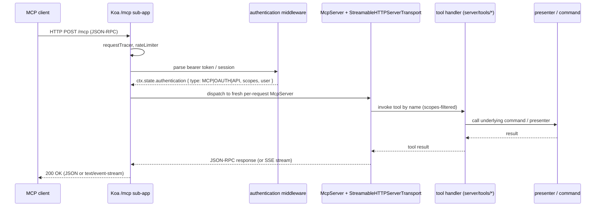

# MCP

The Outline MCP server is a first-class HTTP subsystem that exposes Outline documents, collections, comments, templates, users, attachments, and a generic URL fetch to [Model Context Protocol](https://modelcontextprotocol.io) clients. It is **not** a plugin — see [`PLUGINS.md`](PLUGINS.md) for what "plugin" means here, and the deep-dive on plugin registration in `server/utils/PluginManager.ts`.

This doc covers the MCP request surface, the seven tools, the OAuth 2.1 + PKCE flow used by clients to obtain scoped access, and the supporting files.

## Prerequisites

Familiarity with:

- The [Model Context Protocol](https://modelcontextprotocol.io) — clients, servers, tools, transports.
- OAuth 2.1 with PKCE, including the authorization-code flow with public clients, refresh tokens, and Dynamic Client Registration (DCR).
- The Koa middleware model and the Outline authentication pipeline (see [`BACKEND.md`](BACKEND.md)).
- The Outline security model for cookie/JWT/session concerns and PKCE mechanics (see [`SECURITY_MODEL.md`](SECURITY_MODEL.md)).

## Architecture

The MCP server is mounted as a standard Koa sub-app at `/mcp` inside the `web` service, alongside `/api`, `/auth`, `/oauth`, and the SSR routes. See [`server/services/web.ts`](../../server/services/web.ts) for the full mount table.

Each MCP request is handled by a fresh `McpServer` instance from `@modelcontextprotocol/sdk/server/mcp.js`, bound to a per-request `StreamableHTTPServerTransport` from `@modelcontextprotocol/sdk/server/streamableHttp.js`. The transport is constructed with `sessionIdGenerator: undefined`, so the server is **stateless** — no session ID is issued or stored, no per-session buffer is kept, and horizontal scaling drops in without sticky sessions. Koa passes the raw response through (`ctx.respond = false`) and `transport.handleRequest(ctx.req, ctx.res, ctx.request.body)` answers the request directly.

The entry point is [`server/routes/mcp/index.ts`](../../server/routes/mcp/index.ts). Per request, the route:

1. Throttles via `rateLimiter(RateLimiterStrategy.OneThousandPerHour)` (see [`server/middlewares/rateLimiter.ts`](../../server/middlewares/rateLimiter.ts)).
2. Authenticates via the standard auth middleware, accepting `AuthenticationType.{MCP, OAUTH, API}` only.
3. Gates on `user.team.getPreference(TeamPreference.MCP)` — a team-level off-switch. Returns `NotFoundError` when disabled.
4. Sets `UserFlag.MCP` on the user (with `hooks: false` so lifecycle hooks skip) as a "last used MCP" marker.
5. Builds a fresh `McpServer` via `createMcpServer(scopes, guidance?)`, attaches `extra.authInfo = {token, clientId, scopes, extra: {user, scope, ip}}`, and dispatches to the transport.

Tool implementations live as siblings under [`server/tools/`](../../server/tools/) (one file per tool):

- `attachments.ts`, `collections.ts`, `comments.ts`, `documents.ts`, `fetch.ts`, `templates.ts`, `users.ts`.
- `util.ts` holds shared helpers and the telemetry wrapper tagged `outline-mcp` for Sentry.

Each tool file exports a `xxxTools(server: McpServer, scopes: string[])` (or `fetchTool` for the singleton) function that registers the tool on the server only when its scope is present. Input is validated with Zod; policies are enforced via `authorize` / `can`; writes go through the same commands as the REST API (`documentCreator`, `documentUpdater`, `documentMover`, etc.); results are passed through the matching presenter (`presentDocument`, `presentCollection`, `presentUser`, etc.). The `documents` tool alone is the largest, clocking in at ~780 lines for eight operations.

## Request flow

## Authentication

`/mcp` accepts three `AuthenticationType` values (from [`server/types.ts`](../../server/types.ts)):

- `AuthenticationType.MCP` — internal calls made by the Outline server itself.
- `AuthenticationType.OAUTH` — bearer tokens issued by the Outline OAuth server (`server/routes/oauth/`).
- `AuthenticationType.API` — API keys issued by the in-app developer settings.

OAuth tokens and API keys are path-restricted: [`server/models/oauth/OAuthAuthentication.ts`](../../server/models/oauth/OAuthAuthentication.ts) and [`server/models/ApiKey.ts`](../../server/models/ApiKey.ts) both explicitly allow the `/mcp` path. CSRF is skipped on these transports — see [`SECURITY_MODEL.md`](SECURITY_MODEL.md) for the full set of request defences.

Per-request scope filtering happens inside `createMcpServer(scopes, guidance?)`: only tools whose scopes are present on the bearer token are registered with that `McpServer` instance.

## Discovery

Two well-known documents are served for MCP clients, both gated by `TeamPreference.MCP` (default `true`; declared in [`shared/constants.ts`](../../shared/constants.ts) under `TeamPreferenceDefaults`):

- `/.well-known/oauth-authorization-server/mcp` — the OAuth 2.1 authorization server metadata (RFC 8414).
- `/.well-known/oauth-protected-resource/mcp` — the protected-resource metadata describing the scopes required to talk to `/mcp` (RFC 9728).

If `TeamPreference.MCP` is `false` for a workspace, the `/.well-known/oauth-protected-resource/mcp` endpoint returns `404`. The `/.well-known/oauth-authorization-server/mcp` endpoint still returns metadata but omits `registration_endpoint`, which causes most MCP clients to fall back to a manual configuration.

## Tools

Seven tools are exposed. Each is implemented in [`server/tools/`](../../server/tools/) and registered on `createMcpServer` only when the matching OAuth scope is present on the bearer token. The OAuth server advertises its supported scopes (`["read", "write"]`) in the well-known metadata at `/.well-known/oauth-authorization-server/mcp`, and each tool factory gates registration on the appropriate scope.

### `documents`

The largest tool surface. Implements `list`, `get`, `search`, `create`, `update`, `delete`, `publish`, and `move`. Reads and writes go through the same `documentCreator` / `documentUpdater` / `documentMover` commands used by the REST API; results are formatted with `presentDocument`. `create` and `update` accept a `templateId` parameter that pre-fills the body from a template (see the `defaultInstructions` text in `server/routes/mcp/index.ts`). The tool's own `defaultInstructions` also tells clients to omit a top-level H1 from `text` — the document title is a separate field.

### `collections`

`list`, `get`, `create`, `update`, `delete`. Operations are scoped to the team of the bearer token. `create` and `update` accept name, description, color, icon, and permission enum; reads and writes go through the `Collection` model's standard lifecycle (policies applied via `authorize` / `can`, results returned through `presentCollection`). There is no dedicated collection command module — collection CRUD lives alongside other lightweight model operations.

### `comments`

`list`, `get`, `create`, `update`, `delete`, `resolve`. Comments are anchored to a document via the ProseMirror `comment` mark (see [`EDITOR.md`](EDITOR.md) for the mark spec). The `resolve` action flips the mark's `resolved` attribute without removing it.

### `templates`

`list`, `get`, `create`. Templates are an `ArchivableModel` variant of Document; the tool exposes only the template-specific subset (name, body, scope).

### `users`

`list`, `get`, `me`. `me` returns the authenticated user; `list` and `get` are scoped to the team. Output goes through `presentUser`.

### `attachments`

`create` from URL. Fetches the resource over HTTP using the SSRF-protected `fetch` utility (vendored `request-filtering-agent@3.2.0`; see [`SECURITY_MODEL.md`](SECURITY_MODEL.md) for the threat model) and creates an `Attachment` row tied to the target document.

### `fetch`

Generic URL fetch used by clients to read external content and to download attachments via signed URLs. Output is returned as a resource the client can ingest. All requests go through the same SSRF protection as `attachments`.

## OAuth flow for MCP clients

MCP clients are public OAuth 2.1 clients. The flow:

1. The client discovers endpoints from `/.well-known/oauth-authorization-server/mcp`. If the workspace has `TeamPreference.MCP` enabled, the document advertises the authorization and token endpoints plus supported PKCE methods.
2. If the client doesn't yet have a `client_id`, it registers via Dynamic Client Registration (RFC 7591) against the server's registration endpoint. MCP clients are typically public, but the server advertises both `client_secret_post` and `none` (`token_endpoint_auth_methods_supported`), so confidential clients are also supported.
3. The client opens a browser to the authorization endpoint with a PKCE code challenge (RFC 7636) and requests the scopes it needs.
4. Outline renders the consent screen at [`app/scenes/Login/OAuthAuthorize.tsx`](../../app/scenes/Login/OAuthAuthorize.tsx). On approval the OAuth server issues an authorization code and redirects back to the client.
5. The client exchanges the code at the token endpoint for an access token + refresh token. PKCE is enforced server-side; the access token is bound to the granted scopes and used as the bearer on `/mcp`.
6. The token row is persisted in `OAuthAuthentication` (see [`server/models/oauth/OAuthAuthentication.ts`](../../server/models/oauth/OAuthAuthentication.ts)); refresh rotates it.

The bearer token is then presented on every `/mcp` request and gates which of the seven tools is visible to that client. For a deeper treatment of PKCE, rotation, and the request defences layered on top of this transport, see [`SECURITY_MODEL.md`](SECURITY_MODEL.md). The OAuth server itself is documented in [`BACKEND.md`](BACKEND.md).

## Client settings and developer surface

The web client exposes MCP in two places:

- [`app/scenes/Settings/Features.tsx`](../../app/scenes/Settings/Features.tsx) renders the workspace's MCP endpoint URL and any per-workspace guidance appended to `defaultInstructions`.
- [`app/scenes/Login/OAuthAuthorize.tsx`](../../app/scenes/Login/OAuthAuthorize.tsx) is the consent page that completes the OAuth dance from step 3 above.

## Reserved domain

`mcp` is a reserved share domain — see [`shared/utils/domains.ts`](../../shared/utils/domains.ts). This prevents workspace URLs like `mcp.outline.com` from being claimed as a share slug and matches the namespace the OAuth and protected-resource metadata live under.

## Observability

The MCP server logs and reports errors under the Sentry service tag `outline-mcp`, so MCP-only errors can be filtered separately from the main `outline` service in Sentry's issue stream. The wrapper in [`server/tools/util.ts`](../../server/tools/util.ts) sets the tag at the start of every tool invocation. Client-side 4xx conditions (bad `Accept` header, malformed JSON-RPC) are answered by the SDK transport and logged at `warn` level so they don't pollute Sentry's issue stream; only unexpected 5xx-class failures are reported.

## Operational notes

- **Per-team gate.** `TeamPreference.MCP` (default `true`) is the master switch. Set to `false` in the workspace preferences to hide the well-known documents and make `/mcp` return `NotFoundError`.
- **Per-workspace guidance.** A workspace can append custom guidance to `defaultInstructions` via the `guidanceMCP` field on the team. The merged text is sent as the MCP server's `instructions`, which most clients surface to the model.
- **Rate limiting.** The route is throttled at 1,000 requests per hour per actor (see `RateLimiterStrategy.OneThousandPerHour`). The default per-route limiter in [`server/middlewares/rateLimiter.ts`](../../server/middlewares/rateLimiter.ts) and `RATE_LIMITER_MULTIPLIER` apply.
- **Adding a tool.** Add a new file under [`server/tools/`](../../server/tools/), export a `xxxTools(server, scopes)` function, and call it from `createMcpServer` in `server/routes/mcp/index.ts`. Mirror the existing pattern: Zod input schema, policy check via `authorize` / `can`, presenter for output.
- **Disabling tools per client.** Each `xxxTools(server, scopes)` factory gates registration on a specific scope in the bearer's `scopes` array, so a client with a narrower grant sees a smaller tool surface.

## File map

- [`server/routes/mcp/`](../../server/routes/mcp) — the `/mcp` Koa sub-app, transport, and per-request `McpServer` factory.
- [`server/tools/`](../../server/tools) — the seven tool implementations plus `util.ts`.
- [`server/services/web.ts`](../../server/services/web.ts) — mounts the MCP sub-app at `/mcp`.
- [`server/middlewares/authentication.ts`](../../server/middlewares/authentication.ts) — accepts `AuthenticationType.{MCP, OAUTH, API}`.
- [`server/middlewares/rateLimiter.ts`](../../server/middlewares/rateLimiter.ts) and [`server/utils/RateLimiter.ts`](../../server/utils/RateLimiter.ts) — request throttling.
- [`server/models/oauth/OAuthAuthentication.ts`](../../server/models/oauth/OAuthAuthentication.ts) and [`server/models/oauth/OAuthClient.ts`](../../server/models/oauth/OAuthClient.ts) — OAuth token + client persistence.
- [`server/models/ApiKey.ts`](../../server/models/ApiKey.ts) — API-key model with path-based access.
- [`shared/constants.ts`](../../shared/constants.ts) — `TeamPreferenceDefaults.MCP = true`.
- [`shared/types.ts`](../../shared/types.ts) — `TeamPreference.MCP = "mcp"` enum and `TeamPreferences` shape.
- [`shared/utils/domains.ts`](../../shared/utils/domains.ts) — reserved `mcp` share domain.
- [`app/scenes/Settings/Features.tsx`](../../app/scenes/Settings/Features.tsx) — client-side endpoint URL display.
- [`app/scenes/Login/OAuthAuthorize.tsx`](../../app/scenes/Login/OAuthAuthorize.tsx) — OAuth consent page.