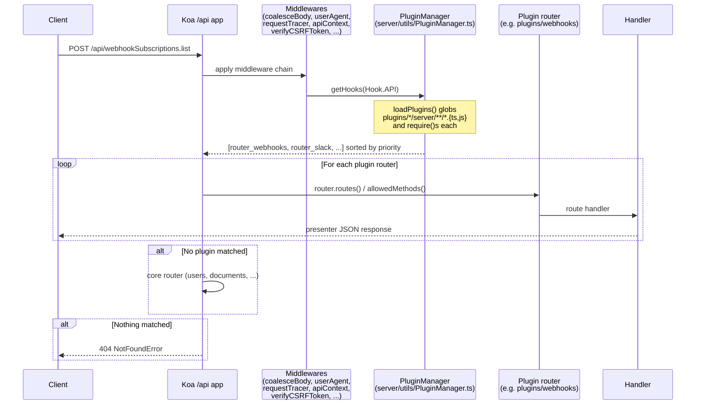

# Plugins

Outline's plugin system lets third-party code mount routes, register OAuth providers, contribute processors and tasks, contribute unfurlers and search providers, and contribute UI surfaces (settings screens, import cards, sidebar icons) without forking the codebase. Each plugin is a folder under `plugins/` with a `plugin.json` manifest and optional `server/`, `client/`, and `shared/` subfolders. The server and client each have a `PluginManager` that discovers plugins at startup and dispatches hooks to registered handlers.

> MCP is a first-class subsystem of the server, not a plugin. See [`docs/MCP.md`](MCP.md) for the MCP server, and [`docs/ARCHITECTURE.md`](ARCHITECTURE.md) for the folder map.
>
> If your plugin contributes to the editor, read [`docs/EDITOR.md`](EDITOR.md) first — registration goes through `inlineExtensions / listExtensions / tableExtensions / basicExtensions / richExtensions`.
>
> If your plugin subscribes to events, read [`docs/DATA_MODEL.md`](DATA_MODEL.md) for the event bus.

## Prerequisites

You should be comfortable with the following before authoring or modifying a plugin.

- **Backend plugin concepts.** A plugin can register a Koa router, an authentication strategy, an event-bus processor, a one-shot task, an unfurl handler, a search provider, an issue provider, an email template, a group-sync provider, or an uninstall hook. Hooks are static additions — a plugin cannot deregister or replace an existing core hook.
- **Frontend plugin concepts.** A client plugin can contribute a settings screen (lazy-loaded into the settings sidebar), an import card on the home page, or a sidebar icon. UI surfaces are rendered through the same MobX-React / styled-components stack as the rest of the app.
- **OAuth 2.0.** Auth-provider plugins typically wrap a Passport strategy that completes an OAuth dance, exchanges the code, and provisions a `User` row. Read [`docs/SECURITY_MODEL.md`](SECURITY_MODEL.md) for CSRF, state validation, and scope handling.
- **Webhooks.** Outbound webhooks are HMAC-signed and delivered with exponential backoff. Inbound webhooks are validated against a per-subscription secret.
- **WebAuthn / passkeys.** The `passkeys` plugin registers the WebAuthn ceremony; understand `navigator.credentials.create` / `.get` before modifying it.

## Server PluginManager

`server/utils/PluginManager.ts` is the in-process registry for server-side hooks. It is a static class — no DI, no per-request state — that lazy-loads plugin code on first use.

### Hook enum

`Hook` enumerates the ten extension points a server plugin can register.

| Hook | Value type | Purpose |
| --- | --- | --- |
| `Hook.API` | `Router` | A Koa router mounted at `/api`. Plugin routes are registered **before** the core routes so that a plugin can shadow a core endpoint if needed. |
| `Hook.AuthProvider` | `{ router: Router \| Promise<Router>; id: string }` | A Passport-style auth strategy with its own router. The `id` matches `AuthenticationProvider.name` and is used to route the user through the right provider. |
| `Hook.EmailTemplate` | `typeof BaseEmail<any>` | A transactional email class extending `BaseEmail`. The mailer picks up all registered templates. |
| `Hook.IssueProvider` | `BaseIssueProvider` | An issue-tracker integration (GitHub, GitLab) that can list, search, and create issues. Used by the comment composer. |
| `Hook.Processor` | `typeof BaseProcessor` | A Bull queue processor that reacts to events from the event bus. See [`docs/DATA_MODEL.md`](DATA_MODEL.md). |
| `Hook.SearchProvider` | `BaseSearchProvider` | A document index/search backend. The default `search-postgres` plugin uses tsvector; OpenSearch can be plugged in here. |
| `Hook.Task` | `typeof BaseTask<object>` | A one-shot background job, scheduled or enqueued by other code. |
| `Hook.UnfurlProvider` | `{ unfurl: UnfurlSignature; cacheExpiry: number }` | Resolves a URL into an OG-style preview card. Multiple providers are chained; the first to match wins. |
| `Hook.Uninstall` | `UninstallSignature` | Cleanup hook called when the admin removes the integration from the workspace. |
| `Hook.GroupSyncProvider` | `{ id: string; provider: GroupSyncProvider }` | Bridges external IdP groups into Outline's `Group` / `GroupUser` model on each login. |

### Plugin shape

A plugin entry is a plain object with a `type`, a `value` matching `PluginValueMap[type]`, and optional `name`, `description`, `priority`. Plugins register themselves by calling `PluginManager.add([...])` from their `server/index.ts`:

```ts
import { PluginManager, Hook } from "@server/utils/PluginManager";
import config from "../plugin.json";
import router from "./api/webhookSubscriptions";

PluginManager.add({
  ...config,
  type: Hook.API,
  value: router,
});
```

The `loadPlugins()` method is called lazily by `getHooks` and synchronously globs `plugins/*/server/!(*.test|schema).[jt]s` from the build root. Each file is `require()`-d once per process. There is no per-plugin hot reload — restart the worker for changes.

### Priority and ordering

`PluginPriority` controls registration order. Lower runs first.

| Priority | Value |
| --- | --- |
| `VeryHigh` | 0 |
| `High` | 100 |
| `Normal` | 200 |
| `Low` | 300 |
| `VeryLow` | 500 |

Defaults to `Normal` if the plugin's `priority` field is missing. The current `PluginManager` resolves only the numeric `priority` field; an `after` string field is reserved in the manifest schema but is not yet consumed by the manager — relative ordering today must be expressed as a numeric priority.

The API mount in `server/routes/api/index.ts` iterates `PluginManager.getHooks(Hook.API)` sorted by priority and mounts each router **before** the core routes. This ordering matters for any plugin that wants to shadow a core endpoint (use `VeryHigh` with care).

## Client PluginManager

`app/utils/PluginManager.ts` mirrors the server. It is a MobX-observable registry so UI surfaces re-render when a plugin becomes enabled or disabled.

### Hook enum

The client enum has three values:

- `Hook.Settings` — contributes a tile to the settings sidebar (group, icon, lazy component, optional `enabled` predicate).
- `Hook.Imports` — contributes a card to the home-page import chooser (title, subtitle, icon, action element).
- `Hook.Icon` — contributes a sidebar icon component for a custom resource type.

### Discovery

`PluginManager.loadPlugins()` uses Vite's `import.meta.glob` to enumerate `../../plugins/*/client/index.{ts,js,tsx,jsx}` at build time and dynamically imports each module. The bootstrap call is in `app/index.tsx`, immediately after `initI18n` and before the provider stack mounts.

### Deployments

Each client plugin may declare a `deployments` array of `"cloud" | "community" | "enterprise"`. The `register` method filters by `isCloudHosted()`:

- `["cloud"]` — registered only when `isCloudHosted()` is true.
- `["community"]` or `["enterprise"]` — registered only when `isCloudHosted()` is false (self-hosted).
- `[]` or omitted — registered in every deployment.

### usePluginValue

`usePluginValue<T extends Hook>(type, id)` is a thin React hook that wraps `useComputed` around `PluginManager.getHook(type, id)?.value`. Components consume it to render a single plugin's contribution reactively without re-subscribing to the full map.

## Manifest

Every plugin declares a `plugin.json` at its root. The fields are read by the build (for inclusion in `build/plugins/<id>/plugin.json`), by the server (priority / ordering), and by the client (deployments gating).

```json
{
  "id": "figma",
  "name": "Figma",
  "priority": 15,
  "description": "Adds a Figma integration for link unfurling and converting links to mentions.",
  "after": "linear",
  "deployments": ["cloud", "community", "enterprise"]
}
```

| Field | Required | Purpose |
| --- | --- | --- |
| `id` | yes | Unique slug. Matches the folder name. |
| `name` | yes | Human-readable label shown in the UI. |
| `priority` | optional | Server mount order; lower is earlier. See `PluginPriority`. |
| `description` | optional | One-line summary, shown on the integrations card. |
| `after` | optional | Reserved for future relative ordering. Not consumed by `PluginManager` today; use `priority` for ordering. |
| `deployments` | optional | `["cloud"]`, `["community", "enterprise"]`, or omitted (all). |

A small number of plugins have no `plugin.json` (`storage`, `iframely`, `enterprise`). They register themselves entirely from code: `storage` and `iframely` register a single server hook each; `enterprise` contributes only `client/translations.tsx` strings and registers no hook.

## Plugin reference

The table below lists every plugin in the tree. Manifest-derived fields (`deployments`, `priority`) come from `plugins/*/plugin.json`; hooks are observed from each plugin's `server/index.ts` (or the client entry, where noted).

| Plugin | Deployment(s) | Server hooks | Client hooks | Env guard | Purpose |
| --- | --- | --- | --- | --- | --- |
| `azure` | all | `AuthProvider` | — | `AZURE_CLIENT_ID` + `AZURE_CLIENT_SECRET` | Microsoft Entra ID (Azure AD) SSO. |
| `diagrams` | all | — | `Settings` | — | Configure a custom Diagrams.net host URL for embed previews. |
| `discord` | all | `AuthProvider` | — | `DISCORD_CLIENT_ID` + `DISCORD_CLIENT_SECRET` | Discord OAuth sign-in. |
| `email` | all | `AuthProvider` | — | `SMTP_HOST` or `SMTP_SERVICE` (or development) | Email magic-link sign-in. |
| `enterprise` | all (no manifest) | — | — (translations only) | — | Extra i18n strings + UI affordances for the enterprise deployment. |
| `figma` | all | `API`, `UnfurlProvider` | — | `FIGMA_CLIENT_ID` + `FIGMA_CLIENT_SECRET` | Figma link unfurling and mention conversion. |
| `github` | all | `API`, `Task`, `IssueProvider`, `UnfurlProvider`, `Uninstall` | — | `GITHUB_CLIENT_ID` + `GITHUB_CLIENT_SECRET` + `GITHUB_APP_NAME` + `GITHUB_APP_ID` + `GITHUB_APP_PRIVATE_KEY` | GitHub OAuth, issue search/create, webhook receiver. |
| `gitlab` | all | `API`, `IssueProvider`, `UnfurlProvider`, `Task` | — | — (always on) | GitLab issue search/create and link unfurling. |
| `google` | all | `AuthProvider` | — | `GOOGLE_CLIENT_ID` + `GOOGLE_CLIENT_SECRET` | Google Workspace OAuth sign-in. |
| `googleanalytics` (manifest id `google-analytics`) | all | — | `Settings` | — | Stream page views to a GA4 measurement ID. |
| `iframely` | all (no manifest) | `UnfurlProvider` | — | `IFRAMELY_API_KEY` (cloud) or `IFRAMELY_URL` (custom) | Catch-all URL unfurl via Iframely. |
| `linear` | all | `API`, `Task`, `UnfurlProvider`, `Uninstall` | — | `LINEAR_CLIENT_ID` + `LINEAR_CLIENT_SECRET` | Linear issue search/create and link unfurling. |
| `matomo` | community, enterprise | — | `Settings` | — | Stream page views to a self-hosted Matomo server. |
| `notion` | all | `API`, `Processor`, `Task` | — | `NOTION_CLIENT_ID` + `NOTION_CLIENT_SECRET` | Notion workspace import. |
| `oidc` | all | `AuthProvider` | — | `OIDC_*` (manual or issuer URL) | Generic OpenID Connect SSO with discovery. |
| `passkeys` | all | `AuthProvider`, `API`, `Processor`, `EmailTemplate` | — | — (always on) | WebAuthn passkey enrolment and sign-in. |
| `search-postgres` | all | `SearchProvider` | — | — (always on) | Default tsvector full-text search. |
| `slack` | all | `AuthProvider`, `API`, `Processor` | — | `SLACK_CLIENT_ID` + `SLACK_CLIENT_SECRET` | Slack OAuth, `/outline` slash command, link unfurling, notification fan-out. |
| `storage` | all (no manifest) | `API` | — | `FILE_STORAGE=local` | Local-disk upload and download backend. |
| `umami` | community, enterprise | — | `Settings` | — | Stream page views to a self-hosted Umami server. |
| `webhooks` | all | `API`, `Processor`, `Task` (×2) | — | — (always on) | Outbound webhooks with HMAC signing. |
| `zapier` | cloud | — | `Settings` | — | Connect Outline to Zapier for no-code automation. |

## Plugin API hook flow

The diagram below shows how a request to a plugin-registered endpoint travels through the server stack. Plugin routes are mounted before the core routes in `server/routes/api/index.ts`, so the first router to match the path wins.



The `getHooks` call is idempotent and lazy — the first invocation triggers `loadPlugins()`, subsequent calls are in-memory reads from `Map<Hook, Plugin<Hook>[]>`. The plugin modules are `require()`-d once per process; environment guards (`if (env.SOME_VAR)`) are evaluated at that time and skipped plugins never register.

## Deep dives

The four examples below cover the breadth of what a plugin can do. Use them as templates.

### `webhooks`

`plugins/webhooks` registers four entries from one `server/index.ts`:

- `Hook.API` — `webhookSubscriptions` router at `/api/webhookSubscriptions.*`. Lets users create, list, update, and delete subscriptions.
- `Hook.Processor` — `WebhookProcessor` consumes `documents.*`, `users.*`, `collections.*`, etc. from the global event queue and decides whether to deliver them.
- `Hook.Task` — `DeliverWebhookTask` performs the actual HTTP POST. Outbound payloads are signed with HMAC SHA-256 using the subscription's secret; the signature is delivered in an `Outline-Signature` header.
- `Hook.Task` — `CleanupWebhookDeliveriesTask` is a periodic task that prunes delivered rows older than the retention window.

Retries use Bull's exponential backoff (5 attempts starting at 1s). The inbound webhook receiver used by plugins like GitHub lives at `plugins/*/api/*.ts` and is validated by `server/middlewares/validateWebhook.ts` against the same HMAC scheme.

### `storage`

`plugins/storage` is the simplest server-only plugin: a single `Hook.API` entry that mounts a router serving `/api/files.*` for upload, download, and avatar endpoints. It is gated by an environment check at the top of `server/index.ts`:

```ts
const enabled = !!(
  env.FILE_STORAGE_UPLOAD_MAX_SIZE &&
  env.FILE_STORAGE_LOCAL_ROOT_DIR &&
  env.FILE_STORAGE === "local"
);
```

When `FILE_STORAGE` is `s3` (the production default), the plugin's `PluginManager.add` call never runs and S3Storage in `server/storage/files/` takes over. The router itself lives in `plugins/storage/server/api/files.ts`; the per-endpoint Zod schema is in `schema.ts`. Tests live in `plugins/storage/server/api/files.test.ts` and run as part of the `server` Vitest project.

### `oidc`

`plugins/oidc` registers a single `Hook.AuthProvider`. The plugin supports two configuration modes and picks one at load time:

- **Manual**: `OIDC_CLIENT_ID`, `OIDC_CLIENT_SECRET`, `OIDC_AUTH_URI`, `OIDC_TOKEN_URI`, `OIDC_USERINFO_URI`. The router in `auth/oidc.ts` uses these endpoints directly.
- **Discovery**: `OIDC_CLIENT_ID`, `OIDC_CLIENT_SECRET`, `OIDC_ISSUER_URL`. The plugin calls `<issuer>/.well-known/openid-configuration` (`oidcDiscovery.ts`) to resolve the endpoints, caches the result, and proceeds.

If neither mode is configured, the plugin does nothing — useful for installations that only use Slack or Google. The router follows the same Passport-style flow as the other auth plugins; CSRF state is generated via `server/utils/oauthState.ts` and verified on the callback. The display name shown on the login screen comes from `OIDC_DISPLAY_NAME` or falls back to the manifest's `name`.

### `slack`

`plugins/slack` is the broadest single plugin and exercises the most surface area:

- `Hook.AuthProvider` — Slack OAuth sign-in via `auth/slack.ts`. Provisions a `User` and an `AuthenticationProvider` on first login.
- `Hook.API` — `api/hooks.ts` exposes the `/api/hooks.*` router that Slack's slash command and event subscription webhooks call back into. Handlers verify the Slack signing secret.
- `Hook.Processor` — `SlackProcessor` consumes document events and posts messages to configured Slack channels.
- `presenters/` — Slack-flavoured renderers that turn Outline documents into Block Kit payloads (`mrkdwn`, attachments).
- `processors/SlackProcessor.ts` — fan-out from the event bus to channels.

`SLACK_CLIENT_ID` and `SLACK_CLIENT_SECRET` gate the whole plugin. When unset, the add call is skipped and Slack features vanish from the UI.

## Authoring guide

This section walks through adding a new plugin from scratch.

### Scaffold the folder

```
plugins/
└── myplugin/
    ├── plugin.json
    ├── server/
    │   ├── index.ts
    │   ├── env.ts
    │   └── api/
    │       ├── index.ts        # koa-router
    │       ├── schema.ts       # zod input schemas
    │       └── myplugin.test.ts
    ├── client/
    │   ├── index.tsx
    │   ├── Settings.tsx        # only if registering Hook.Settings
    │   └── Icon.tsx            # only if registering Hook.Settings/Icon
    └── shared/
        └── types.ts            # types shared by server and client
```

The folder name is the plugin id by convention. The build (`build:server` script in `package.json`) compiles `server/` and `shared/` into `build/plugins/<id>/` and copies `plugin.json` verbatim.

### Manifest

```json
{
  "id": "myplugin",
  "name": "My Plugin",
  "priority": 100,
  "description": "One-line description of what it does."
}
```

### Server entry

```ts
// plugins/myplugin/server/index.ts
import env from "./env";
import { Hook, PluginManager } from "@server/utils/PluginManager";
import config from "../plugin.json";
import router from "./api";

if (env.MYPLUGIN_API_KEY) {
  PluginManager.add({
    ...config,
    type: Hook.API,
    value: router,
  });
}
```

Gate registration on an environment check so a plugin that is not configured does not register a router. The `env` import typically uses class-validator with `@Public()` decorators on the fields that should be exposed to the client via `presentEnv`.

### Server router

```ts
// plugins/myplugin/server/api/index.ts
import Router from "koa-router";
import auth from "@server/middlewares/authentication";
import validate from "@server/middlewares/validate";
import MyPlugin from "./schema";

const router = new Router();

router.post("myplugin.list", auth(), validate(MyPlugin.listSchema), async (ctx) => {
  ctx.body = { data: [] };
});

export default router;
```

### Client entry

```tsx
// plugins/myplugin/client/index.tsx
import { createLazyComponent } from "~/components/LazyLoad";
import { Hook, PluginManager } from "~/utils/PluginManager";
import config from "../plugin.json";
import Icon from "./Icon";

PluginManager.add([
  {
    ...config,
    type: Hook.Settings,
    value: {
      group: "Integrations",
      icon: Icon,
      component: createLazyComponent(() => import("./Settings")),
      description: "Configure the My Plugin integration.",
    },
  },
]);
```

### Registering each hook

The `Hook` values are independent — register only the ones you need.

- **`Hook.API`** — pass a `koa-router` instance. It is mounted under `/api/`.
- **`Hook.AuthProvider`** — pass `{ router, id }`. The router must expose `/auth/<id>` and `/auth/<id>.callback`; see `plugins/google/server/auth/google.ts`.
- **`Hook.EmailTemplate`** — subclass `BaseEmail` from `@server/emails/templates/BaseEmail` and pass the class itself.
- **`Hook.IssueProvider`** — subclass `BaseIssueProvider` from `@server/utils/BaseIssueProvider` and pass an instance.
- **`Hook.Processor`** — subclass `BaseProcessor` and pass the class; see `server/queues/processors/`.
- **`Hook.SearchProvider`** — subclass `BaseSearchProvider` and pass an instance.
- **`Hook.Task`** — subclass `BaseTask` and pass the class.
- **`Hook.UnfurlProvider`** — pass `{ unfurl: UnfurlSignature, cacheExpiry: number }`.
- **`Hook.Uninstall`** — pass an async function `(integration: Integration) => Promise<void>`.
- **`Hook.GroupSyncProvider`** — pass `{ id, provider }` where `provider` extends `GroupSyncProvider` from `server/utils/GroupSyncProvider.ts`.

### Editor extension plugins

If your plugin contributes a node, mark, or extension to the editor, read [`docs/EDITOR.md`](EDITOR.md) first. The plugin should expose a helper that returns the new extension array, and the consumer side calls it inside `props.extensions` of the `Editor` component. Registration through `inlineExtensions / listExtensions / tableExtensions / basicExtensions / richExtensions` is **not** how plugins register editor contributions — those arrays are part of the core editor bundle.

### Event subscribers

If your plugin subscribes to events (e.g. for an outbound integration or webhook fan-out), register a `Hook.Processor` that consumes from `globalEventQueue`. See [`docs/DATA_MODEL.md`](DATA_MODEL.md) for the event envelope shape and the discriminated union of event names.

### Tests

Server tests live next to the file under test and are excluded from the build glob (`!(*.test|schema).[jt]s`). They run in the `server` Vitest project:

```bash
yarn test plugins/myplugin/server
```

Client tests live in the same project as the rest of `app/` and run in `jsdom`. The `app/test/setup.ts` already mocks `ApiClient` and `localStorage`; no extra setup is required for most plugins. For tests that exercise `usePluginValue`, wrap in a `Provider` from `mobx-react` and call `PluginManager.loadPlugins()` first.

### Local testing

Run `yarn dev:watch` and create a workspace to exercise your plugin end-to-end. Watch `server/logging/` output — `Logger.debug("plugins", ...)` is emitted at registration time, but only in the master process (forks stay quiet to avoid duplicate logs).

## File map

- `plugins/` — every plugin lives here.
- `plugins/*/plugin.json` — manifest consumed by build + client + server.
- `plugins/*/server/` — server entry; `index.ts` registers hooks; `api/`, `auth/`, `processors/`, `tasks/`, `email/`, `presenters/` are conventions, not requirements.
- `plugins/*/client/` — client entry; `index.tsx` registers hooks; `Settings.tsx`, `Icon.tsx` are conventional UI files.
- `plugins/*/shared/` — types and helpers shared between server and client (compiled into both bundles).
- `server/utils/PluginManager.ts` — server registry: `Hook` enum, `PluginPriority`, `loadPlugins`, `getHooks`.
- `app/utils/PluginManager.ts` — client registry: `Hook` enum, `loadPlugins` (via `import.meta.glob`), `usePluginValue`.
- `server/routes/api/index.ts` — mounts plugin `Hook.API` routers before core routes.
- `server/utils/oauthState.ts` — CSRF state for OAuth providers.
- `server/middlewares/validateWebhook.ts` — HMAC verification for inbound webhooks.
- `server/queues/processors/BaseProcessor.ts` — base class for `Hook.Processor` plugins.
- `server/queues/tasks/base/BaseTask.ts` — base class for `Hook.Task` plugins.
- `server/utils/BaseIssueProvider.ts`, `server/utils/BaseSearchProvider.ts`, `server/utils/GroupSyncProvider.ts` — base classes for the matching hooks.
