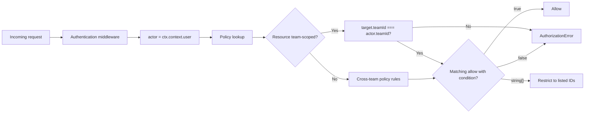
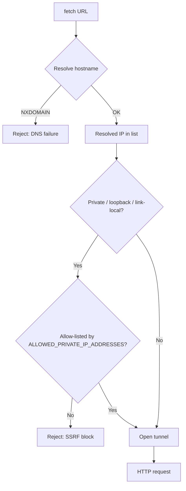
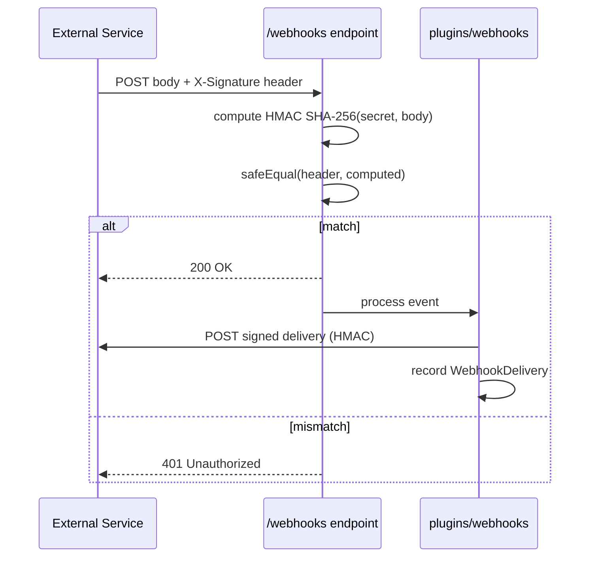
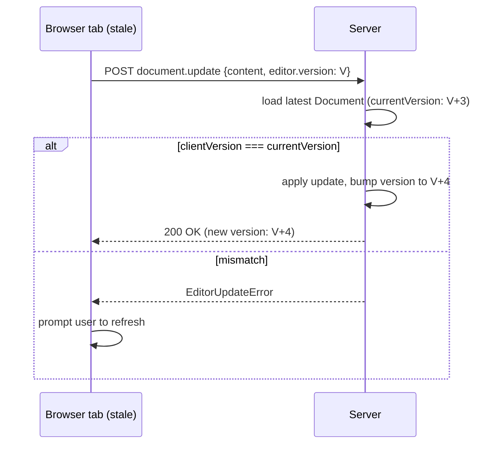

# Security model

This document describes the **threats and controls** that Outline applies at runtime. It is a reference for developers extending the server, plugins, or the OAuth surfaces. The *implementation patterns* — middleware ordering, request lifecycle, presenters, commands — live in [`BACKEND.md`](./BACKEND.md); this doc assumes that context and focuses on *what is defended, how, and where to look*.

> Note: the existing [`docs/SECURITY.md`](./SECURITY.md) is the vulnerability disclosure policy. It is unchanged. This file is the internal developer reference for the security model itself.

## Controls at a glance

| Surface | Control | Where to look |
| --- | --- | --- |
| Browser session | JWT cookie, CSRF double-submit | `server/middlewares/authentication.ts`, `server/middlewares/csrf.ts` |
| OAuth login | Passport strategies per provider | `plugins/*/server/auth/`, `server/middlewares/passport.ts` |
| Passwordless | WebAuthn + email magic link | `plugins/passkeys/`, `plugins/email/` |
| Server-to-server | API key (encrypted at rest) | `server/models/ApiKey.ts`, `server/utils/crypto.ts` |
| MCP / OAuth | PKCE + refresh rotation + DCR | `server/routes/mcp/`, `server/routes/oauth/` |
| Authorization | cancan policies, `string[]` UI gating | `server/policies/`, `server/middlewares/apiContext.ts` |
| Throttling | Redis-backed limiter + per-route overrides | `server/middlewares/rateLimiter.ts`, `server/utils/RateLimiter.ts` |
| Content policy | Helmet CSP, S3-aware `script-src` | `server/middlewares/csp.ts` |
| Outbound HTTP | SSRF filter, private-IP allow-list | `server/utils/fetch.ts`, `server/utils/requestFilteringAgent/` |
| Storage encryption | `@Encrypted` decorator + `SECRET_KEY` | `server/storage/vaults.ts`, `server/models/decorators/` |
| Webhook integrity | HMAC SHA-256, constant-time compare | `server/middlewares/validateWebhook.ts`, `server/utils/crypto.ts` |
| Upload safety | Size caps + mime allow-lists | `shared/validations.ts`, `server/middlewares/multipart.ts` |
| Concurrent edits | `editor.version` monotonic check | `server/commands/documentUpdater.ts` |
| Error visibility | Sentry with reportable filter | `server/logging/sentry.ts` |
| Transport | HTTPS, HSTS, trusted-proxy IP recovery | `server/services/web.ts`, `server/env.ts` |
| Audit | Append-only `Event`, `SearchQuery`, `WebhookDelivery` | `server/models/{Event,SearchQuery,WebhookDelivery}.ts` |

## Prerequisites

You should be comfortable with the following before reading this document:

- HTTPS, cookies (`HttpOnly`, `Secure`, `SameSite`), and CSRF defences (double-submit token or synchronizer pattern).
- JSON Web Tokens (JWT) — signing, verification, and the difference between session and bearer usage.
- OpenID Connect (OIDC) and OAuth 2.0 (authorization code, client credentials, refresh tokens, PKCE, dynamic client registration).
- The OWASP Top 10 — at least injection, broken authentication, broken authorization, SSRF, XSS, and cryptographic-failure categories.
- Koa middleware ordering and how `ctx.state` / `ctx.context` flow between handlers.
- Basic Postgres row-level security concepts and how soft-delete + audit append-only logs combine.

Familiarity with the [`BACKEND.md`](./BACKEND.md) request-lifecycle section is recommended.

## AuthN

### Session JWTs

The session transport is a JWT signed with `SECRET_KEY`. The auth middleware reads the token from **any** of four locations, in order: cookie, `Authorization` header, request body, or query string. The four-way read is implemented in `server/middlewares/authentication.ts` (the `parseAuthentication` helper) and is gated by `AuthenticationType` so each route can declare what it accepts (`app`, `api`, `mcp`, `oauth`). Cookie-bound tokens are the default for browser sessions; bearer tokens are accepted for API and MCP clients.

Cookies carrying the session JWT are issued with `HttpOnly`, `Secure`, and `SameSite=lax`. The `SameSite` value tolerates top-level navigation (so deep links work) while still rejecting cross-site form posts that lack the CSRF token.

### OAuth providers

OAuth login flows are implemented by plugins under `plugins/*/server/auth/`. First-party providers cover Slack, Google, Azure AD, Discord, generic OIDC, and an email magic-link transport. Each provider is a passport strategy loaded by `server/middlewares/passport.ts`. The plugin contract is documented in [`PLUGINS.md`](./PLUGINS.md); adding a new provider means registering the strategy and emitting the `AuthenticationProvider` model on first login.

The OAuth callback always validates the `state` parameter against `server/utils/oauthState.ts` to prevent cross-site request forgery on the callback URL itself.

### Passkeys

`plugins/passkeys` adds WebAuthn enrolment and sign-in. The plugin stores the credential on `UserPasskey`; the verification step uses the platform authenticator challenge. Existing session credentials are not bypassed — passkey sign-in replaces the active session JWT. The plugin enforces that each passkey credential is bound to a specific user; re-enrolment requires re-authentication of the existing session.

### API keys

`ApiKey` is the long-lived bearer token for server-to-server clients. The token string is stored encrypted at rest using the `@Encrypted` decorator (see *Data at rest* below) and is never returned in plain text after creation. Hashing for lookup uses `server/utils/crypto.ts` (`crypto.hash`); the plaintext is shown to the user exactly once at creation time. The token string is restricted to the path prefixes declared on the model (`/api/*`, `/mcp`, etc.); see `server/models/ApiKey.ts`.

API key requests bypass CSRF verification because they have no ambient authority — a third-party site cannot read the bearer token out of the user's browser.

### MCP / OAuth server

The MCP endpoint exposes a complete OAuth 2.0 server (RFC 6749) implemented in `server/routes/mcp/index.ts` and `server/routes/oauth/`. It accepts:

- **PKCE-only** authorization-code grants (no implicit flow, no resource-owner-password).
- **Refresh-token rotation** with reuse detection — refresh tokens are single-use; replays invalidate the chain and force re-authentication.
- **Dynamic Client Registration (DCR)** per the MCP spec for clients that register on first use.

Discovery documents at `/.well-known/oauth-authorization-server/mcp` and `/.well-known/oauth-protected-resource/mcp` advertise endpoints, scopes, and PKCE requirements. The MCP-specific request flow, scopes, and discovery documents are documented in [`MCP.md`](./MCP.md); this doc only summarises the controls (PKCE + rotation + DCR). The `AuthenticationType.MCP` and `AuthenticationType.OAUTH` values gate `/mcp` in `server/middlewares/authentication.ts`.

### Session lifecycle

Sessions are derived from the JWT payload (user id, team id, role, expiry) and re-checked on every request. Three conditions cause the auth middleware to reject a previously valid session:

- The JWT signature fails verification against `SECRET_KEY` (`server/utils/jwt.ts#getJWTPayload`).
- The referenced user no longer exists or has been deleted.
- The user is suspended — `UserSuspendedError` is raised even for an otherwise valid token.

Suspension is the only "soft" revoke path that does not require rotating `SECRET_KEY`: a suspended user simply cannot authenticate until an admin re-enables the account. Logout clears the cookie and removes the client-side session, but the JWT remains valid until its `exp` claim, so a leaked token cannot be revoked unilaterally except by rotating `SECRET_KEY` or suspending the user.

```mermaid
sequenceDiagram
    participant Client as MCP Client
    participant OAuth as /oauth routes
    participant MCP as /mcp
    Client->>OAuth: 1. Authorization code request (PKCE S256)
    OAuth-->>Client: 2. Authorization code
    Client->>OAuth: 3. Token exchange (code + verifier)
    OAuth-->>Client: 4. Access token + refresh token
    Client->>MCP: 5. POST /mcp with Bearer token
    MCP->>OAuth: 6. (token introspection if opaque)
    OAuth-->>MCP: 7. Active + scopes
    MCP-->>Client: 8. Tool result
    Note over Client,OAuth: 9. Refresh tokens rotate on every use; replay invalidates the chain
```

## AuthZ

### The `cancan.ts` engine

Authorization is cancan-style. The engine in `server/policies/cancan.ts` resolves the question *"can `actor` perform `action` on `target`?"* by walking the registered policies. Each policy function returns one of:

- `true` — allowed.
- `false` — denied.
- `string[]` — allowed **only** for the listed entity IDs (membership-based gating; used for collections, groups, and any resource that can be enumerated by the client UI to grey out forbidden rows).

The `string[]` return value is the bridge between server-side AuthZ and the UI: the server ships the *allowed* set to the client via `presentPolicies`, and the client uses it to disable controls without round-tripping per click. Failing closed is the default — if no policy matches, the answer is `false` and the request is rejected with `AuthorizationError`.

### Policy file pattern

Every resource has a `server/policies/<resource>.ts` file. Each file exports one or more `allow(actor, action, target, condition?)` rules. `condition` is an optional narrowing predicate (e.g. "draft" or "published"). Side-effect registration happens in `server/policies/index.ts`, which imports every policy file for its module side-effects.

A typical rule reads:

```
allow(User, "read", Document, (actor, document) =>
  document.publishedAt != null || document.createdById === actor.id
);
```

The full set of policy files lives under `server/policies/`; the most-touched ones are `document.ts`, `collection.ts`, `team.ts`, `user.ts`, `group.ts`, `comment.ts`, `share.ts`, `apiKey.ts`, `webhookSubscription.ts`, `integration.ts`, `oauthClient.ts`, `notification.ts`, and `revision.ts`. New resources should always ship a policy file alongside the model — there is no implicit "allow" fallback.

### Team-scoped vs cross-team resources

Most resources are **team-scoped**: the policy checks that `target.teamId === actor.teamId` (or that the actor has a membership in the target team). A small set are **cross-team** — `User`, `Event`, `OAuthClient`, and `Integration` — and the policies for those reflect that they are visible across team boundaries under their own rules. Document sharing across teams is handled by the `Share` model rather than by relaxing the `Document` policy; cross-team `Share` records are themselves team-scoped on the *destination* team and re-checked on every read.



## Request defences

### CSRF

CSRF tokens are managed by `server/middlewares/csrf.ts`. The middleware exposes:

- `attachCSRFToken` — issues a token on safe methods (`GET`, `HEAD`, `OPTIONS`) and sets it in a non-`HttpOnly` cookie + matching request field. The cookie name and field name live in `shared/constants.ts` (`CSRF.cookieName`, `CSRF.fieldName`).
- `verifyCSRFToken` — on unsafe methods, requires the field to equal the cookie and be bundleable with `SECRET_KEY`. Mismatch raises `CSRFError`.

CSRF verification is **skipped** for OAuth bearer-token requests and API-key requests, on the assumption that those transports cannot be replayed by a third-party site (no ambient authority). Cookie-based sessions always go through the check.

### Rate limiting

`server/middlewares/rateLimiter.ts` wraps `rate-limiter-flexible` against Redis (in-memory fallback). There is one **default** limiter applied to all routes, plus per-route overrides for sensitive endpoints (login, magic-link request, OAuth callback, password reset). The default key is the authenticated `userId` when a session JWT is present, otherwise the client IP. `RATE_LIMITER_MULTIPLIER` (env) scales every limit linearly for tenants that need headroom (e.g. cloud-hosted plans).

When the limiter rejects a request, the response includes `Retry-After` and raises `RateLimitExceededError`. The limiter is initialised at boot from `server/utils/RateLimiter.ts`, which also provides an `insuranceRateLimiter` fallback for the period before Redis is reachable.

### CSP

`server/middlewares/csp.ts` builds the Content Security Policy via `koa-helmet`. The `script-src` directive is derived from the storage configuration: `AWS_S3_UPLOAD_BUCKET_URL` (or `AWS_S3_ACCELERATE_URL`) supplies an origin stripped of the bucket prefix so that worker scripts and CDN-hosted assets are whitelisted automatically. Dev environments may set `DEVELOPMENT_UNSAFE_INLINE_CSP=true` to permit inline scripts for hot-reload tooling; this flag must be left unset in production.

`object-src 'none'`, `base-uri 'self'`, and `frame-ancestors 'none'` are always set; embeds that need framing are handled via the embed iframe sandbox rather than via CSP relaxation.

### SSRF protection

Outbound HTTP from the server goes through `server/utils/fetch.ts`, which uses a vendored copy of `request-filtering-agent@3.2.0` (in `server/utils/requestFilteringAgent/`, with attribution in the file header). The agent resolves the target hostname to an IP and rejects the request if the IP is in a private, loopback, link-local, or otherwise non-routable range. DNS resolution happens at request time so a hostname that resolves to a private IP cannot bypass the filter by using a public CNAME.

The `ALLOWED_PRIVATE_IP_ADDRESSES` env var is a CIDR allow-list (single IPs or ranges) for self-hosted deployments that intentionally call internal services. The agent is applied to user-driven fetches (embeds, unfurls, link previews, MCP `fetch` tool). Requests that fail the IP check raise `InvalidRequestError` and are not retried.



## Data at rest

The `@Encrypted` decorator on a Sequelize column routes writes through `SequelizeEncrypted(Sequelize, env.SECRET_KEY)` (in `server/storage/vaults.ts`, backed by the `sequelize-encrypted` package). The vault module is the *only* way encrypted columns should be configured — code paths that write a secret to the database without going through `@Encrypted` are bugs. The decorator is applied to:

- `ApiKey.secret` — the token used to authenticate API key requests. The plaintext is shown to the user exactly once at creation and is never returned afterwards.
- `OAuthAuthentication.accessToken`, `refreshToken`, `code` — the OAuth material the MCP server stores for each client (one row per (user, client) pair).
- `IntegrationAuthentication.accessToken`, `refreshToken`.
- `Attachment.key` — the S3 key under which the file body is stored. Encrypting the key means a leaked S3 credential does not directly map attachment IDs to file content.

Two secrets drive the encryption layer:

- `SECRET_KEY` — 64 hex characters (32 bytes). Master secret for JWT signing, CSRF token binding, and the `@Encrypted` vault. Rotating it invalidates all sessions and stored tokens, and is therefore a coordinated operation: any deployment that rotates `SECRET_KEY` must also re-encrypt all `@Encrypted` columns, which `server/scripts/` provides tooling for.
- `UTILS_SECRET` — secret used to authenticate the cron `/utils` endpoint for maintenance operations. Distinct from `SECRET_KEY` so a leak of cron tooling does not expose the vault.

Secrets can also be supplied through `*_FILE` variants in `server/env.ts` for Docker-secret deployments; the env loader (`server/utils/environment.ts`) reads the file when the env var is a path rather than a literal value. The runtime never logs either secret, and `server/logging/Logger.ts` redacts them via the standard `redact` option.

## Webhook authenticity

Inbound webhooks are verified by `server/middlewares/validateWebhook.ts` using HMAC SHA-256. The middleware accepts a `secretKey` (or a resolver that pulls one from the database by URL/team), reads the signature from a configurable header, and compares it in constant time via `server/utils/crypto.ts#safeEqual`. Verification failure short-circuits with a `401`. Mismatch raises `AuthorizationError` upstream.

The HMAC input is the JSON-stringified request body; the header carries a hex digest. For per-provider compatibility the middleware can be configured with `hmacSign: false` to use the configured secret as a static bearer token instead. The signature is computed against the raw body that Koa hands to the middleware, so signing is independent of how the consumer reads the body downstream.

Outbound deliveries from `plugins/webhooks` are signed with HMAC SHA-256 using the subscription's secret and retried with exponential backoff (1s, 5s, 30s, 5m). Each attempt is recorded on a `WebhookDelivery` row so delivery history is queryable from the team settings UI; failures surface there and via the `webhooks.failed` event. `WebhookSubscriptionValidation.maxSubscriptions` (in `shared/validations.ts`) caps the number of webhook subscriptions per team to limit blast radius if a single subscription secret leaks.



## File upload safety

Upload size is bounded by three env vars in `server/env.ts`:

- `FILE_STORAGE_UPLOAD_MAX_SIZE` — per-attachment upload ceiling (default fallback).
- `FILE_STORAGE_IMPORT_MAX_SIZE` — per-document import ceiling (e.g. Notion, Confluence, Markdown zip).
- `FILE_STORAGE_WORKSPACE_IMPORT_MAX_SIZE` — bulk import ceiling.

Imports also cap execution time via the import-task timeout (`server/queues/tasks/`). Upload middleware (`server/middlewares/multipart.ts`) validates the declared content type against the per-purpose lists in `shared/validations.ts#AttachmentValidation`:

- `avatarContentTypes` — `image/jpg`, `image/jpeg`, `image/png` for user/team avatars.
- `emojiContentTypes` — PNG, WebP, GIF, JPEG for custom emoji (capped at `emojiMaxFileSize`, 1 MB).
- `imageContentTypes` — a broader list including `image/svg`, `image/avif`, `image/heic`, etc., for document embeds.

Uploads whose declared mime type is outside the relevant list are rejected before bytes are written to storage. Files that pass the gate are streamed to S3 via a presigned URL; the server never proxies the full body through Koa, which avoids both memory pressure and a request-smuggling attack surface. Attachment keys are stored encrypted (see *Data at rest*) so an S3 credential leak does not directly map attachment IDs to file content.

Beyond uploads, document content itself is bounded: `DocumentValidation.maxStateLength` caps the collaborative Yjs state, `maxRecommendedLength` warns for very large documents, and `maxTitleLength` / `maxSummaryLength` cap human-readable fields. These caps are enforced in the relevant commands, not in the database, so they can evolve without migrations.

## Editor update enforcement

The collaborative editor maintains an integer `editor.version` on the client. On each save, the client sends the version it last observed; the server compares it against the latest stored version. A mismatch raises `EditorUpdateError` (`server/errors.ts`). The control exists to prevent a stale tab from clobbering concurrent edits that landed while it was offline — the user is asked to refresh rather than overwrite blindly.

`editor.version` is bumped on every server-side `documentUpdater` and on every collaborative persistence flush. The check is performed at the top of `documentCollaborativeUpdater` and the synchronous `documentUpdater`; both paths raise the same error so the client UI can react identically. The Hocuspocus `EditorVersionExtension` (`server/collaboration/EditorVersionExtension.ts`) performs the same check on the collaboration path so an editor that opens while the server already has a newer version is rejected at connection time rather than on first save.



## Error reporting

Errors are routed to Sentry by `server/logging/sentry.ts`. The transport fires only when the error is `isReportable === true` *or* `err.status === 500`; validation and 4xx errors are excluded by default. The transport respects `SENTRY_DSN_*` env vars (server vs. MCP) and the `LOG_LEVEL` cutoff.

The Sentry init block applies a denylist (`ignoreErrors`) so the following error classes never reach Sentry: `BadRequestError`, `SequelizeValidationError`, `SequelizeEmptyResultError`, `ValidationError`, `ForbiddenError`, `UnauthorizedError`, `TeamDomainRequiredError`, `GmailAccountCreationError`, `AuthRedirectError`, `UserSuspendedError`, `TooManyRequestsError`, and the "Premature close" client-disconnect string. Warnings are sampled at 10% in `beforeSend` to keep the noise floor manageable.

Two service tags let operators filter error streams:

- `service: outline` — the main web/worker/cron process group.
- `service: outline-mcp` — the MCP endpoint, so MCP client issues can be triaged separately.

PII redaction is handled by `server/logging/sentry.ts`: user emails, IP addresses, and document content are scrubbed before the event is sent, and the `event.user` block is restricted to the user ID. The trace context (`server/logging/tracer.ts`) correlates the error to the originating request span.

## Transport

The web service enforces HTTPS by default. `FORCE_HTTPS` (env, default `true` in production) wraps the Koa stack with `koa-sslify`, redirecting HTTP requests to HTTPS with `301`. HSTS is added by `koa-helmet` with a one-year max-age and `includeSubDomains`.

Behind a reverse proxy, `PROXY_IP_HEADER` (e.g. `x-forwarded-for`) is consulted to recover the client IP, and `PROXY_HEADERS_TRUSTED` controls which upstream hops are trusted to set that header. Misconfiguration of these two is the most common cause of incorrect rate-limit keys and audit-log IPs. The default `koa-sslify` configuration assumes a single trusted hop; deployments behind multiple layers must list each proxy explicitly.

WebSocket endpoints (`/collaboration`, `/realtime`) inherit the same proxy configuration. The collaboration service additionally requires a stable `COLLABORATION_URL` env var so the Hocuspocus auth handshake resolves back to the correct origin; the `AuthenticationExtension` in `server/collaboration/AuthenticationExtension.ts` then verifies the same session JWT or API key that the web stack would have accepted.

The OAuth callback URL, MCP endpoint, and webhook receiver URL all require HTTPS in production; `FORCE_HTTPS=false` is intended only for local development behind `yarn install-local-ssl` (which provisions a self-signed cert for `local.outline.dev`). The CSRF, OAuth `state`, and webhook HMAC checks are all designed to be safe over plaintext HTTP for development, but production deployments that accidentally disable `FORCE_HTTPS` will see most browsers refuse the session cookie.

## Audit trail

Three append-only logs cover the security-relevant event surface:

- **`Event`** — every state-changing command emits an `Event` row (or schedule) with `{teamId, actorId, ip, authType?, changes?}`. The full subtype list is the discriminated union in `server/types.ts` (around 25 variants keyed by `name = "namespace.event_action"`). `Event` rows are written by `Model.insertEvent` via `saveWithCtx` and are not user-mutable. Retention is enforced by the cleanup task in `server/queues/tasks/`.
- **`SearchQuery`** — `server/models/SearchQuery.ts` records user search history with actor, query text, and timestamp. Retention is governed by the cron cleanup task (`server/queues/tasks/`).
- **`WebhookDelivery`** — outbound webhook attempts are recorded with status, attempt count, response code, and last error so delivery failures are investigable from the UI.

The retention and cleanup cadence for these tables is configured by the cron partition running hourly. None of the three tables expose update or delete routes in the API — they are write-only from the application's perspective and are pruned by the cron tasks, never by user action.

## Build-time and supply-chain controls

A small number of controls apply before any request reaches the runtime:

- **Patches** for upstream bugs that affect security-relevant behaviour. Two are in `patches/` and are applied via `patch-package` on `yarn install`: `@benrbray/prosemirror-math` (KaTeX `ParseError` import fix) and `y-prosemirror` (backport of selection-class support). When patching, scope the change to a comment about the threat it mitigates so reviewers understand why a patch is needed.
- **Vulnerability audit** runs in CI as `yarn npm audit --severity high --recursive --environment production`. Transitive advisories are addressed via `resolutions` in `package.json`; per the project's `AGENTS.md`, each `resolutions` entry is scoped to the vulnerable descriptor (`name@npm:<range>`) rather than overriding the package globally.
- **CodeQL** runs weekly and on every push/PR to `main` via `.github/workflows/codeql-analysis.yml`, scanning the JS/TS surface for the patterns CodeQL flags out of the box.

These controls are run-time independent — they catch issues before the affected code is shipped, so they sit alongside (not under) the runtime defences above.

## What's not enforced by the platform

The controls above cover the most-requested runtime defences, but several common expectations are not provided. A deployment that needs them must add them outside the platform (reverse proxy, WAF, SIEM, or a custom plugin) or accept the gap. The list below is honest about the limits of the platform — plan for these gaps explicitly rather than discovering them in an incident.

- **No second factor beyond passkeys.** There is no built-in TOTP / time-based 2FA. WebAuthn via `plugins/passkeys/` is the only strong second factor; deployments that mandate time-based codes for every user must layer an external IdP and require it at sign-in.
- **No IP allow-listing on the admin surface.** The Bull Board at `/admin` and the cron `/utils` endpoint trust the proxy and `SECRET_KEY` / `UTILS_SECRET`; neither checks a CIDR allow-list. Restrict access at the reverse proxy, a VPN, or a zero-trust network.
- **CSRF does not cover MCP transports.** The `/mcp` endpoint is exempt from `verifyCSRFToken` by design because it speaks OAuth bearer tokens (see *AuthN → MCP / OAuth server*). API-key requests are exempt for the same reason. Self-hosted deployments that expose `/mcp` publicly rely on the OAuth server's PKCE + refresh-token rotation to keep that surface safe.
- **No intrusion detection or anomaly alerting.** The platform ships no built-in detector for brute-force, credential stuffing, impossible travel, or unusual export volume. The Sentry transport is the only out-of-the-box signal (see *Error reporting*), and it is not wired to any SIEM.
- **No `SECRET_KEY` rotation tooling.** The env var is set once and persists for the life of the deployment. Rotating it invalidates every active session, every CSRF token, and every `@Encrypted` column at once; `server/scripts/` provides no built-in re-encrypt workflow. Treat rotation as a planned maintenance operation, not a routine one.
- **`Sentry` keeps 90% of warnings.** The `beforeSend` filter in `server/logging/sentry.ts` drops 10% of `warning`-level events (`if (Math.random() < 0.1) return null;`) to keep the noise floor manageable. If low-severity signal matters for your deployment, raise the sample rate or export to a dedicated store.

## Cross-references

- Server request lifecycle, middleware ordering, and the `ctx.context` pattern — [`BACKEND.md`](./BACKEND.md).
- MCP OAuth flow, scopes, and discovery endpoints — [`MCP.md`](./MCP.md).
- Plugin authoring (adding OAuth providers, webhook subscribers, or storage backends) — [`PLUGINS.md`](./PLUGINS.md).
- Event bus semantics and the `Event` subtype union — [`DATA_MODEL.md`](./DATA_MODEL.md).
- Vulnerability disclosure policy (where to report a security issue) — [`docs/SECURITY.md`](./SECURITY.md).
- Build, deploy, and the production hardening env vars — [`BUILD_AND_DEPLOY.md`](./BUILD_AND_DEPLOY.md).
- CI security scans (CodeQL, dependency audit) — [`CI.md`](./CI.md).

## File map

The directories referenced in this doc, one line each:

- `server/middlewares/` — authentication, CSRF, CSP, rate limiter, multipart, webhook validator, transaction, validation, request tracer.
- `server/policies/` — one policy file per resource, registered via `index.ts` for side-effect import.
- `server/utils/` — JWT, CSRF token generation, crypto helpers (`safeEqual`, `hash`), RateLimiter class, SSRF-safe fetch.
- `server/utils/requestFilteringAgent/` — vendored `request-filtering-agent@3.2.0` with attribution in the file header.
- `server/storage/vaults.ts` — `SequelizeEncrypted` used by the `@Encrypted` decorator.
- `server/storage/database.ts` — Sequelize bootstrap with read-only pool support.
- `server/errors.ts` — error factory functions referenced by error reporting (`EditorUpdateError`, `AuthenticationError`, `AuthorizationError`, `CSRFError`, `RateLimitExceededError`, `InvalidRequestError`, `FileImportError`).
- `server/types.ts` — `AuthenticationType` enum and the `Event` discriminated union.
- `server/env.ts` — all env vars referenced (`SECRET_KEY`, `UTILS_SECRET`, `RATE_LIMITER_MULTIPLIER`, `FORCE_HTTPS`, `PROXY_*`, `ALLOWED_PRIVATE_IP_ADDRESSES`, `FILE_STORAGE_*_MAX_SIZE`, `DEVELOPMENT_UNSAFE_INLINE_CSP`, `AWS_S3_*`, `SENTRY_DSN_*`).
- `server/models/` — `ApiKey`, `OAuthAuthentication`, `OAuthClient`, `OAuthAuthorizationCode`, `WebhookSubscription`, `WebhookDelivery`, `Event`, `SearchQuery`, `UserPasskey`, `Attachment`, `Integration`, `IntegrationAuthentication`.
- `server/routes/oauth/` — OAuth server routes for the MCP endpoint (authorize, token, dynamic client registration).
- `server/routes/mcp/` — MCP Streamable HTTP transport.
- `server/collaboration/` — Hocuspocus extensions including the auth extension that validates the session JWT or API key.
- `server/logging/` — winston logger with Sentry transport for reportable errors.
- `shared/constants.ts` — CSRF cookie/header/field names.
- `shared/validations.ts` — `AttachmentValidation` mime-type allow-list.
- `plugins/passkeys/` — WebAuthn enrolment and sign-in.
- `plugins/oidc/`, `plugins/slack/`, `plugins/google/`, `plugins/azure/`, `plugins/discord/` — first-party OAuth providers.
- `plugins/webhooks/` — outbound webhook delivery + HMAC signing + retry/backoff.
- `plugins/email/` — email magic-link authentication transport.